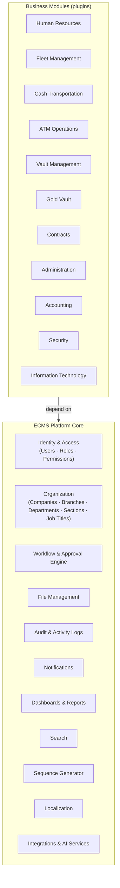
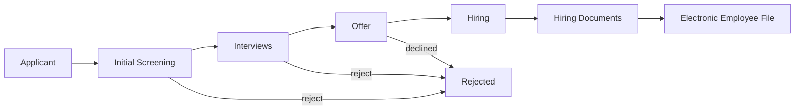

# Business Architecture

## 1. Company context

**EGYCASH** provides money transfer and storage services, precious-metals custody, and ATM
replenishment and maintenance — operating under strict physical-security, auditability, and
regulatory constraints. The company runs a geographically distributed operation: multiple
companies (legal entities), branches, fleets of armored vehicles, vaults, and field teams.

**ECMS (Enterprise Cash Management System)** is the company's operational backbone. It must:

- Digitize and standardize every operational process (HR, fleet, cash logistics, vaults, ATM ops).
- Enforce **accountability**: who did what, when, from where — for every record.
- Support **configurable approval chains** — cash operations are approval-heavy by nature.
- Remain maintainable for **10+ years** with a team that may grow to **20+ developers**.

## 2. Platform, not application

The single most important business-architecture decision:

> **ECMS is a platform. Business capabilities are plugins.**

This mirrors how SAP, Dynamics, Odoo, and ServiceNow are built: a stable core of enterprise
services (identity, authorization, org structure, workflow, files, audit, reporting) with
business modules layered on top. Consequences:

- The **Platform Core is built first** (Milestone 1 design → Milestone 2 implementation).
- A business module may **only** depend on the Platform Core — never on another module.
- New business lines (e.g., a new service EGYCASH launches) become **new modules**, not rewrites.

## 3. Business capability map

## 4. Business modules

| Module | Purpose | Priority |
|---|---|---|
| **Human Resources** | Full employee lifecycle: recruitment → employment → termination | **P0 — Recruitment first** |
| Fleet Management | Armored vehicles, maintenance, routes, assignments | P1 |
| Cash Transportation | CIT (cash-in-transit) orders, trips, custody chains | P1 |
| ATM Operations | Replenishment, first/second-line maintenance, incident handling | P1 |
| Vault Management | Cash vault inventory, deposits, withdrawals, counts | P2 |
| Gold Vault | Precious-metals custody and movements | P2 |
| Contracts | Client contracts, SLAs, pricing | P2 |
| Administration | General administrative services and requests | P2 |
| Accounting | GL integration, billing, cost centers | P3 |
| Security | Physical-security operations, guards, incidents | P3 |
| Information Technology | IT assets, tickets, access requests | P3 |

Priorities express the *implementation order after the Platform Core is complete*; the
architecture treats all modules identically.

## 5. HR — the first module

HR decomposes into sub-modules; **only Recruitment is implemented first**:

Recruitment · Employees · Attendance · Payroll · Leaves · Training · Performance · Medical · Termination

### 5.1 Recruitment business process

Each transition is governed by the **Workflow Engine** (configurable stages, not hard-coded)
and may require approvals via the **Approval Engine**.

### 5.2 Applicant capability requirements

| Capability | Business meaning |
|---|---|
| Egyptian National ID OCR | Scan the national ID; auto-extract name, national number, address, birth date. OCR is an independent, replaceable service. |
| Manual entry | Full data entry without OCR (fallback and correction path). |
| Resume upload | CV attached to the applicant record. |
| Multiple named attachments | Any number of files, each with a category and a human-assigned name/description. |
| Recruitment forms | Structured screening/interview forms tied to the applicant. |
| Timeline | Chronological view of everything that happened to the applicant. |
| Notes & activities | Free-form notes and scheduled activities (calls, interviews). |
| Status history | Every workflow state change with actor and timestamp. |
| Recruitment source | Where the applicant came from (referral, job board, walk-in, …). |
| Platform integrations (future) | Ingest applicants from external recruitment platforms via the Integrations service. |

## 6. Cross-cutting business rules

These rules apply to **every** module and are enforced by the Platform Core:

1. **Multi-company / multi-branch scoping.** Every business record belongs to a company and
   (where applicable) a branch. Users see only the data their scope allows.
2. **Permission-based access.** Every action maps to a named permission
   (`applicant.create`, `applicant.approve`, …). Roles are only *bundles* of permissions.
3. **Full auditability.** Every create/update/delete stores old value, new value, actor,
   timestamp, and IP address.
4. **Configurable workflows.** Business processes are data (workflow definitions), not code.
5. **Bilingual operation.** Arabic (RTL) and English across the entire UI and reference data.
6. **Document-centric.** Files are first-class citizens with categories, versions, and metadata —
   never stored inside the database itself.

## 7. Success criteria for the platform

- A new business module can be scaffolded and shipped **without modifying Platform Core code**.
- A new developer can locate any feature's code from its name alone (predictable structure).
- Removing a module removes its routes, permissions, menus, and collections — nothing else breaks.
- The system can later be split into services along module boundaries without rewriting business logic.
