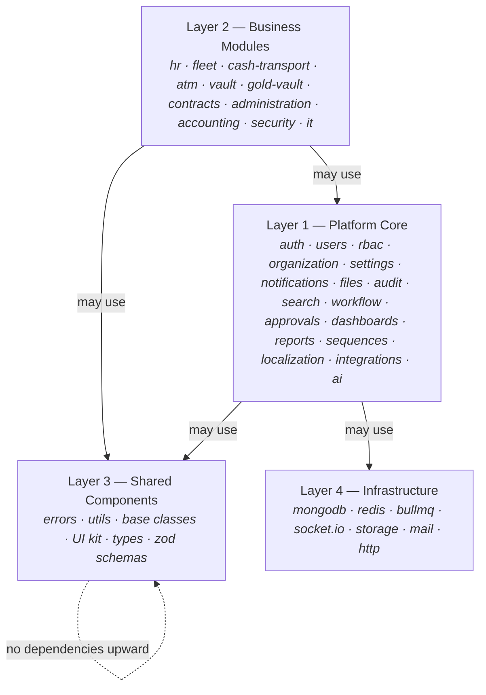
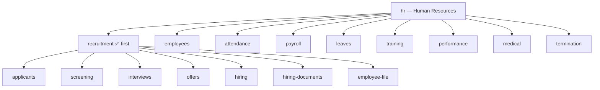

# Module Hierarchy

This document defines the canonical hierarchy of the ECMS Platform: layers, platform services,
business modules, sub-modules, and features. Every identifier introduced here (module IDs,
feature IDs) is **stable** — it is used in permissions, routes, collection names, folder names,
and navigation, and must never be renamed casually.

## 1. The four layers

**Dependency rule (enforced by lint tooling):**

| From ↓ / To → | Platform Core | Business Module | Shared | Infrastructure |
|---|---|---|---|---|
| **Business Module** | ✅ | ❌ **never** | ✅ | ❌ (only via Platform) |
| **Platform Core** | ✅ (within core) | ❌ | ✅ | ✅ |
| **Shared** | ❌ | ❌ | ✅ | ❌ |
| **Infrastructure** | ❌ | ❌ | ✅ | ✅ |

- Modules talk to each other **only** through Platform events (`eventBus`) or Platform-registered
  contracts — never by importing another module's code.
- Business modules never touch Infrastructure directly; they use Platform services (e.g., the
  File service, not Multer/S3; the Notification service, not Socket.IO).

## 2. Platform Core services (Layer 1)

| Service ID | Name | Responsibility |
|---|---|---|
| `auth` | Authentication | Login, JWT access tokens, rotating refresh tokens, sessions, password policy |
| `users` | Users | User accounts, profiles, credentials lifecycle |
| `rbac` | Roles & Permissions | Permission registry, roles, role→permission grants, user→role assignments, data scopes |
| `organization` | Organization | Companies, branches, departments, sections, job titles |
| `settings` | Settings | Hierarchical settings (system → company → branch → user), typed & validated |
| `notifications` | Notifications | In-app (Socket.IO), email, future SMS/push; templates; per-user preferences |
| `files` | File Management | Upload, metadata, categories, versioning, preview, storage adapters |
| `audit` | Audit & Activity Logs | Audit trail (old/new values), activity feed, system logs |
| `search` | Search Engine | Cross-module indexed search with permission filtering |
| `workflow` | Workflow Engine | Configurable state machines per business entity |
| `approvals` | Approval Engine | Approval chains, delegation, escalation — used by workflows |
| `dashboards` | Dashboard Engine | Widget registry, per-role dashboards, module-contributed widgets |
| `reports` | Reports Engine | Report definitions, parameters, export (PDF/Excel), scheduling |
| `sequences` | Sequence Generator | Atomic, gap-controlled document numbering (`APP-2026-000123`) |
| `localization` | Localization | Locales (ar/en), translations, RTL, date/number formatting |
| `integrations` | Integrations | Outbound webhooks, inbound connectors, API keys for third parties |
| `ai` | AI Services | Future-ready facade: OCR, document intelligence, assistants |

Platform services may depend on each other **downward only** as documented in
[Platform Core](../02-architecture/platform-core.md) (e.g., `workflow` uses `approvals`,
everything uses `audit`).

## 3. Business modules (Layer 2)

| Module ID | Name | Sub-modules |
|---|---|---|
| `hr` | Human Resources | `recruitment`, `employees`, `attendance`, `payroll`, `leaves`, `training`, `performance`, `medical`, `termination` |
| `fleet` | Fleet Management | *(designed later)* |
| `cash-transport` | Cash Transportation | *(designed later)* |
| `atm` | ATM Operations | *(designed later)* |
| `vault` | Vault Management | *(designed later)* |
| `gold-vault` | Gold Vault | *(designed later)* |
| `contracts` | Contracts | *(designed later)* |
| `administration` | Administration | *(designed later)* |
| `accounting` | Accounting | *(designed later)* |
| `security` | Security | *(designed later)* |
| `it` | Information Technology | *(designed later)* |

## 4. HR module hierarchy

### Recruitment features

| Feature ID | Name | Notes |
|---|---|---|
| `applicants` | Applicants | OCR + manual entry, attachments, timeline, notes, sources, status history |
| `screening` | Initial Screening | Structured screening forms; pass/fail decisions |
| `interviews` | Interviews | Scheduling, panels, structured evaluation forms |
| `offers` | Offers | Offer letters, terms, approval chain, acceptance tracking |
| `hiring` | Hiring | Conversion of accepted applicant into hiring pipeline |
| `hiring-documents` | Hiring Documents | Required-document checklist, collection tracking |
| `employee-file` | Electronic Employee File | Consolidated digital file handed to the `employees` sub-module |

## 5. Identifier discipline

A single canonical ID scheme flows through the entire system:

| Concern | Pattern | Example |
|---|---|---|
| Module folder | `modules/<module-id>/` | `modules/hr/` |
| Feature folder | `modules/<module>/<sub-module>/<feature>/` | `modules/hr/recruitment/applicants/` |
| Permission | `<resource>.<action>` | `applicant.create` |
| API route | `/api/v1/<module>/<feature>` | `/api/v1/hr/applicants` |
| Mongo collection | `<module>_<entity>` (platform: no prefix) | `hr_applicants`, `users` |
| Event name | `<module>.<entity>.<event>` | `hr.applicant.hired` |
| Frontend route | `/<module>/<feature>` | `/hr/applicants` |

This 1:1 traceability is what keeps a 20-developer codebase navigable: given any permission,
URL, collection, or event name, the owning folder is unambiguous.
