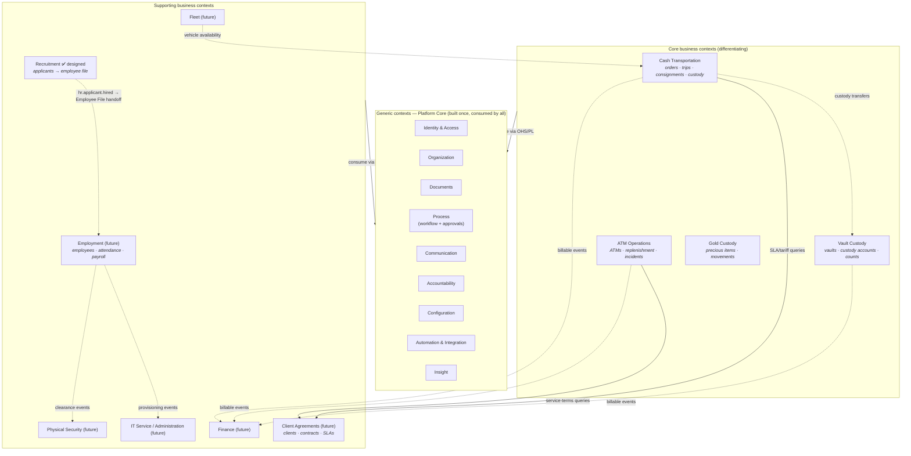

# Bounded Contexts

How the ECMS domain is partitioned into contexts with explicit boundaries, and how those
contexts relate. The context boundaries deliberately **coincide with the architecture's
module/service boundaries** (ADR-001, ADR-003): a bounded context maps to either a Platform
Core service cluster (Layer 1) or a business module (Layer 2), so the linguistic boundary,
the code boundary, and the data-ownership boundary are the same line.

Companion: [Domain Model](domain-model.md) (entity catalogs per context) ·
[Entity Relationships](entity-relationships.md) · [Ubiquitous Language](ubiquitous-language.md).

---

## 1. Context map

Solid arrows = synchronous **query contracts**; dashed arrows = asynchronous **domain
events**. Business contexts never point at each other with anything else.

## 2. Context definitions

### Generic contexts (Platform Core, Layer 1)

| Context | Owns the meaning of | Maps to services |
| --- | --- | --- |
| **Identity & Access** | who someone is, what they may do, at what scope | `auth`, `users`, `rbac` |
| **Organization** | where work happens: the singleton Organization, branches, departments, sections, job titles | `organization` |
| **Documents** | every stored artifact, its versions, integrity, and access | `files` |
| **Process** | how business entities progress: state machines, approvals, delegation, SLAs | `workflow`, `approvals` |
| **Communication** | telling humans things: notifications, templates, preferences, translations | `notifications`, `localization` |
| **Accountability** | what happened: audit facts and human timelines | `audit` |
| **Configuration** | every tunable value and temporary flag | `settings` |
| **Automation & Integration** | scheduled work, document numbering, events in flight, doors to external systems, OCR | `scheduler`, `sequences`, kernel event bus, `integrations`, `ai` |
| **Insight** | finding and summarizing: search, dashboards, reports | `search`, `dashboards`, `reports` |

### Business contexts (Layer 2 modules)

| Context | Module ID | Mission | Status |
| --- | --- | --- | --- |
| **Recruitment** | `hr` (recruitment sub-module) | applicant → hired employee file | ✅ Designed (Milestone 1); implementation from phase 2.3 |
| Employment | `hr` (later sub-modules) | employee lifecycle after hiring | Future design |
| Cash Transportation | `cash-transport` | move value under gapless custody | Future design |
| Vault Custody | `vault` | store and reconcile value | Future design |
| ATM Operations | `atm` | keep client ATMs full and healthy | Future design |
| Gold Custody | `gold-vault` | custody of precious items | Future design |
| Fleet | `fleet` | armored vehicles and their readiness | Future design |
| Client Agreements | `contracts` | who we serve, on what terms | Future design |
| Finance | `accounting` | billable events → invoices → GL export | Future design |
| Physical Security | `security` | guards, shifts, incidents, clearances | Future design |
| IT Service / Administration | `it`, `administration` | assets, tickets, requests | Future design |

## 3. Relationship patterns (which DDD relationship applies where)

| Relationship | Pattern | Rules |
| --- | --- | --- |
| Business context → generic context | **Customer–Supplier** over an **Open Host Service / Published Language** | Platform contracts (`packages/contracts`) are the published language: DTOs, permission keys, event names, the entity-reference shape. Modules conform to the platform's language, never the reverse. Platform contract changes are ADR-governed and versioned (`requiresPlatform`, Review R25). |
| Business context → business context (read) | **Query contract** registered with the platform | The owning context publishes an interface + DTO; consumers depend on the registered interface, never the module (Software Architecture §5). When services split, this becomes HTTP/gRPC without call-site changes. |
| Business context → business context (react) | **Domain events**, reliable tier | Payloads carry IDs + display fields with a `schemaVersion` (Review R22); consumers are idempotent, tolerant readers. Eventual consistency is accepted and made visible in UX. |
| Shared value objects | **Shared Kernel** (deliberately tiny) | Only `contracts/common` value objects (Review R8) and the entity-reference shape. Growing the shared kernel requires an ADR — it is the highest-coupling relationship we allow. |
| Recruitment → Employment | **Handoff artifact** | The Employee File aggregate is assembled in Recruitment and consumed by Employment via the `hr.applicant.hired` event; identity correlation by National ID (Review R9). Employment must re-validate, not trust blindly (anti-corruption at the boundary). |
| Finance ← operational contexts | **Event-carried facts** | Operational contexts emit Billable Events; Finance owns pricing interpretation. Operations never compute money owed. |
| External systems (GL, OCR, email, job boards) | **Anti-Corruption Layer** in Automation & Integration | Connectors translate external models to ours at the edge; no external schema leaks inward (Platform Core §16). |

## 4. Boundary rules (what may never cross)

1. **Mongoose/storage models never cross a context boundary** — only published DTOs and events
   (ADR-005, ADR-008).
2. **Workflow state vocabularies belong to their definition**, not to consuming code; another
   context reacting to a state change listens for the transition event, it does not read the
   state name from a shared enum (ADR-011).
3. **Person data does not merge across contexts**: Applicant ≠ Employee ≠ User. Correlation is
   by National ID; each context re-validates what it imports (Review R9).
4. **Money and value quantities** move between contexts only inside immutable facts (custody
   transfers, billable events) — never as mutable shared state.
5. **The shared kernel is append-only and ADR-gated**; anything context-specific that sneaks
   into `contracts/common` is a review reject.

## 5. Evolution notes

- **Context ≠ deployment**: today every context lives in the modular monolith; the map above
  is also the future microservice cut (ADR-001). Extracting a context = its module folder,
  its prefixed collections, its events moved to a broker.
- **Recruitment ⇄ Employment** will exert pressure to merge into one "HR" context. Resist
  until Employment is designed: the handoff artifact (Employee File) keeps the seam honest,
  and merging later is cheaper than untangling.
- **Gold Custody vs Vault Custody** intentionally share a *pattern* (custody account +
  immutable movements + reconciliation) but not entities — see OQ-6 in the
  [Domain Model](domain-model.md) before assuming otherwise.
