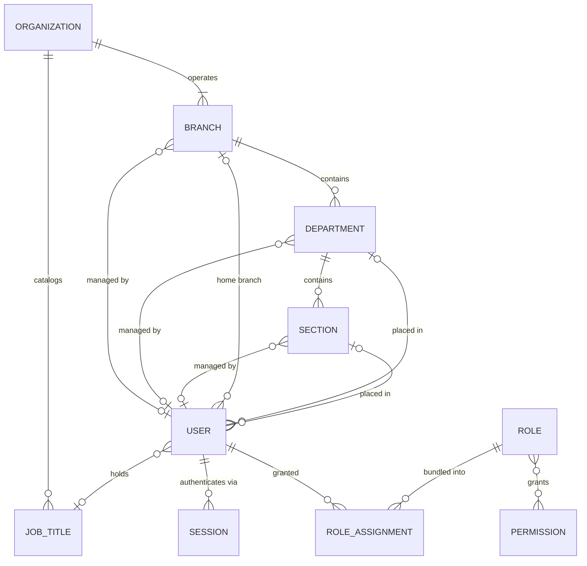
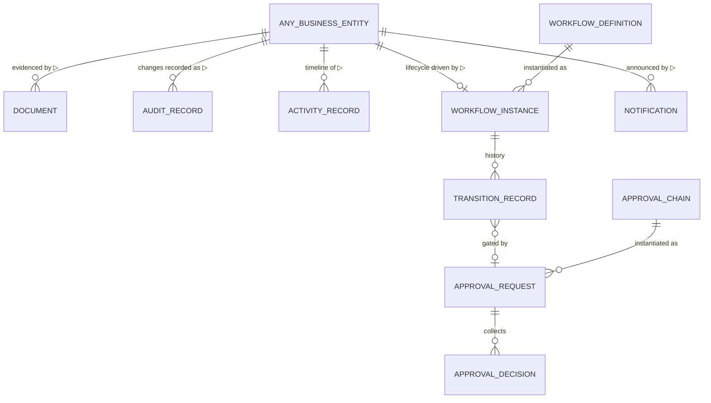
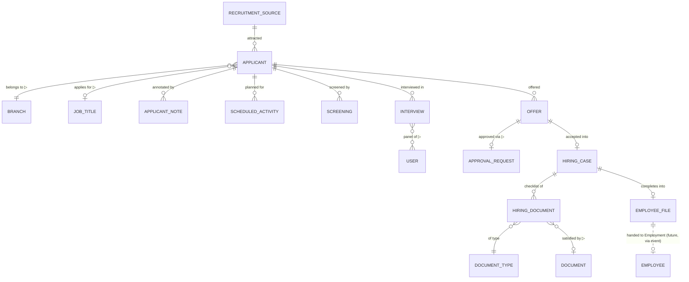
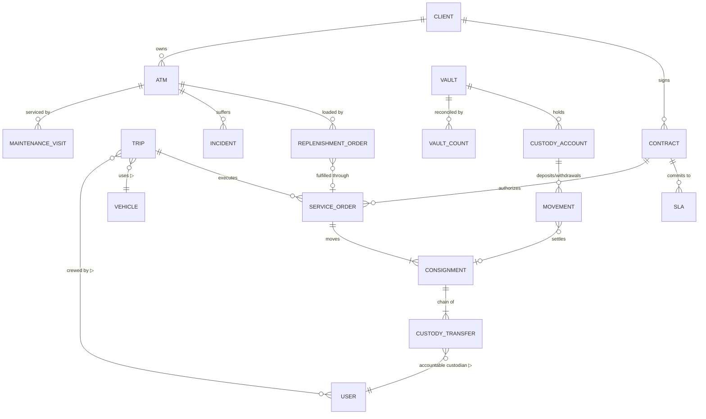

# Entity Relationships

**Conceptual** relationships between domain entities — cardinalities and meaning, no
attributes, no collections, no keys. The *implementation-level* diagrams (fields, indexes,
collections) live in [ER Diagrams](../05-database/er-diagrams.md) and
[Database Design](../05-database/database-design.md); where the two disagree, this document
describes intent and those describe today's storage.

Notation: `——` association with cardinality · `▷` "references by ID across a context
boundary" (never a join).

---

## 1. Identity, organization, and access

Reading guide: a Role Assignment carries its **data scope** (`own | branch | organization`)
and optional validity window — the assignment, not the role, decides how far a permission
reaches. Org units point at their manager (and at most one acting manager window at a time);
approver resolution walks up Section → Department → Branch when a unit has no manager.

## 2. The universal cross-context reference

Documents, audit facts, workflow instances, approvals, and notifications attach to **any**
business entity through one published shape — the entity reference:

This is why platform contexts never know module types: they know the reference, the module
knows the meaning.

## 3. Recruitment

Cardinality notes with business meaning:

- An applicant may be screened and interviewed **multiple times** (re-application, multiple
  rounds); the workflow definition, not code, decides what repetition is legal.
- At most **one open offer** per applicant at a time (an invariant of the Offer aggregate);
  history keeps every offer ever made.
- A hiring document either awaits collection or points at exactly one Document version group.
- If OQ-2 lands on requisition-driven recruiting, `JOB_REQUISITION ||--o{ APPLICANT` becomes
  the anchor relationship and the branch/job-title references above hang off the requisition
  instead — the diagram is drawn applicant-first pending that decision.

## 4. Core operations (future — indicative)

Drawn now to fix vocabulary and the custody chain shape; every entity here awaits its
module's design document.

The one relationship that defines the core business: **Consignment → Custody Transfer is a
gapless, append-only chain** — between any two transfers there is exactly one accountable
custodian, and a vault Movement or client handover is always the closing link of a chain.

## 5. Cross-context dependency summary

| From | To | Via | Meaning |
| --- | --- | --- | --- |
| Every context | Identity & Access | ID reference | actors, assignees, managers, approvers, custodians |
| Every business context | Organization | ID reference | branch scoping of every aggregate |
| Every context | Documents / Accountability / Process / Communication | entity reference | attachments, audit, lifecycle, notifications |
| Recruitment | Employment *(future)* | `hr.applicant.hired` event + Employee File | employment begins |
| Employment | IT Service / Physical Security *(future)* | events | provisioning, clearances |
| Cash Transportation | Vault Custody *(future)* | custody-transfer events | trip ↔ vault settlement |
| Cash Transportation / ATM / Vault | Client Agreements *(future)* | query contract | contract/SLA/tariff validation |
| Operational contexts | Finance *(future)* | billable-event stream | invoicing without operational coupling |
| Fleet | Cash Transportation *(future)* | query contract | vehicle availability for trips |

No other cross-context dependencies are permitted; anything new here is an ADR-level change.
