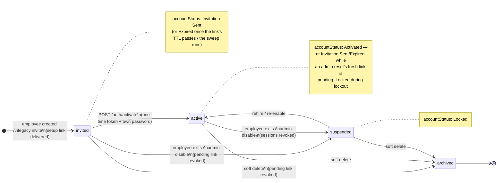
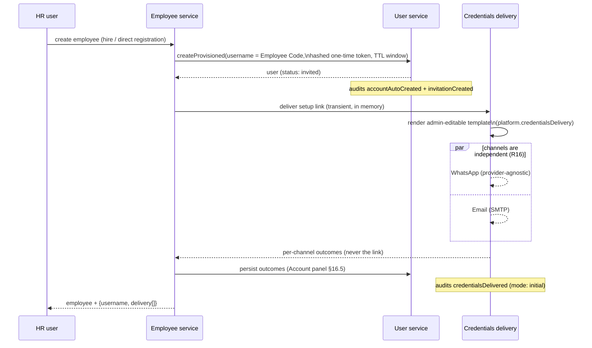
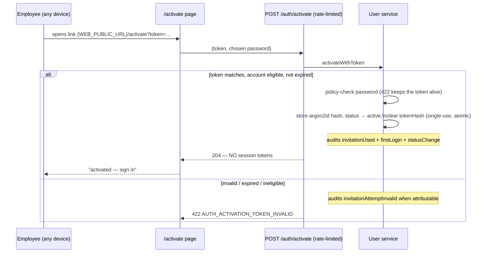
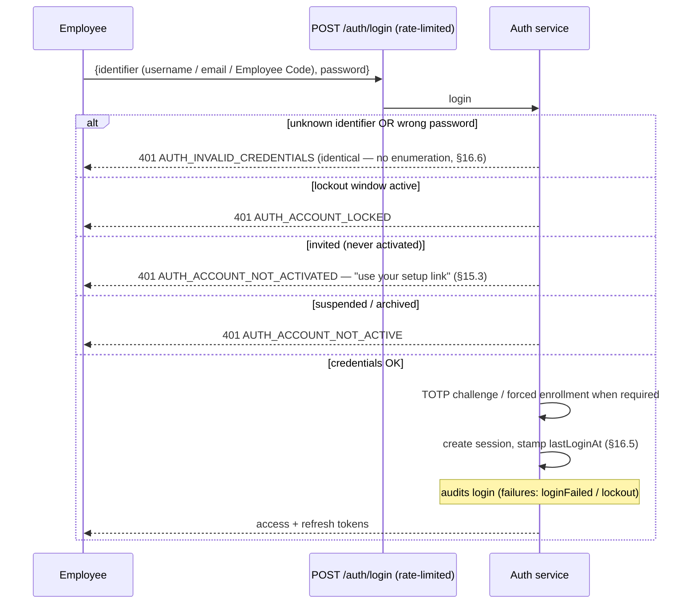
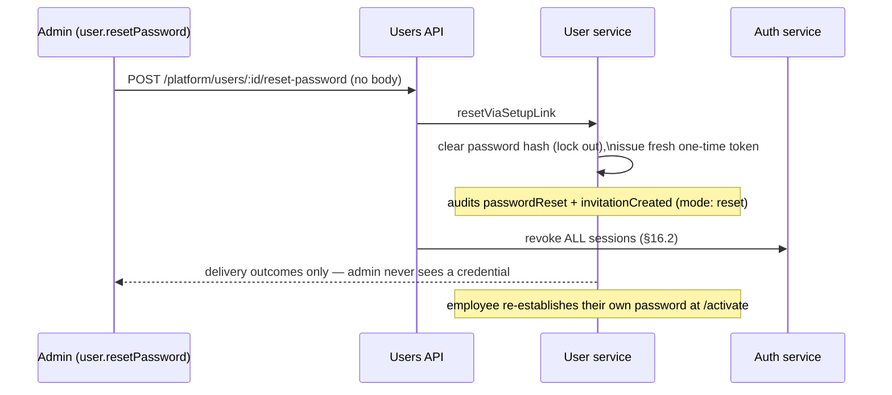

# Account Lifecycle (Authentication & Employee Accounts)

Companion to `docs/02-architecture/platform-identity.md`, governed by the frozen design
`docs/12-planning/auth-account-lifecycle-design.md` (Revisions 1–6). This document carries
the complete lifecycle **state diagram** and the **sequence diagrams** required by §16.7.

Vocabulary: the stored **user status** is `invited → active → suspended → archived`
("disable, never delete"). The **derived** admin-facing `accountStatus`
(Not Invited / Invitation Sent / Activated / Expired / Locked — §15.4) is computed from the
stored status, the pending-link state, and the lockout window; it is never persisted.

## 1. Account state diagram



Derivation rules (§15.4, first match wins): `suspended`/`archived` → **Locked**;
`lockedUntil` in the future → **Locked**; awaiting a link (invited, or active with the
credential cleared by a reset) → **Invitation Sent** while a valid link is pending, else
**Expired**; otherwise **Activated**. An employee with no linked login renders as
**Not Invited** on the employee page.

## 2. Employee creation → provisioning

Provisioning never blocks employee creation (§13 R13); failures are audited and the manual
create-login override (D7) remains.



## 3. Invitation (resend / expiry)

```mermaid
sequenceDiagram
    participant A as Admin
    participant API as Users API
    participant U as User service
    participant S as Hourly sweep
    A->>API: POST /platform/users/:id/credentials/resend
    alt a link is pending
        API->>U: resendSetupLink
        U->>U: new token replaces (and invalidates) the old
        Note over U: audits invitationResent — the supersession record (§16.1)
        U-->>A: fresh delivery outcomes
    else nothing pending (already activated / swept)
        API-->>A: 422 — use reset instead
    end
    S->>U: sweepExpiredInvitations (hourly)
    U->>U: clear expired pending tokens\n(stale secrets never linger)
    Note over U: audits invitationExpired once per invitation;\nsentAt + delivery outcomes SURVIVE (§16.1)
```

## 4. Activation

One-time (§15.1), device-independent (§16.3), MFA-independent (§15.8), and **never** a
session mint (§16.2). The URL carries only the token (§15.6).



## 5. Login



## 6. Password reset (admin)



## 7. Account disable & employee exit

```mermaid
sequenceDiagram
    participant Src as Admin action / Exit engine
    participant U as User service
    participant AU as Auth service (event handler)
    Src->>U: changeStatus → suspended (or archived)
    Note over U: works from active AND invited (§15.5)
    U->>U: revoke any pending setup link\nin the same operation
    Note over U: audits statusChange (+ invitationRevoked when a link died)
    U-->>AU: UserStatusChanged event
    AU->>AU: revoke ALL sessions immediately (§16.2)
    Note over Src: exits keep history — accounts are\nsuspended, never deleted; rehire re-enables
```

## 8. Audit map (quick reference)

| Lifecycle moment | Audit actions |
|---|---|
| Provisioning / legacy invite | `accountAutoCreated`, `invitationCreated`, `credentialsDelivered` |
| Resend | `invitationResent`, `credentialsDelivered` |
| Expiry (hourly sweep) | `invitationExpired` |
| Activation | `invitationUsed`, `firstLogin`, `statusChange` (or `passwordChanged` post-reset) |
| Failed activation attempt | `invitationAttemptInvalid` (when attributable) |
| Login | `login` / `loginFailed` / `lockout` |
| Admin reset | `passwordReset`, `invitationCreated`, `sessionRevoked` |
| Disable / exit / delete | `statusChange` / `delete`, `invitationRevoked`, `sessionRevoked` |
| TOTP | `totpEnrolled` / `totpDisabled` / `totpReset` / `totpRequiredChanged` |
