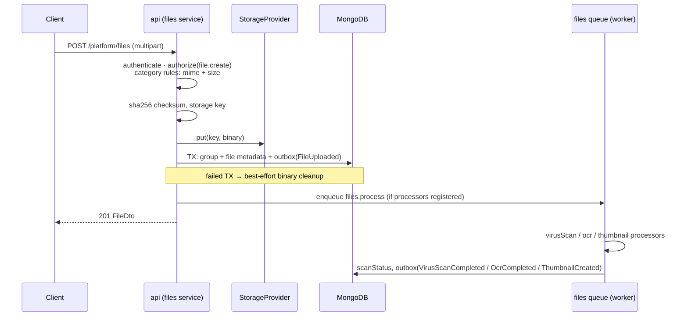
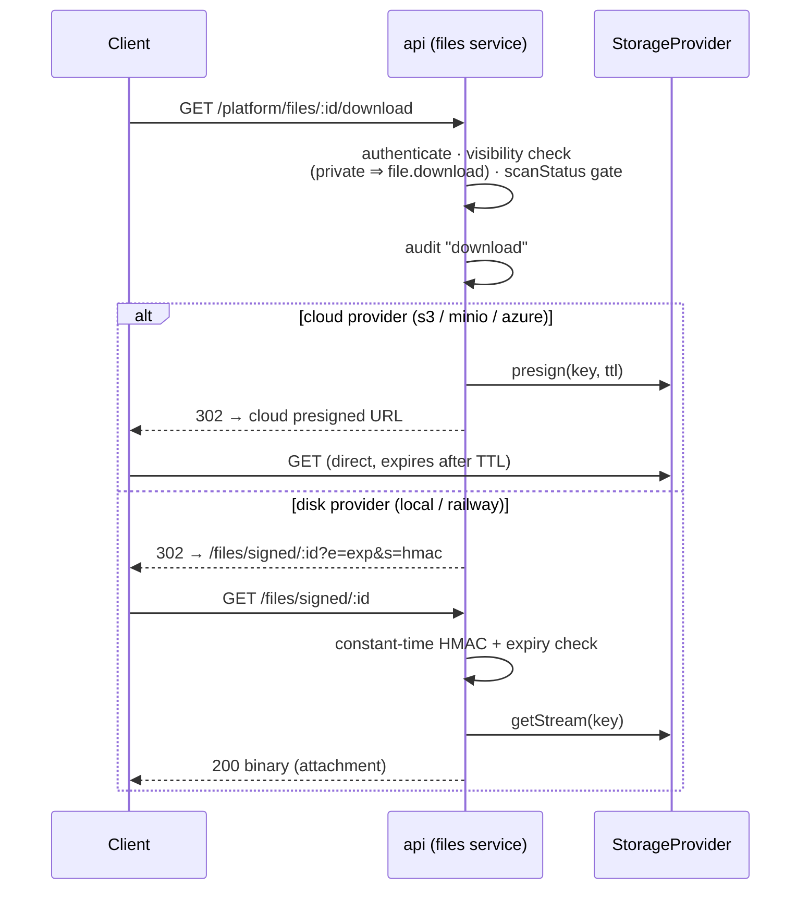

# File Management Service (Sprint 3.1)

Implementation reference for the platform `files` service (design: ADR-010,
[Platform Core §7](platform-core.md)). Generic and reusable by every module: files attach
to any business entity through the standard entity reference and are never touched by
module code directly — modules call this service.

## 1. Storage providers

Binary data never enters MongoDB. Providers implement one interface
(`put · getStream · delete · getSignedUrl`); selection is deployment configuration
(`STORAGE_DRIVER`) validated at boot.

| Driver | Backing store | Presigned URLs | Notes |
| --- | --- | --- | --- |
| `local` | Local filesystem (`STORAGE_LOCAL_ROOT`) | app-signed fallback | default in development/tests |
| `railway` | Railway volume (`RAILWAY_VOLUME_MOUNT_PATH`) | app-signed fallback | the local provider rooted at the mounted volume |
| `s3` | Amazon S3 (`S3_*`) | native (SigV4) | |
| `minio` | MinIO / any S3-compatible store | native (SigV4) | `s3` adapter + `S3_ENDPOINT` + path-style addressing |
| `azure` | Azure Blob Storage (`AZURE_STORAGE_*`) | native (SAS) when shared-key credentials are available | falls back to app signing otherwise |

**Signed-URL abstraction:** `GET /:id/download` always answers with a short-lived URL
(TTL `SIGNED_URL_TTL_SECONDS`). Cloud providers presign natively; disk providers fall back
to the platform's own HMAC-signed streaming endpoint — callers cannot tell the difference,
and no file is ever served statically.

## 2. Metadata

Every version records: original filename · stored filename · MIME type · extension ·
`sha256:` checksum (dedup + integrity) · size · upload timestamp · uploader · entity
reference (module, entity type, entity id) · category · tags · visibility
(`private | public`) · status (`active | archived`) · scan status · storage driver + key.
Versions share a **group** (ADR-010): replace = version n+1, previous versions stay
retrievable; exactly one version is latest.

**Categories** are an admin catalog (`fileCategory.manage`) carrying the intake rules:
allowed MIME types (exact or `type/*`), max size (MB), optional retention days
(enforcement job arrives with a later capability — the rule is data today).

## 3. API

Base: `/api/v1/platform/files` · standard envelope, pagination, error codes.

| Endpoint | Permission | Behavior |
| --- | --- | --- |
| `POST /` (multipart: `file` + fields) | `file.create` | Upload v1 of a new group; category rules enforced; 201 |
| `GET /` | `file.view` | List latest versions; filters: entity ref, category, tag, `status` (default `active`), `search` |
| `GET /:id` | `file.view` | Read metadata |
| `GET /:id/versions` | `file.view` | Version history of the file's group |
| `PATCH /:id` | `file.edit` | Metadata: display name, description, tags, visibility, category (optimistic `version`) |
| `POST /:id/replace` (multipart) | `file.edit` | New content version in the same group; 201 |
| `POST /:id/archive` · `/:id/restore` | `file.edit` | Status transitions; archived files leave default listings |
| `GET /:id/download` | authenticated¹ | 302 redirect to a signed URL (or `?mode=ticket` → `{url, expiresAt}`); **audited per download** |
| `DELETE /:id` | `file.delete` | Soft delete (default for business data) |
| `DELETE /:id/permanent` | `file.purge` ⚠️ break-glass | Removes binary + metadata; audit keeps the fingerprint |
| `GET /signed/:id?e&s` | *none (HMAC capability URL)* | Streams the binary; constant-time signature check, expiry enforced |
| `GET/POST/PATCH/DELETE /platform/file-categories` | `file.view` / `fileCategory.manage` | Category catalog |

¹ Download authorization is **visibility-aware**: `private` requires `file.download`
(denials audited); `public` allows any authenticated user. Files blocked by the virus
scanner are not downloadable (`FILE_BLOCKED`). Per-owning-entity authorization deepens
when the first module consumer lands (files currently scope `own` = uploader).

Error codes: `FILE_TYPE_NOT_ALLOWED`, `FILE_TOO_LARGE`, `FILE_BLOCKED`,
`FILE_SIGNATURE_INVALID`, `FILE_CATEGORY_INACTIVE` (+ standard codes).

## 4. Upload pipeline

## 5. Download via the signed-URL abstraction

## 6. Extension points & events

Post-upload processors register through `registerFileProcessor({id, handler})` and run in
the **worker** on the `files` queue — the service owns the seam, not the implementations:

| Extension point | Processor id | Completion event | Arrives with |
| --- | --- | --- | --- |
| Virus scanning | `virusScan` | `platform.file.virusScanCompleted` (also sets `scanStatus`: `clean`/`blocked`) | integrations capability |
| OCR | `ocr` | `platform.file.ocrCompleted` | AI/OCR capability (ADR-014) |
| Thumbnails | `thumbnail` | `platform.file.thumbnailCreated` | notifications/UI capability |

Lifecycle events (reliable/outbox tier, versioned payloads): `platform.file.uploaded`
(upload **and** replace, carrying `fileVersion`), `.deleted` (soft and permanent —
permanent carries `permanent: true`), `.archived`, `.restored`.

## 7. Operational notes

- Platform-wide upload cap `MAX_UPLOAD_MB` (multer, memory storage); categories can only
  tighten it.
- `STORAGE_SIGNING_SECRET` must be a real secret outside development (boot-enforced).
- Every download and permission denial is audited; `file.purge` use is logged as
  break-glass (Permission Matrix §6 review applies).
