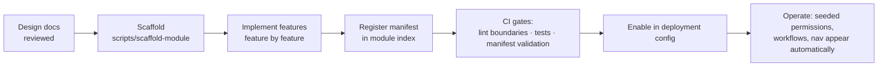

# Module Structure

This document specifies what a **business module** is, its anatomy, its lifecycle, and the rules
it must obey. It is the contract every future module (Fleet, Cash Transportation, ATM, …) is
built against — and the checklist reviewers use.

## 1. Definition

A module is a **self-contained business capability** that plugs into the Platform Core:

- It owns its **data** (module-prefixed collections), **API routes**, **permissions**,
  **workflows**, **UI pages**, **navigation**, **widgets**, and **events**.
- It depends **only** on Layer 1 (Platform Core) and Layer 3 (Shared).
- It can be enabled/disabled per deployment (and, later, per company) without breaking anything else.
- Deleting its folder must leave the rest of the system compiling and running.

## 2. Module anatomy (backend)

```
modules/hr/
├── hr.module.ts                 # ModuleManifest — THE single integration point
├── recruitment/                 # sub-module
│   ├── applicants/              # feature (canonical shape — see Folder Structure §4)
│   ├── screening/
│   ├── interviews/
│   ├── offers/
│   ├── hiring/
│   ├── hiring-documents/
│   └── employee-file/
└── shared/                      # code shared between THIS module's features only
```

### 2.1 The Module Manifest

Everything the platform needs to know about a module is declared in one file:

```ts
// hr.module.ts — conceptual (design-level)
export const hrModule: ModuleManifest = {
  id: 'hr',
  name: { en: 'Human Resources', ar: 'الموارد البشرية' },
  version: '1.0.0',

  permissions: [...applicantPermissions, ...interviewPermissions /* … */],
  routes:      [{ prefix: '/hr', register: registerRecruitmentRoutes }],
  models:      [ApplicantModel /* … */],           // validated: 'hr_' collection prefix
  workflows:   [recruitmentWorkflowDefinition],     // seeded, then DB-managed
  sequences:   [{ key: 'hr.applicant', pattern: 'APP-{YYYY}-{seq:6}', scope: 'company' }],
  navigation:  [{ path: '/hr/applicants', label: {…}, permission: 'applicant.view', icon: 'users' }],
  widgets:     [applicantsBySourceWidget, hiringFunnelWidget],
  searchables: [{ entity: 'applicant', fields: ['fullName', 'nationalId', 'code'],
                  permission: 'applicant.view' }],
  eventSubscriptions: [
    { event: 'platform.approval.completed', handler: onApprovalCompleted },
  ],
  seed: seedHrReferenceData,      // recruitment sources, document checklists, …
};
```

The kernel validates every manifest at boot (unique IDs, permission naming
`<resource>.<action>`, collection prefix = module ID, route prefix = module ID) and **fails the
boot** on violation.

## 3. Module anatomy (frontend)

Mirror image, registered with the web shell:

```ts
// modules/hr/hr.module.ts (web)
export const hrModule: FrontendModuleManifest = {
  id: 'hr',
  routes: hrRoutes,               // lazy-loaded: React.lazy per page
  navigation: [...],              // filtered by useCan() before rendering
  widgets: [...],                 // registered into the dashboard grid
  translations: { en, ar },       // namespaced: 'hr.applicants.title'
};
```

The shell composes: sidebar = platform nav + Σ(module nav visible to the user);
routes = platform routes + Σ(module routes); dashboards pull from the widget registry.

## 4. Communication rules

| Need | Sanctioned mechanism | Forbidden alternative |
|---|---|---|
| Tell the world something happened | Emit a domain event: `eventBus.emit('hr.applicant.hired', payload)` | Calling another module's service |
| React to another module | Subscribe in the manifest (`eventSubscriptions`) | Importing another module's events file |
| Read another module's data | The owning module registers a **query contract** with the platform registry; consumer resolves the interface | Cross-module import or cross-collection join |
| Use files/notifications/workflow/… | Platform service API | Touching Multer, Socket.IO, SMTP, storage directly |

Event payloads carry **IDs + denormalized display fields**, never Mongoose documents.
Events that must survive a crash (side effects with business meaning) go through the
**outbox** → BullMQ path; fire-and-forget UI-ish events may use the in-process bus
([ADR-008](../03-decisions/ADR-008-event-bus.md)).

## 5. Module lifecycle



- **Adding a module** touches: its own folder, one line in the module index, docs. Nothing else.
- **Disabling a module** (config flag) removes its routes, nav, widgets, searchables at boot;
  its data stays untouched.
- **Removing a module** is deleting its folder + its registration line; a data-retention decision
  is made explicitly for its collections.

## 6. Sub-module and feature granularity rules

- A **sub-module** groups features that share a business sub-domain and reference data
  (e.g., `recruitment`). Sub-modules of one module may share code via the module's `shared/`.
- A **feature** owns exactly one aggregate (one primary collection + its value objects).
  If a feature needs a second primary collection, it's two features.
- Feature-internal helpers stay in the feature folder. Promotion path when duplication appears:
  feature → module `shared/` → (only if platform-worthy and business-agnostic) Platform Core.
  Never copy-paste across modules; never promote business logic into Layer 3.

## 7. What a module may never do (review checklist)

- ❌ Import from `modules/<other-module>/**` (lint-enforced).
- ❌ Import from `infrastructure/**` (must go through platform services).
- ❌ Define a permission outside `<own-resource>.<action>` or reuse another module's resource name.
- ❌ Create a collection without the module prefix, or query another module's collections.
- ❌ Register routes outside its own `/api/v1/<module-id>/` prefix.
- ❌ Store files, send emails, or open sockets directly.
- ❌ Hard-code workflow states/transitions in business logic (must read the workflow instance).
- ❌ Skip audit: every mutation goes through the service layer where auditing is applied.
