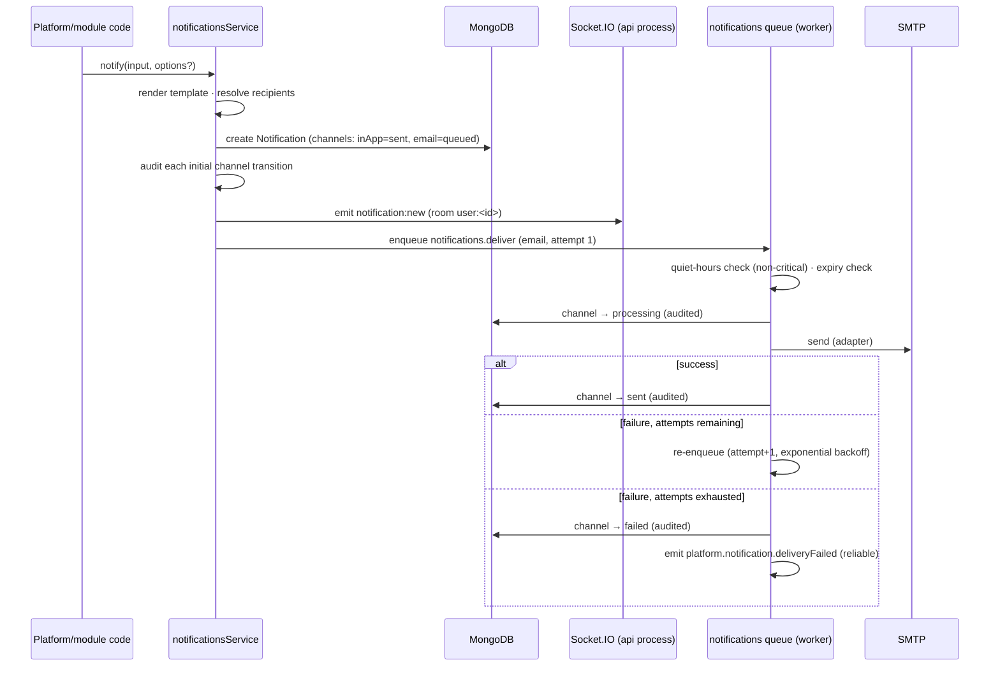

# Notifications Service (Sprint 3.3 / Release v0.5.0)

Implementation reference for the platform `notifications` service (design:
[sprint-3.3-plan.md](../12-planning/sprint-3.3-plan.md)). The one platform-wide
entry point for telling a user something happened: an in-process function call
(`notificationsService.notify()`), never an HTTP endpoint — trusted platform/module code
calls it the same way it calls `auditService.record()`.

## 1. Architecture

```
notify(input, options?) → template lookup (active, latest) → render (§2) →
resolve recipients (§1) → per recipient: idempotency check → create Notification
(in-app channel delivered synchronously) → audit each initial channel → emit
platform.notification.created (in-process) → enqueue other channels (email)
```

- **Recipients** (`NotifyRecipients`): a single `userId`, a `userIds` array, or a
  permission-based fan-out (`{permission, scope: 'organization'}` or
  `{permission, scope: 'branch', branchId}`) resolved via
  `rbacService.listUserIdsWithPermission` — wider-scope-implies-narrower (an
  `organization`-scope holder always qualifies for a `branch`-scope query).
- **In-app is the delivery guarantee.** It is created synchronously inside `notify()`,
  before the function returns; a missed live Socket.IO push is not a lost notification —
  the persisted inbox is. Delivery failure on any *other* channel never throws back to
  the caller.
- **Channel adapters** (`ChannelAdapter { id, send(notification, rendered) }`) are the
  one extension seam — the same shape as `registerFileProcessor` (Sprint 3.1). Two are
  built: `inApp` (Socket.IO live push) and `email` (SMTP via nodemailer). Adding
  `sms`/`push`/`whatsapp` later is a new adapter file, zero changes to `notify()`.
- **Rendering** (`{{variable}}` placeholder substitution only — no conditionals/loops):
  missing declared variables fail fast; extra `data` keys are ignored. One authored
  plain-text `body` per language is rendered into a multipart HTML+text email via a
  generic, code-owned HTML shell (`wrapEmailHtml`) — templates never author HTML.
- **Idempotency**, three independent layers: (1) the existing event-bus dedup (ADR-008)
  for the two wired-up subscribers; (2) an optional caller-supplied `idempotencyKey`
  (unique per recipient); (3) a delivery job past `queued` status is a no-op on a
  duplicate/retried attempt.

## 2. Database model

Three collections, matching the frozen plan exactly (no separate counter/series
collection anywhere):

### `notifications` (append-mostly; no `BaseDocFields`)

`recipientUserId · entityRef · templateKey/templateVersion · category · priority ·
data · title/body {ar,en} · channels[] · readAt · archivedAt · expiresAt ·
idempotencyKey · attachments (file id references, §3f) · createdAt`

Each `channels[]` entry: `channel · status · statusHistory[] · sentAt · deliveredAt ·
readAt · error`. Status lifecycle: `queued → processing → sent → delivered → read` /
`failed` / `cancelled`, with one back-edge — `processing → queued` between retry
attempts (a channel waiting out its backoff is exactly "enqueued, not yet picked up",
the plan's own definition of `queued`) — **every transition is audited**
(`action: 'statusChange'`, entity = the notification). The idempotency guard checks for
status `queued` before proceeding: a stale/duplicate job attempt for a channel already
past that point (`processing` mid-attempt, or any terminal state) no-ops.

### `notification_templates` (versioned; `key + version` unique, `key + isLatest` unique-partial)

`key · version · isLatest · category · priority · subject{ar,en}|null · body{ar,en} ·
channels[] · variables[] · defaultExpiryHours|null · status (active|inactive) ·
createdBy · createdAt`. Every edit — including deactivation — creates a **new
version**; nothing is ever mutated in place. Version allocation is optimistic-insert-
with-retry against the unique `(key, version)` index (no counter collection), wrapped
in a transaction that unsets the old `isLatest` before inserting the new one.

### `notification_preferences` (two logical shapes, one physical collection)

Distinguished by a `kind` discriminator (`preference` | `quietHours`), each with its own
partial unique index, so a query for one never cross-matches the other:

- `kind: 'preference'` — `userId · category · channel · enabled` (unique per triple).
  Preferences key on **category** (10-value closed vocabulary, §3a), not per-template —
  a manageable toggle set ("Fleet notifications"), not fifty individual switches.
- `kind: 'quietHours'` — `userId · enabled · start · end` (`HH:mm`, one row per user).
  Interpreted in **server/UTC time** — the platform has no per-user timezone model
  (`User.locale` is language, not timezone; same documented simplification). Defers
  non-`critical`, *external*-channel delivery only; the in-app row is never deferred.
  `priority: critical` always bypasses it.

## 3. API

Base: `/api/v1/platform` · standard envelope, pagination, error codes.

### Admin — template catalog

| Endpoint | Permission | Notes |
| --- | --- | --- |
| `GET /notification-templates` | `notificationTemplate.view` | latest versions; filter `status`/`category` |
| `POST /notification-templates` | `notificationTemplate.create` | creates version 1 |
| `GET /notification-templates/:id` | `notificationTemplate.view` | one version |
| `GET /notification-templates/:id/versions` | `notificationTemplate.view` | full history for the `key` |
| `PATCH /notification-templates/:id` | `notificationTemplate.edit` | creates a **new version**, not an in-place edit |
| `DELETE /notification-templates/:id` | `notificationTemplate.delete` | new version with `status: inactive` — never a hard delete |
| `POST /notification-templates/:id/preview` | `notificationTemplate.view` | renders against sample `data`; sends nothing |
| `POST /notification-templates/:id/test` | `notificationTemplate.test` *(special)* | sends a rendered preview to the **caller only**, on the requested channel |

### Self-service — inbox & preferences (`authenticate` only, no permission — identity ownership)

| Endpoint | Notes |
| --- | --- |
| `GET /notifications` | mine; filters `unreadOnly`/`entityType`/`entityId`/`category`; paginated |
| `GET /notifications/unread-count` | live query, not a maintained counter |
| `POST /notifications/:id/read` | mine only; first-read-wins (conditional write, idempotent) |
| `POST /notifications/read-all` | mine; marks every currently-unread row |
| `DELETE /notifications/:id` | archive mine |
| `GET /notification-preferences` | mine — per-category rows + `quietHours` |
| `PUT /notification-preferences` | upsert mine, one `{category, channel, enabled}` at a time |
| `PUT /notification-preferences/quiet-hours` | upsert mine — `{enabled, start, end}` |

Error codes: standard codes only (no notifications-specific ones this sprint).

## 4. Delivery pipeline



Retry policy reuses the platform's own queue defaults (ADR-009) — 5 attempts,
exponential backoff (2s, 4s, 8s, 16s, 32s) — tracked via an explicit `attempt` counter
in the job payload (not BullMQ's native throw-based retry), so the handler can
positively detect the final attempt.

## 5. Real-time (Socket.IO)

`initSocketServer`/`emitToRoom` (`infrastructure/realtime`) are generic transport
plumbing with no notifications/auth knowledge; `notification.socket.ts` is the
notifications-aware layer on top: JWT-authenticated connect (same verification as the
HTTP `authenticate` middleware), joins room `user:<id>`. Server → client events:
`notification:new` (payload: `NotificationDto`) and `notification:read` (multi-tab
sync after a REST mark-read call succeeds).

**Cross-process delivery:** Socket.IO only runs in the **api** process, but reliable-
tier event subscribers (e.g. `platform.audit.alertRaised`) run in the **worker**
process (ADR-009) — a `notify()` call from there has no local Socket.IO server to push
through. `infrastructure/realtime/socket-server.ts` closes this gap with a small,
hand-rolled Redis pub/sub relay (`emitToRoom` publishes; every api-process instance
subscribes and re-emits) — the same mechanism already needed for horizontal API
scaling, applied here to the worker/api split. Skipped entirely in tests (single
process, direct local emit only).

Missed notifications while offline are not buffered/redelivered — the client re-fetches
`GET /notifications/unread-count` (and the list, if open) on connect/reconnect. No
acknowledgement protocol: the REST mark-read endpoint is the one source of truth for
read state.

## 6. Events

**Inbound — subscribes to (a deliberately short initial list, BD-006):**

| Event | Recipients | Seed template |
| --- | --- | --- |
| `platform.audit.alertRaised` *(Sprint 3.2, reliable)* | everyone holding `auditLog.view` @ organization | `platform.securityAlertRaised` (`critical`) |
| `platform.roleAssignment.changed` *(Sprint 2.1, in-process)* | the affected `userId` | `platform.roleAssignmentChanged` (`normal`) |

Both seed templates are idempotently ensured at boot (`ensureBuiltinNotificationTemplates`,
same pattern as `organizationService.ensure`/`fileCategoryService.ensure`) so the
subscriptions always have a template to render, in every environment including tests.

**Outbound — new events:**

| Event | Tier | Payload v1 |
| --- | --- | --- |
| `platform.notification.created` | in-process | `{notificationId, recipientUserId, templateKey}` — cache/live-UI seam only |
| `platform.notification.deliveryFailed` | reliable (outbox) | `{notificationId, recipientUserId, channel, templateKey, error}` |

## 7. Scheduling & expiration

- **`sendAt`** (`NotifyOptions`): a future timestamp enqueues a single delayed
  `notifications.scheduledSend` job carrying the serialized input — nothing (not even
  in-app) is created before it fires; expiration is re-checked when it does. A past-due
  `sendAt` sends immediately (send-now path).
- **`expiresAt`** resolves from caller input, else the template's `defaultExpiryHours`,
  else never. Already-past at `notify()` time is a **full no-op** (nothing created on
  any channel). A channel still `queued` when it expires transitions to `cancelled`,
  never `sent`.
- **Recurring delivery is out of scope** — `sendAt` is a one-time timestamp only.

## 8. Settings

| Key | Default | Scope | Purpose |
| --- | --- | --- | --- |
| `notifications.email.enabled` | `true` | org/branch/user | Kill switch consulted when no per-category preference row exists |
| `notifications.quietHours.enabledByDefault` | `false` | organization | Default `enabled` shown when a user has no quiet-hours row |

## 9. Out of scope this sprint

Frontend inbox UI · SMS/push/WhatsApp adapters (interface-ready) · digest/scheduled-
summary notifications (`digestMode` field reserved, unused) · a quiet-hours-expiry
sweep job · an admin "resend a failed delivery" action · notification retention/purge ·
attaching referenced files to email (reference only, §3f) · the administration console
(template management UI, queue monitoring, resend/retry, statistics) · a dedicated
metrics backend.

## 10. Operational notes

- `notify()` is trusted in-process code — no runtime caller-identity check, the same
  trust boundary as `auditService.record()`/`emit()`. It is not reachable over HTTP.
- Channel authorization has two independent halves: what a template **may** use
  (`channels[]`, reviewed at template create/edit time) and what a recipient **will
  accept** (their own preferences + quiet hours) — a recipient's opt-out is never
  overridden, with the single exception of `critical` priority bypassing quiet-hours
  *timing* (never bypassing an outright channel opt-out).
- `SMTP_HOST`/`SMTP_PORT`/`SMTP_USER`/`SMTP_PASSWORD`/`SMTP_SECURE`/
  `NOTIFICATIONS_EMAIL_FROM` configure the mail transport; tests use nodemailer's
  `jsonTransport` (no network).
