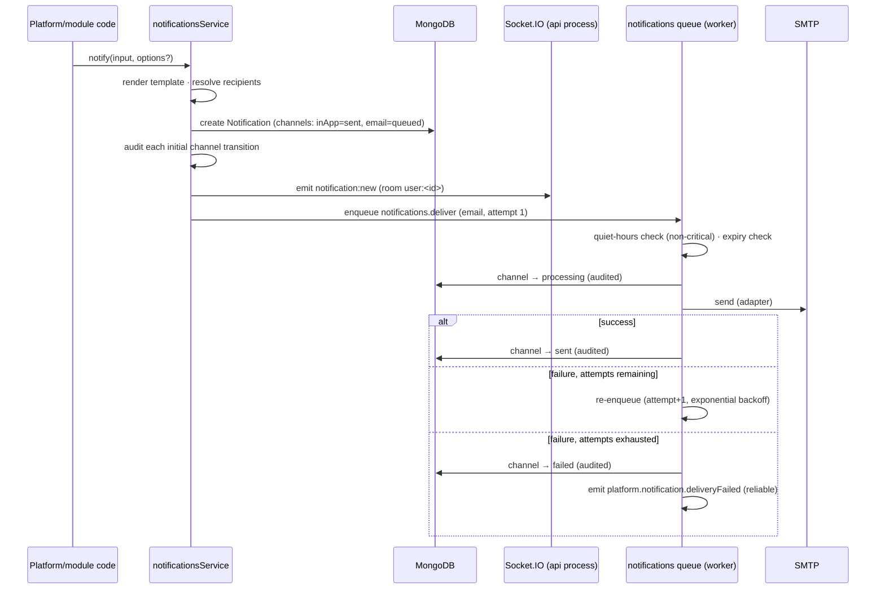

# Notifications Service (Sprint 3.3 / Release v0.5.0)

Implementation reference for the platform `notifications` service (design:
[sprint-3.3-plan.md](../12-planning/sprint-3.3-plan.md)). The one platform-wide
entry point for telling a user something happened: an in-process function call
(`notificationsService.notify()`), never an HTTP endpoint — trusted platform/module code
calls it the same way it calls `auditService.record()`.

## 1. Architecture

```
notify(input, options?) → template lookup (active, latest) → render (§2) →
resolve recipients (§1) → per recipient: idempotency check → create Notification
(in-app channel delivered synchronously) → audit each initial channel → emit
platform.notification.created (in-process) → enqueue other channels (email)
```

- **Recipients** (`NotifyRecipients`): a single `userId`, a `userIds` array, or a
  permission-based fan-out (`{permission, scope: 'organization'}` or
  `{permission, scope: 'branch', branchId}`) resolved via
  `rbacService.listUserIdsWithPermission` — wider-scope-implies-narrower (an
  `organization`-scope holder always qualifies for a `branch`-scope query).
- **In-app is the delivery guarantee.** It is created synchronously inside `notify()`,
  before the function returns; a missed live Socket.IO push is not a lost notification —
  the persisted inbox is. Delivery failure on any *other* channel never throws back to
  the caller.
- **Channel adapters** (`ChannelAdapter { id, send(notification, rendered) }`) are the
  one extension seam — the same shape as `registerFileProcessor` (Sprint 3.1). Three are
  built: `inApp` (Socket.IO live push), `email` (SMTP via nodemailer) and `push`
  (Web Push/VAPID — §11). The seam held: `push` arrived as one adapter file and one
  capability check, with no change to `notify()`'s own flow. Adding `sms`/`whatsapp`
  later is the same move again.
- **Rendering** (`{{variable}}` placeholder substitution only — no conditionals/loops):
  missing declared variables fail fast; extra `data` keys are ignored. One authored
  plain-text `body` per language is rendered into a multipart HTML+text email via a
  generic, code-owned HTML shell (`wrapEmailHtml`) — templates never author HTML.
- **Idempotency**, three independent layers: (1) the existing event-bus dedup (ADR-008)
  for the two wired-up subscribers; (2) an optional caller-supplied `idempotencyKey`
  (unique per recipient); (3) a delivery job past `queued` status is a no-op on a
  duplicate/retried attempt.

## 2. Database model

Three collections, matching the frozen plan exactly (no separate counter/series
collection anywhere):

### `notifications` (append-mostly; no `BaseDocFields`)

`recipientUserId · entityRef · templateKey/templateVersion · category · priority ·
data · title/body {ar,en} · channels[] · readAt · archivedAt · expiresAt ·
idempotencyKey · attachments (file id references, §3f) · createdAt`

Each `channels[]` entry: `channel · status · statusHistory[] · sentAt · deliveredAt ·
readAt · error`. Status lifecycle: `queued → processing → sent → delivered → read` /
`failed` / `cancelled`, with one back-edge — `processing → queued` between retry
attempts (a channel waiting out its backoff is exactly "enqueued, not yet picked up",
the plan's own definition of `queued`) — **every transition is audited**
(`action: 'statusChange'`, entity = the notification). The idempotency guard checks for
status `queued` before proceeding: a stale/duplicate job attempt for a channel already
past that point (`processing` mid-attempt, or any terminal state) no-ops.

### `notification_templates` (versioned; `key + version` unique, `key + isLatest` unique-partial)

`key · version · isLatest · category · priority · subject{ar,en}|null · body{ar,en} ·
channels[] · variables[] · defaultExpiryHours|null · status (active|inactive) ·
createdBy · createdAt`. Every edit — including deactivation — creates a **new
version**; nothing is ever mutated in place. Version allocation is optimistic-insert-
with-retry against the unique `(key, version)` index (no counter collection), wrapped
in a transaction that unsets the old `isLatest` before inserting the new one.

### `notification_preferences` (two logical shapes, one physical collection)

Distinguished by a `kind` discriminator (`preference` | `quietHours`), each with its own
partial unique index, so a query for one never cross-matches the other:

- `kind: 'preference'` — `userId · category · channel · enabled` (unique per triple).
  Preferences key on **category** (10-value closed vocabulary, §3a), not per-template —
  a manageable toggle set ("Fleet notifications"), not fifty individual switches.
- `kind: 'quietHours'` — `userId · enabled · start · end` (`HH:mm`, one row per user).
  Interpreted in **server/UTC time** — the platform has no per-user timezone model
  (`User.locale` is language, not timezone; same documented simplification). Defers
  non-`critical`, *external*-channel delivery only; the in-app row is never deferred.
  `priority: critical` always bypasses it.

## 3. API

Base: `/api/v1/platform` · standard envelope, pagination, error codes.

### Admin — template catalog

| Endpoint | Permission | Notes |
| --- | --- | --- |
| `GET /notification-templates` | `notificationTemplate.view` | latest versions; filter `status`/`category` |
| `POST /notification-templates` | `notificationTemplate.create` | creates version 1 |
| `GET /notification-templates/:id` | `notificationTemplate.view` | one version |
| `GET /notification-templates/:id/versions` | `notificationTemplate.view` | full history for the `key` |
| `PATCH /notification-templates/:id` | `notificationTemplate.edit` | creates a **new version**, not an in-place edit |
| `DELETE /notification-templates/:id` | `notificationTemplate.delete` | new version with `status: inactive` — never a hard delete |
| `POST /notification-templates/:id/preview` | `notificationTemplate.view` | renders against sample `data`; sends nothing |
| `POST /notification-templates/:id/test` | `notificationTemplate.test` *(special)* | sends a rendered preview to the **caller only**, on the requested channel |

### Self-service — inbox & preferences (`authenticate` only, no permission — identity ownership)

| Endpoint | Notes |
| --- | --- |
| `GET /notifications` | mine; filters `unreadOnly`/`entityType`/`entityId`/`category`; paginated |
| `GET /notifications/unread-count` | live query, not a maintained counter |
| `POST /notifications/:id/read` | mine only; first-read-wins (conditional write, idempotent) |
| `POST /notifications/read-all` | mine; marks every currently-unread row |
| `DELETE /notifications/:id` | archive mine |
| `GET /notification-preferences` | mine — per-category rows + `quietHours` |
| `PUT /notification-preferences` | upsert mine, one `{category, channel, enabled}` at a time |
| `PUT /notification-preferences/quiet-hours` | upsert mine — `{enabled, start, end}` |

Error codes: standard codes only (no notifications-specific ones this sprint).

## 4. Delivery pipeline


```mermaid
sequenceDiagram
    participant Caller as Platform/module code
    participant N as notificationsService
    participant M as MongoDB
    participant Sock as Socket.IO (api process)
    participant Q as notifications queue (worker)
    participant Mail as SMTP

    Caller->>N: notify(input, options?)
    N->>N: render template · resolve recipients
    N->>M: create Notification (channels: inApp=sent, email=queued)
    N->>N: audit each initial channel transition
    N->>Sock: emit notification:new (room user:<id>)
    N->>Q: enqueue notifications.deliver (email, attempt 1)
    Q->>Q: quiet-hours check (non-critical) · expiry check
    Q->>M: channel → processing (audited)
    Q->>Mail: send (adapter)
    alt success
        Q->>M: channel → sent (audited)
    else failure, attempts remaining
        Q->>Q: re-enqueue (attempt+1, exponential backoff)
    else failure, attempts exhausted
        Q->>M: channel → failed (audited)
        Q->>Q: emit platform.notification.deliveryFailed (reliable)
    end
```

Retry policy reuses the platform's own queue defaults (ADR-009) — 5 attempts,
exponential backoff (2s, 4s, 8s, 16s, 32s) — tracked via an explicit `attempt` counter
in the job payload (not BullMQ's native throw-based retry), so the handler can
positively detect the final attempt.

## 5. Real-time (Socket.IO)

`initSocketServer`/`emitToRoom` (`infrastructure/realtime`) are generic transport
plumbing with no notifications/auth knowledge; `notification.socket.ts` is the
notifications-aware layer on top: JWT-authenticated connect (same verification as the
HTTP `authenticate` middleware), joins room `user:<id>`. Server → client events:
`notification:new` (payload: `NotificationDto`) and `notification:read` (multi-tab
sync after a REST mark-read call succeeds).

**Cross-process delivery:** Socket.IO only runs in the **api** process, but reliable-
tier event subscribers (e.g. `platform.audit.alertRaised`) run in the **worker**
process (ADR-009) — a `notify()` call from there has no local Socket.IO server to push
through. `infrastructure/realtime/socket-server.ts` closes this gap with a small,
hand-rolled Redis pub/sub relay (`emitToRoom` publishes; every api-process instance
subscribes and re-emits) — the same mechanism already needed for horizontal API
scaling, applied here to the worker/api split. Skipped entirely in tests (single
process, direct local emit only).

Missed notifications while offline are not buffered/redelivered — the client re-fetches
`GET /notifications/unread-count` (and the list, if open) on connect/reconnect. No
acknowledgement protocol: the REST mark-read endpoint is the one source of truth for
read state.

## 6. Events

**Inbound — subscribes to (a deliberately short initial list, BD-006):**

| Event | Recipients | Seed template |
| --- | --- | --- |
| `platform.audit.alertRaised` *(Sprint 3.2, reliable)* | everyone holding `auditLog.view` @ organization | `platform.securityAlertRaised` (`critical`) |
| `platform.roleAssignment.changed` *(Sprint 2.1, in-process)* | the affected `userId` | `platform.roleAssignmentChanged` (`normal`) |

Both seed templates are idempotently ensured at boot (`ensureBuiltinNotificationTemplates`,
same pattern as `organizationService.ensure`/`fileCategoryService.ensure`) so the
subscriptions always have a template to render, in every environment including tests.

**Outbound — new events:**

| Event | Tier | Payload v1 |
| --- | --- | --- |
| `platform.notification.created` | in-process | `{notificationId, recipientUserId, templateKey}` — cache/live-UI seam only |
| `platform.notification.deliveryFailed` | reliable (outbox) | `{notificationId, recipientUserId, channel, templateKey, error}` |

## 7. Scheduling & expiration

- **`sendAt`** (`NotifyOptions`): a future timestamp enqueues a single delayed
  `notifications.scheduledSend` job carrying the serialized input — nothing (not even
  in-app) is created before it fires; expiration is re-checked when it does. A past-due
  `sendAt` sends immediately (send-now path).
- **`expiresAt`** resolves from caller input, else the template's `defaultExpiryHours`,
  else never. Already-past at `notify()` time is a **full no-op** (nothing created on
  any channel). A channel still `queued` when it expires transitions to `cancelled`,
  never `sent`.
- **Recurring delivery is out of scope** — `sendAt` is a one-time timestamp only.

## 8. Settings

| Key | Default | Scope | Purpose |
| --- | --- | --- | --- |
| `notifications.email.enabled` | `true` | org/branch/user | Kill switch consulted when no per-category preference row exists |
| `notifications.quietHours.enabledByDefault` | `false` | organization | Default `enabled` shown when a user has no quiet-hours row |

## 9. Out of scope this sprint

Frontend inbox UI · SMS/WhatsApp adapters (interface-ready; `push` shipped later — §11) ·
digest/scheduled-
summary notifications (`digestMode` field reserved, unused) · a quiet-hours-expiry
sweep job · an admin "resend a failed delivery" action · notification retention/purge ·
attaching referenced files to email (reference only, §3f) · the administration console
(template management UI, queue monitoring, resend/retry, statistics) · a dedicated
metrics backend.

## 10. Operational notes

- `notify()` is trusted in-process code — no runtime caller-identity check, the same
  trust boundary as `auditService.record()`/`emit()`. It is not reachable over HTTP.
- Channel authorization has two independent halves: what a template **may** use
  (`channels[]`, reviewed at template create/edit time) and what a recipient **will
  accept** (their own preferences + quiet hours) — a recipient's opt-out is never
  overridden, with the single exception of `critical` priority bypassing quiet-hours
  *timing* (never bypassing an outright channel opt-out).
- `SMTP_HOST`/`SMTP_PORT`/`SMTP_USER`/`SMTP_PASSWORD`/`SMTP_SECURE`/
  `NOTIFICATIONS_EMAIL_FROM` configure the mail transport; tests use nodemailer's
  `jsonTransport` (no network).

## 11. Web Push (`push` channel)

The browser's own notification, on a device that is not looking at ECMS. One adapter file
(`channel-adapters/push.adapter.ts`), one collection, and one new question asked inside
`notify()` — nothing about the pipeline above changes.

### Configuration, and the state where there is none

`VAPID_PUBLIC_KEY` / `VAPID_PRIVATE_KEY` / `VAPID_SUBJECT`. Generate a pair once per
deployment (`npx web-push generate-vapid-keys`); the private key is a secret.

**Both empty is a supported, working state** — dev, CI and any deployment that has not set
this up behave exactly as they did before push existed: no push row is ever created, the
browser is never asked for a permission it would have nothing to receive on, and the
preferences page says the server has not set it up rather than showing a dead switch. A
**half** pair fails the boot (`initPushChannel`), because it is a typo or a half-finished
secrets copy, never a decision — and the alternative is a `web-push` error inside a worker
retry hours after the deploy.

### `push_subscriptions`

`userId · endpoint (unique) · keys{p256dh,auth} · userAgent · createdAt · lastSeenAt ·
failureCount`

**The endpoint is the identity, not the user.** A subscription belongs to a BROWSER — one
person with a laptop and a phone has two rows — and the push service keeps accepting
deliveries for an endpoint until it is removed, whoever is signed in. So `endpoint` is
unique across the whole collection and the same endpoint arriving for a second user
*re-owns* the row: on a shared machine, the first person's notifications must not keep
arriving on the second person's screen.

### When a notification gets a push channel at all

Push is the first channel with a **capability** question, and `notify()` asks it *before*
any preference (`push-eligibility.shouldOfferPush`): a deployment with no VAPID pair, or a
recipient with no registered device, gets **no push channel row** — the same quiet shape an
opt-out already produces.

The ordering is the load-bearing part. A preference row cannot answer a capability
question: somebody who enabled push on a laptop and then removed that browser still has
`enabled: true` on record, and honouring it would put a push row on every notification they
receive — delivering nothing, retrying five times, and settling on `failed` with a
`deliveryFailed` event, for something they read in the app an hour earlier. Across a
company-wide announcement, thousands of them.

### Delivery

Queued and retried exactly like email, from the same `notifications.deliver` job. Within
one delivery the adapter fans out across the recipient's devices and reports success when
**any** of them took it — a phone that has been off since Friday must not earn a retry that
re-pushes to the laptop that already buzzed.

Failures are sorted into two kinds, which is the difference between a self-healing table and
one that rots: **404/410** means the push service has disowned the endpoint for good, and the
row is deleted on sight; **anything else** (a 503, a timeout) is soft, counted, and forgiven
up to `MAX_PUSH_FAILURES` — deleting a live device because the push service had a bad minute
loses a real person's notifications, and their only clue would be that they stopped arriving.

The payload is **encrypted to the device's own keys** before it leaves this process; neither
Google's nor Mozilla's push service can read it. That is what makes it acceptable to send the
real title and body rather than a stub. What must not go in one is anything the recipient
would not want on a lock screen — a decision for whoever authors the template.

### The browser half

`apps/web/public/sw.js` carries the `push` and `notificationclick` handlers — the worker the
installable-app work already added. A push always calls `showNotification` (browsers revoke
the permission of a site that receives a push and shows nothing), notifications are tagged by
notification id so a retry replaces rather than stacks, and a click focuses an ECMS tab that
is already open instead of opening a fourth window.

`GET /platform/push/config` · `GET|POST|DELETE /platform/push/subscriptions` are self-scoped
(identity ownership, no permission), like the inbox and the preferences beside them. Only the
**public** key is served: it identifies this server to the push service and can encrypt
nothing on its own.

**iOS needs the app installed.** Safari delivers Web Push only to a PWA added to the Home
Screen (16.4+), which is what the manifest work shipped for. A plain iOS tab reports
`unsupported`, and the preferences page says so rather than offering a switch that cannot work.

## 12. HR announcements (`hr.announcement`)

Everything else the platform notifies about is a CONSEQUENCE — a leave request was decided,
a contract expired. An announcement is the other kind: a message a human writes, whose
recipients are **chosen** rather than derived. That choice is the whole feature; delivery is
one `notify()` call against a seeded carrier template
(`{{titleAr}}/{{titleEn}}/{{bodyAr}}/{{bodyEn}}`, category `hr`, priority `normal`), so an
announcement inherits channels, opt-outs, quiet hours, both languages, the queue, the
retries and push without a second delivery path existing.

`critical` is deliberately not offered to a sender: it is the priority that bypasses quiet
hours, and a company notice is not a security alert however urgent it feels at 11pm.

### Audience

Three shapes (`AnnouncementAudienceSchema`): `everyone`, a hand-picked `employees` list, or
a `filter`.

A filter is an **AND of ORs** — every criterion set must hold, and within one criterion any
listed value qualifies, which is how "the drivers and the guards, in Maadi and Giza" comes
out as two criteria of two values rather than four sends. Criteria span organisational
placement (branch/department/section/job title/manager), employment (type, status) and
personal attributes (gender, religion, nationality, marital status). The two free-text ones
are offered from `GET /hr/announcements/audience-options`, which reads the values employee
files actually hold — a hardcoded list would silently fail to match the day somebody spelled
one differently.

`everyone` is a separate case rather than an empty filter, and `{}` is **refused**: reaching
the whole company has to be said out loud, so it can never be what somebody gets by clearing
a criterion and not noticing.

**Ended employments are excluded unless asked for.** A login outlives an exit, so the
employed statuses are the default for a filter and for `everyone`. A hand-picked list does
not get that default — naming somebody is the intent, and a final payslip notice legitimately
goes to a person who has left.

### The ceiling

An audience resolves through `employeeRepository.listForAudience(criteria, scope)`, and the
scope is `scopeSelector(ctx, 'employee.view')` — the same selector every employee list already
goes through. So **what a sender may SEE is what they may ADDRESS**: a branch-scoped HR
manager who names three branches still reaches only their own, and the intersection is applied
by the repository rather than re-derived here, because an intersection re-derived is one that
can be written as a union by mistake.

`announcement.send` is its own permission. Reading the registry and MESSAGING everybody in it
are different powers — plenty of people may legitimately list employees, very few should be
able to put a notification on all their screens at once. That key decides *whether*; the scope
above decides *how far*.

### Preview before send

`POST /hr/announcements/preview` resolves an audience without creating anything and returns
`matched` / `recipients` / `unreachable` plus a few names. The compose screen disables sending
until it has run, and retires the count on every edit to the audience: a stale number is worse
than none, because it is the number a person remembers having seen.

`unreachable` is the number this exists for. An audience is chosen in EMPLOYEES and delivered
to LOGINS, and the two are not the same set — a company of 300 with 180 accounts reaches 180
people, and a sender told only "sent to everyone" is wrong about their own announcement in a
way nothing corrects.

### The record

`hr_announcements` stores what was sent, to which audience, by whom, with the counts **frozen
at send time**. Re-running the filter tomorrow answers a different question: people join,
transfer and leave, and a filter is a description of a moment. The row is written before
`notify()` and unconditionally, so an audience that turned out empty still leaves an answer to
"what did we announce?".

## 13. HR notification rules (`hr.notificationRule`)

§12 gave HR a message it writes and sends. This is the same message sent by something that
**happened** instead of by somebody clicking send: a leave request decided, a contract expired,
a probation ended.

Nothing here is a new mechanism. The platform's event catalogue names the triggers, the
automation filter form states the conditions, the §12 audience shapes say who hears about it,
and `notificationsService.notify()` delivers it. What is new is one row in
`hr_notification_rules` tying those together, and the guards around installing one.

### The seam

`rule-bridge.ts` subscribes as an **ordinary event consumer** — the same decision the automation
trigger bridge made, for the same reason: no new bus, no new delivery guarantee, no change to any
publisher. A business module emits `hr.leave.decided` inside its transaction exactly as before,
and the bridge, downstream of that commit, decides which rules the event answers.

One subscription per cataloged event, generated from `eventCatalogNames()` rather than listed by
hand, all pointing at one handler id (`notificationRules.dispatch`). The bus dedups reliable
delivery on `${eventId}:${handlerId}`, so one logical consumer is what this is. Most events match
no rule, and that answer costs one indexed query on `{event, enabled, isDeleted}`.

**It never throws into the bus.** A rule pointed at a field that does not exist, an audience that
resolves to nobody, a notification service having a bad minute — none of it may fail the delivery
of a business event to its other consumers. The event already happened; a rule is a courtesy on
top of it, and a courtesy that can break the thing it is attached to is a liability. The whole
handler is wrapped and every rule is independent of every other.

### Two audiences only an event can offer

Three of the four shapes are §12's, reused whole — a rule that means "everybody in Maadi" must
not describe that differently from a person who means the same thing. The additions are the
reason the feature is worth having:

- **`subject`** — the person the event is **about**, read from its payload at a dot path.
  "Their leave was approved, tell them" cannot be written as a static audience: the recipient is
  different every time the rule fires. `includeManager` adds their reporting manager, looked up
  as another employee rather than assumed from the id on the subject's record.
- **`permission`** — everyone holding a permission at organization scope. "Tell whoever can
  approve this" names a responsibility rather than a list, so it stays correct as the people
  holding it change.

### Everything here fights the same failure

A rule that gets any of this wrong is **enabled, green, and silent**. There is no error, no log
line, no failed run — just a notification that never comes, and a person waiting for it who
concludes the system works differently than they thought. Each guard below exists for one shape
of that.

**Validated at save time, not at dispatch.** `rule-validation.ts` reuses automation's
`validateTrigger` whole — a rule and a workflow trigger ask the same question of the same
catalogue, and two implementations is how the answers start to differ. On top of it, a `subject`
path is checked against the event's declared fields and a `permission` key against the permission
registry. Errors block the save; warnings (an undeclared payload, a deprecated event, a name with
two publishers) are shown and the save proceeds.

**The reach count comes from the same function the bridge uses.** `POST /check` returns how many
people the audience comes to right now, resolved by `resolveUserIds` — never a second
implementation, because the two disagreeing is what makes a preview worse than none. `subject` is
honestly `null`: its recipient is read from each event's payload, so there is no answer until one
arrives. `0` is a real answer and an important one.

**`firedCount` and `lastFiredAt` are on the list.** A rule that has never fired looks exactly
like one that fires correctly, until somebody asks why a notification never came.

**A placeholder the payload has no value for is left standing.** `{{employeeNam}}` arrives in the
message as literal text rather than blanking to `عقد  انتهى`, which is what makes a mistyped
field name visible in the one place somebody will look.

### The loop, guarded twice

A rule sends a notification; creating one emits `platform.notification.created`; a rule on **that**
answers its own output for ever, at machine speed, on real people's phones. The loop is one
dropdown selection away.

So `isRuleTriggerable()` refuses the whole `platform.notification.` family at save time, **and**
`ruleEventSubscriptions()` never subscribes to it. Both, because they stop different things: the
first stops somebody creating the loop, the second stops a rule that predates the check — or one
written straight into the database — from finding an event to loop on. A depth counter would also
stop it, eventually, after some number of rounds of real notifications.

### Authoring is organization-wide, and refusal is enabled-only

`notificationRule.manage` is separate from `announcement.send`. Sending an announcement is one
act by a person who is present; a rule is a **standing** power for the system to message people on
its own, repeatedly, with nobody watching — nearer to granting a permission than to sending a
message.

It must also be held at **organization** scope, read from the grant itself rather than through
`scopeSelector` (whose active-branch narrowing is about which records a screen shows). §12's
audience is bounded by what its sender may see, because it resolves while they are standing
there. A rule resolves later, from a handler with no caller, so there is nothing to bound it by at
that moment — the entire bound is applied at authoring time.

Validation applies **only to an enabled rule**. A disabled one is saveable however broken it is,
the same latitude automation gives an unfireable trigger as a draft — but the reason that matters
most is the other direction: **turning a rule off must always work.** If validation guarded every
write, a rule that became invalid after the fact could no longer be disabled, and disabling it is
precisely what somebody is trying to do at that moment.

### One send per reading language, shared

The bilingual split §12 describes now lives in `send-localised.ts`, used by both the announcement
service and the rule bridge. The two must not answer the language question differently: one of
them getting it wrong means an English reader receiving Arabic, which is exactly the kind of
defect that survives review because it looks right to whoever wrote it.
