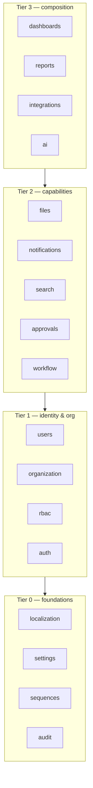

# Platform Core — Service Designs

The Platform Core (Layer 1) is the product being built in Milestone 2. Business modules are
customers of these services. Each service below is specified by responsibility, key entities,
public contract (conceptual), and dependencies.

**Internal dependency order (initialization order at boot):**

Lower tiers never depend on higher tiers. Everything may use `audit`, `settings`, `localization`.

---

## 1. Authentication (`auth`)

**Responsibility:** verify identity and manage sessions. *Nothing else* — user data belongs to
`users`, permissions to `rbac`.

- **Tokens** ([ADR-006](../03-decisions/ADR-006-jwt-refresh-tokens.md)): short-lived JWT access
  token (15 min) + rotating refresh token (7 days, httpOnly secure cookie). Refresh tokens are
  persisted (hashed) per device/session; **rotation with reuse detection** revokes the whole
  session family on replay.
- **Session registry:** users can list and revoke their active sessions; admins can force-logout.
- **Password policy:** configurable via `settings` (length, complexity, expiry, history).
  Hashing with argon2id.
- **Account protection:** login rate limiting (Redis), lockout after N failures, audit of every
  auth event (login, logout, refresh, failure, lockout).
- **Future-ready:** 2FA (TOTP) and SSO (OIDC) slots designed into the login pipeline as steps.

**Contract:** `login(credentials) → tokens`, `refresh(token) → tokens`, `logout(sessionId)`,
`verifyAccessToken(jwt) → AuthContext`.
`AuthContext = { userId, companyId, branchId, permissions[], scope, locale, sessionId }` — the
object every request carries.

## 2. Users (`users`)

**Responsibility:** user accounts and profiles.

- Entities: **User** (credentials reference, status: `active | suspended | archived`, profile,
  locale, avatar fileId), linkage to organization (company, branch, department, section, job title).
- A user is **not** an employee — HR's Employee entity will *reference* a platform User.
  Platform stays business-agnostic.
- Lifecycle: invite → activate → suspend → archive (never hard-delete; audit integrity).

## 3. Roles & Permissions (`rbac`)

**Responsibility:** the authorization model ([ADR-004](../03-decisions/ADR-004-permission-based-authorization.md),
full model in [Security Architecture](../06-security/security-architecture.md)).

- **Permission registry:** permissions are *declared in code* by platform services and module
  manifests (`applicant.create`, …), synced to DB at boot. The DB never invents permissions;
  the code never checks unregistered ones.
- **Roles** group permissions; roles are data (admin-managed), permissions are code.
  System roles (`super-admin`, `platform-admin`) are seeded and protected.
- **Assignments:** user → roles, optionally scoped (`role X in branch Y`).
- **Data scopes:** per assignment: `own | branch | company | all` — enforced by the repository
  base class, not by each feature.
- **Evaluation:** effective permission set computed at login, cached in Redis, invalidated on
  role/assignment change (cache key versioned per user).

**Contract:** `can(ctx, permission, resource?) → boolean`, `getEffectivePermissions(userId)`,
`registerPermissions(moduleId, defs[])`.

## 4. Organization (`organization`)

**Responsibility:** the corporate structure every record hangs off.

- Hierarchy: **Company → Branch → Department → Section**; **Job Title** is a company-level
  catalog referenced by users/employees.
- All entities: localized names (ar/en), code (unique, sequence-generated), status, hierarchy path
  (materialized path for fast subtree queries).
- The org tree is read-heavy → cached in Redis, invalidated on change.
- Moves/merges of org units are audited and workflow-approvable.

## 5. Settings (`settings`)

**Responsibility:** every configurable value in the system, hierarchical and typed.

- **Resolution chain:** user → branch → company → system default.
- Settings are **declared in code** (key, Zod type, default, scope levels allowed, UI metadata)
  by platform services and modules; values live in DB. Unknown keys are rejected.
- Cached in Redis; change events (`platform.settings.changed`) let services react without restart.

## 6. Notifications (`notifications`)

**Responsibility:** tell humans that something happened, on the channel they prefer.

- **Channels:** in-app (Socket.IO + persisted inbox), email (queued via BullMQ); SMS/push are
  future channel adapters behind the same interface.
- **Templates:** localized (ar/en), variable interpolation, managed as data.
- **Preferences:** per user per notification type per channel.
- **API for modules:** `notify({ template, to, data, entityRef })` — modules never touch
  Socket.IO or SMTP directly.
- Delivery is always asynchronous (queued); the in-app inbox is the source of truth, sockets are
  just the live push.

## 7. File Management (`files`)

**Responsibility:** every file in the system ([ADR-010](../03-decisions/ADR-010-file-storage.md)).

- **Metadata in MongoDB, binary in storage.** Storage behind a `StorageAdapter` interface:
  `LocalDiskAdapter` (Railway volume) now, `S3CompatibleAdapter` later — no call-site changes.
- **File record:** original name, display name, description, category, mime, size, checksum
  (sha-256, enables dedup + integrity), storage key, uploader, timestamps, entity reference
  (`{ module, entityType, entityId }`), access policy.
- **Versioning:** a `FileGroup` groups versions; uploads to the same group create version n+1;
  previous versions remain retrievable.
- **Categories:** admin-managed catalog (e.g., "National ID", "Resume", "Contract"), with
  per-category rules: allowed mime types, max size, retention.
- **Security:** no static file serving. Downloads go through an authorized, audited endpoint
  issuing short-lived signed URLs; per-file permission = permission on the owning entity.
- **Preview:** images/PDF inline; thumbnail generation queued in the worker.
- Upload via Multer with strict mime/size validation and malware-scan hook point.

## 8. Audit & Activity Logs (`audit`)

**Responsibility:** the system's memory ([ADR-012](../03-decisions/ADR-012-logging-audit.md)).

Three distinct streams:

| Stream | Content | Written by |
|---|---|---|
| **Audit log** | Entity mutations: entity ref, action, **old value, new value** (field-level diff), actor, IP, user agent, timestamp, requestId | Service layer via `audit.record(...)`; automatic for base-CRUD |
| **Activity log** | Human-readable business events for entity timelines ("Interview scheduled by Sara") | Services, localized message keys |
| **System log** | Technical logs (Pino JSON): requests, errors, jobs, integrations | Infrastructure, automatic |

- Audit is **append-only** (no update/delete API exists) and immutable by convention + restricted DB role.
- Writes are fire-and-forget through the queue with an in-request fallback — audit must never
  fail a business operation, but loss is alarmed.

## 9. Search Engine (`search`)

**Responsibility:** one search box for the whole platform.

- Modules declare **searchables** in their manifest: entity type, indexed fields, display template,
  permission required, link target.
- v1 backend: MongoDB text/Atlas Search per collection with a fan-out aggregator; the `SearchProvider`
  interface allows Elasticsearch/Meilisearch later without touching modules.
- Results are **permission-filtered** and **scope-filtered** server-side before ranking.

## 10. Workflow Engine (`workflow`)

**Responsibility:** configurable state machines for business entities
(full design in [Workflow & Approval Engine](../07-workflows/workflow-engine.md)).

- Workflow **definitions** are versioned data: states, transitions, guards (permission,
  condition), actions (notify, assign, run hook), SLA timers.
- Workflow **instances** attach to an entity (`hr_applicants:id`); every transition is recorded
  (actor, timestamp, comment) → this *is* the status history.
- In-flight instances keep their definition version; new versions apply to new instances.

## 11. Approval Engine (`approvals`)

**Responsibility:** "who must say yes" — used by workflow transitions and directly by modules.

- **Approval chains:** sequential/parallel steps; approver resolution by role, job title,
  org unit manager, or explicit user; quorum rules (all / any / n-of-m).
- **Delegation** (out-of-office), **escalation** (SLA breach → next approver), full decision
  trail (approve/reject/return with comment).
- Emits events (`platform.approval.completed`) that the workflow engine consumes.

## 12. Dashboard Engine (`dashboards`)

**Responsibility:** composable, per-role landing pages.

- Modules contribute **widgets** (manifest-registered): data endpoint, visualization type,
  required permission, default size.
- Dashboards are data: layout grids per role or per user; admins compose them without code.
- Widget data endpoints are ordinary permission-guarded API routes — the engine only composes.

## 13. Reports Engine (`reports`)

**Responsibility:** parameterized, exportable, schedulable reports.

- Report **definitions** registered by modules: parameters (Zod-typed), data source (service
  query), columns, grouping, permission (`<resource>.export` / `.print`).
- Rendering: HTML preview; PDF (Playwright/Chromium in worker) and Excel (exceljs) exports — always
  generated in the worker, delivered via `files` + `notifications`.
- Scheduling: cron-style schedules per report → BullMQ repeatable jobs.

## 14. Sequence Generator (`sequences`)

**Responsibility:** human-facing document numbers — atomic, configurable, gap-monitored.

- Definition per counter: pattern (`APP-{YYYY}-{seq:6}`), scope (global / company / branch),
  reset policy (never / yearly / monthly).
- Implementation: MongoDB atomic `findOneAndUpdate` `$inc` on a counters collection (correct under
  concurrency, survives restarts). Redis is a cache/fast-path only — Mongo is the source of truth.
- Numbers are allocated **inside the same transaction** as document creation to avoid burning
  numbers on failed creates (where a gap occurs anyway, it is logged).

## 15. Localization (`localization`)

**Responsibility:** ar/en everywhere.

- **UI strings:** namespaced translation catalogs (per module) served to the frontend; missing-key
  reporting in dev.
- **Data localization:** the `LocalizedString` type (`{ ar, en }`) for reference-data names across
  platform and modules; API returns both, client picks.
- **Formatting:** dates, numbers, currency via `Intl` with the user's locale; Arabic RTL is a
  first-class layout mode (CSS logical properties, direction-aware components).

## 16. Integrations (`integrations`)

**Responsibility:** the only door to and from external systems.

- **Outbound:** connector registry (OCR provider, email, future recruitment platforms) with per-connector
  credentials in settings (encrypted), retries, circuit breaking, request/response logging.
- **Inbound:** webhook endpoints with HMAC verification; API keys for third-party callers with
  scoped permissions (same RBAC model).
- Modules consume integrations through platform interfaces — never call external HTTP directly.

## 17. AI Services (`ai`)

**Responsibility:** future-ready facade so AI capabilities are platform services, not module hacks.

- **v1 capability: OCR** — `ocr.extract(fileId, documentType) → ExtractedFields` as an
  **independent service**: an `OcrProvider` interface with pluggable implementations (external
  API first; self-hosted later). Runs in the worker; results returned via job status + events.
  Egyptian National ID is the first `documentType`, with a field schema (name, national number,
  address, birth date, …) validated by Zod and returned with per-field confidence.
- Designed slots: document classification, data extraction, assistant/chat — all behind the same
  provider-registry pattern.

---

## Platform Core — collection ownership summary

| Service | Collections (no prefix — platform-owned) |
|---|---|
| auth | `sessions` |
| users | `users` |
| rbac | `permissions`, `roles`, `role_assignments` |
| organization | `companies`, `branches`, `departments`, `sections`, `job_titles` |
| settings | `settings_values` |
| notifications | `notifications`, `notification_templates`, `notification_preferences` |
| files | `files`, `file_groups`, `file_categories` |
| audit | `audit_logs`, `activity_logs` |
| workflow | `workflow_definitions`, `workflow_instances`, `workflow_transitions` |
| approvals | `approval_chains`, `approval_requests`, `approval_decisions` |
| dashboards | `dashboards`, `dashboard_widgets` |
| reports | `report_schedules` |
| sequences | `sequence_counters` |
| localization | `translations` |
| integrations | `integration_connectors`, `webhook_endpoints`, `api_keys` |

Detailed schemas: [Database Design](../05-database/database-design.md).
