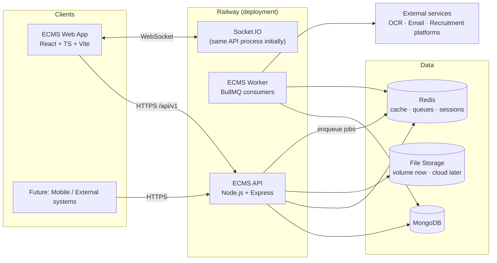
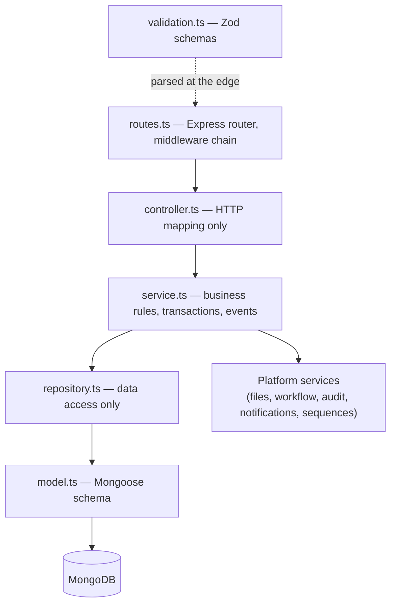

# Software Architecture

## 1. Architectural style

ECMS is a **modular monolith built on a platform kernel**, designed for later extraction into
microservices along module boundaries ([ADR-001](../03-decisions/ADR-001-modular-monolith.md)).

- **Clean Architecture** — dependencies point inward: HTTP/queue/socket adapters → controllers →
  services (business rules) → repositories (data access) → database.
- **Feature-Based Architecture** — code is organized by business feature, not by technical type.
  Everything about "applicants" lives in one folder.
- **Modular Monolith** — one deployable API process, one deployable web app, one worker process;
  strict in-process module boundaries enforced by lint rules.
- **Platform / Plugin model** — modules register themselves with the platform through a
  **Module Manifest**; the platform discovers and mounts them at boot.

## 2. System context



Three runtime processes from day one ([ADR-009](../03-decisions/ADR-009-bullmq-jobs.md)):

| Process | Responsibility |
|---|---|
| **api** | HTTP request/response, Socket.IO, enqueues background work |
| **worker** | BullMQ consumers: OCR, notifications fan-out, report generation, imports/exports, audit projection |
| **web** | Static React SPA served via CDN/static hosting |

Separating the worker immediately (even in the monolith) keeps request latency flat and forces
every long-running task through the queue — a habit that makes the future microservice split trivial.

## 3. Backend layering (Clean Architecture applied)

Every feature — platform or module — has the same internal shape:



**Layer contracts:**

| Layer | May contain | Must NOT contain |
|---|---|---|
| **Routes** | Path definitions, `authenticate`, `authorize('x.y')`, `validate(schema)` middleware | Logic of any kind |
| **Controller** | Extract validated input, call one service method, shape the HTTP response | Business rules, DB access, try/catch chains (central error handler) |
| **Service** | Business rules, orchestration, transactions, event emission, calls to platform services | `req`/`res` objects, Mongoose queries |
| **Repository** | Mongoose queries, projections, pagination | Business decisions, HTTP concepts |
| **Model** | Schema, indexes, virtuals | Business logic in hooks (audit/workflow live in services) |
| **Validation** | Zod schemas for body/query/params; inferred TS types | Anything else |

Why this strictness ([ADR-003](../03-decisions/ADR-003-layered-feature-architecture.md)):
with 20+ developers, the only way reviews stay cheap is when every feature is shaped identically.
"Where does X go?" must have exactly one answer.

## 4. Module plugin system

Modules are discovered and mounted by the platform at boot via a **Module Manifest** — the single
integration point between Layer 2 and Layer 1:

```ts
// Conceptual contract (design-level, not implementation)
interface ModuleManifest {
  id: string;                     // "hr"
  name: LocalizedString;          // { en: "Human Resources", ar: "الموارد البشرية" }
  version: string;
  permissions: PermissionDef[];   // registered into the RBAC permission registry
  routes: RouteRegistration[];    // mounted under /api/v1/<module-id>
  models: ModelRegistration[];    // Mongoose models, collection prefix enforced
  workflows: WorkflowDefinition[];// default workflow definitions (seedable, then DB-managed)
  navigation: NavItem[];          // menu contributed to the web shell
  widgets: WidgetDef[];           // dashboard widgets contributed to the Dashboard Engine
  searchables: SearchableDef[];   // entities exposed to the Search Engine
  sequences: SequenceDef[];       // document-numbering counters the module needs
  eventSubscriptions: EventSub[]; // platform/module events this module listens to
  seed?: () => Promise<void>;     // reference data seeding
}
```

**Boot sequence:**

1. Infrastructure connects (Mongo, Redis).
2. Platform Core services initialize (in dependency order).
3. Module manifests load; the platform **validates** each manifest (ID uniqueness, permission
   naming, collection prefixes, route prefixes).
4. Permissions, workflows, sequences, widgets, searchables, and navigation are registered.
5. Routes mount; event subscriptions bind; the server starts accepting traffic.

A module that fails validation **fails the boot loudly** — misregistered modules are a build-time
problem, never a silent runtime one.

## 5. Inter-module communication

Modules never import each other ([ADR-008](../03-decisions/ADR-008-event-bus.md)). Two sanctioned channels:

1. **Domain events (primary).** A typed, in-process event bus with an outbox-backed async path
   for cross-process delivery via BullMQ.
   Example: `hr.applicant.hired` → the (future) `employees` sub-module creates an employee;
   the `notifications` service informs the hiring manager. The publisher knows nothing about
   subscribers.
2. **Platform contracts (secondary).** When a module must *read* another module's data
   synchronously, the owning module registers a **public query contract** with the platform
   registry (interface + DTO, no Mongoose types). Consumers depend on the platform-registered
   interface, not on the module.

When the system splits into microservices, channel 1 becomes a message broker and channel 2
becomes HTTP/gRPC — call sites don't change shape.

## 6. Frontend architecture

The web app mirrors the backend's platform/module split:

- **App shell (platform)** — auth session, layout, navigation (built from module manifests),
  notifications center, global search, settings, localization/RTL switching.
- **Module packages** — each module contributes routes, pages, and dashboard widgets through a
  frontend module manifest; lazy-loaded per module (route-based code splitting).
- **State strategy** ([ADR-013](../03-decisions/ADR-013-frontend-state.md)):
  - **TanStack Query** owns *all server state* (fetching, caching, invalidation, optimistic updates).
  - **Redux Toolkit** owns *global client state only*: auth session, permissions set, locale/direction,
    UI preferences, notification badge state. If it comes from the API and expires, it belongs to Query.
  - Local component state stays local.
- **UI kit** — shadcn/ui components wrapped once in `shared/ui` (never imported raw in features),
  themed with Tailwind tokens, RTL-aware.
- **Permission-aware rendering** — a `<Can permission="applicant.create">` gate and a `useCan()`
  hook back every action button; the server remains the enforcement authority.

## 7. Cross-cutting concerns (where they live)

| Concern | Mechanism |
|---|---|
| AuthN | `authenticate` middleware → verifies JWT, loads user context ([Security Architecture](../06-security/security-architecture.md)) |
| AuthZ | `authorize('<resource>.<action>')` middleware + service-level checks for data scope |
| Validation | `validate(zodSchema)` middleware at the route edge; services receive typed, parsed input ([ADR-007](../03-decisions/ADR-007-zod-validation.md)) |
| Errors | Central error handler; typed `AppError` hierarchy in `shared/errors`; consistent error envelope ([API Standards](../04-standards/api-standards.md)) |
| Audit | `audit` platform service invoked by services on every mutation; also an automatic diff middleware for standard CRUD ([ADR-012](../03-decisions/ADR-012-logging-audit.md)) |
| Logging | Pino structured logs, `requestId` correlation across api → queue → worker |
| Transactions | MongoDB sessions/transactions wrapped by a platform `unitOfWork` helper used inside services |
| Multi-tenancy scope | `companyId`/`branchId` stamped on records; repository base class applies the caller's data scope automatically |
| Rate limiting | Redis-backed limiter middleware on auth and write endpoints |
| Idempotency | `Idempotency-Key` support on POST endpoints that create documents |

## 8. Path to microservices

The monolith is pre-cut along seams so extraction is mechanical, not a rewrite:

| Seam already in place | Extraction move |
|---|---|
| Modules communicate via events + contracts only | Swap in-process bus for a broker (the outbox pattern is already there) |
| Worker is a separate process | Workers split per module queue |
| Collections are module-prefixed, no cross-module joins | Move a module's collections to its own database |
| Modules never touch Infrastructure directly | Platform services become shared libraries or dedicated services |
| Route prefix per module | API gateway routes `/api/v1/hr/*` to the extracted HR service |

**Rule:** any design proposal that introduces a cross-module import, a cross-module join, or a
synchronous in-process call outside a registered contract is rejected in review — those are the
three things that make future extraction impossible.

## 9. Non-functional requirements

| Attribute | Target / approach |
|---|---|
| Performance | p95 API < 300ms for CRUD; heavy work always queued; Redis caching for permissions, settings, org tree |
| Scalability | Stateless API (JWT + Redis-backed shared state) → horizontal scaling on Railway |
| Availability | Health endpoints (`/health/live`, `/health/ready`); graceful shutdown draining queues and sockets |
| Security | See [Security Architecture](../06-security/security-architecture.md) — OWASP ASVS-aligned |
| Auditability | 100% of mutations audited with old/new values, actor, IP, timestamp |
| Maintainability | Identical feature shape everywhere; dependency rules lint-enforced; docs updated with code |
| Localization | ar/en everywhere, RTL-first CSS (logical properties), localized reference data |
