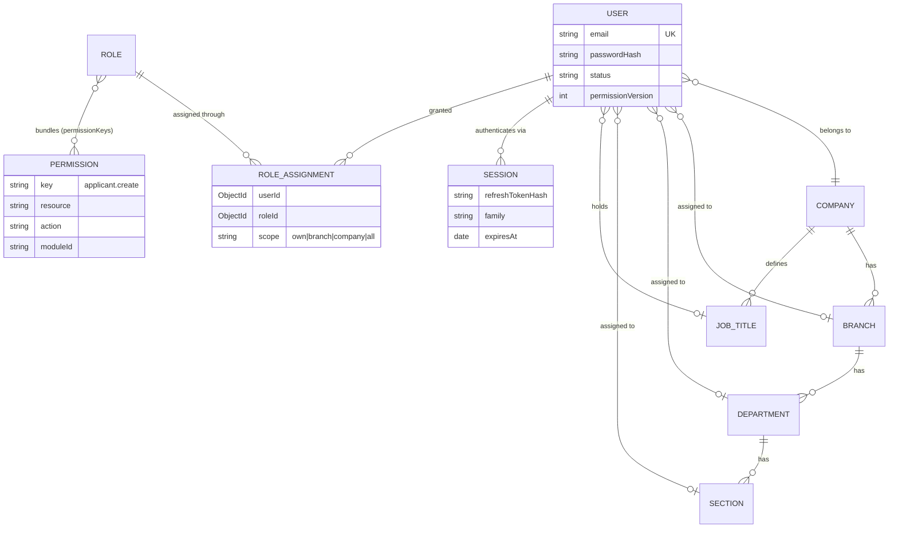
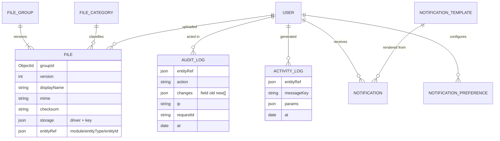
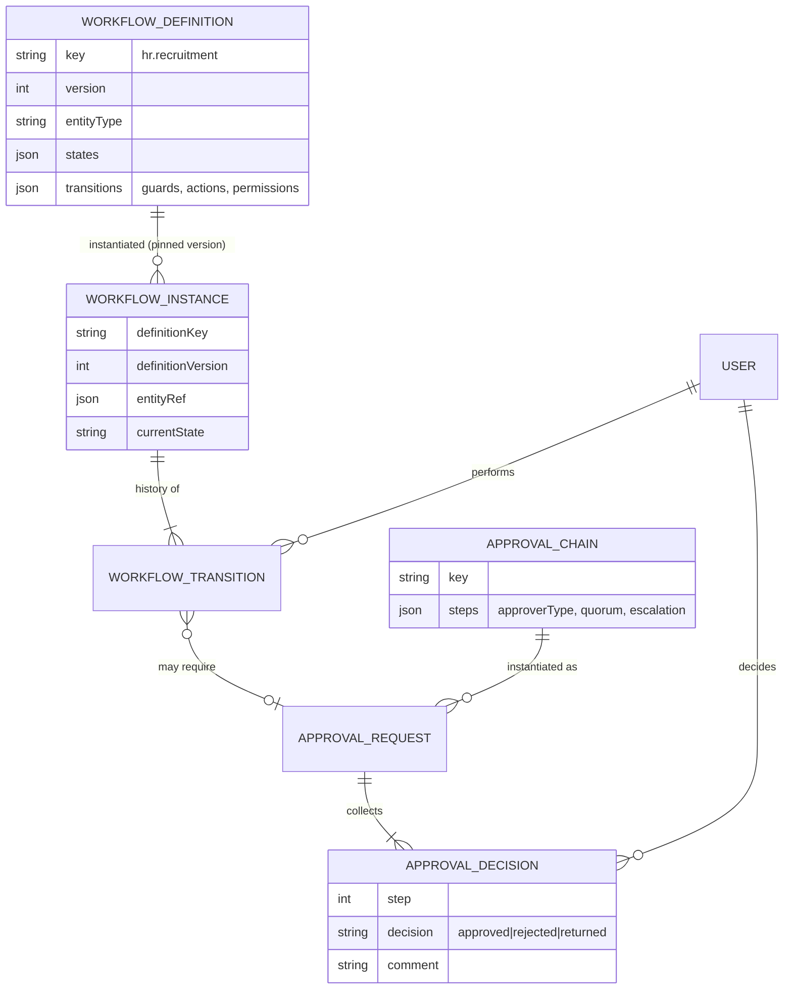
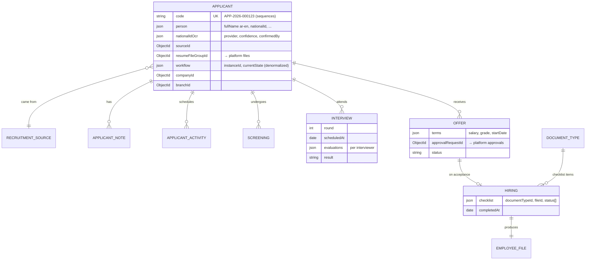

# ER Diagrams

Entity-relationship views of the [Database Design](database-design.md). MongoDB is
document-oriented — "relationships" here are reference fields (`…Id`), never enforced joins;
cross-module references (dashed notes) are ID-only and resolved via platform contracts or events.

## 1. Identity, RBAC & Organization

## 2. Files, Audit & Notifications

## 3. Workflow & Approval engines

## 4. Recruitment (HR module)

**Cross-boundary references (ID-only, no joins):**

| From (module) | To (platform) | Via |
|---|---|---|
| `hr_applicants.resumeFileGroupId`, attachments | `files` / `file_groups` | Files service API |
| `hr_applicants.workflow.instanceId` | `workflow_instances` | Workflow service API |
| `hr_offers.approvalRequestId` | `approval_requests` | Approval service API |
| Applicant timeline | `activity_logs`, `workflow_transitions` | Audit/Workflow read APIs, merged view |
| `position.jobTitleId`, `companyId`, `branchId` | organization collections | Organization service (cached) |
