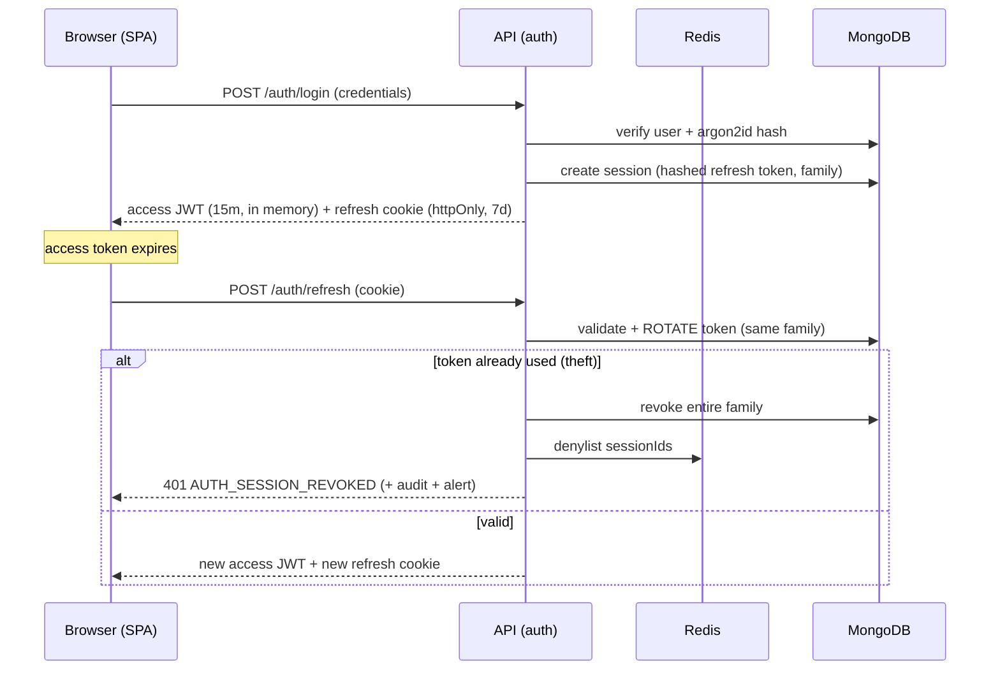

# Security Architecture

ECMS handles identity documents, salaries, and cash-operations data. Security is a platform
property — implemented once in Layer 1, inherited by every module. Aligned with OWASP ASVS L2.

## 1. Authentication

Design per [ADR-006](../03-decisions/ADR-006-jwt-refresh-tokens.md); summary:

Controls: argon2id hashing · configurable password policy (settings) · per-IP and per-account
login rate limits · lockout with backoff · session list & revocation UI · every auth event audited.
Designed-in extension points: TOTP 2FA, OIDC SSO.

## 2. Authorization

Model per [ADR-004](../03-decisions/ADR-004-permission-based-authorization.md); enforcement is
**layered — deny by default at every layer**:

| Layer | Check |
|---|---|
| Route middleware | `authenticate` → `authorize('applicant.edit')` — no route mounts without a permission declaration (kernel validates at boot) |
| Service | business-rule + record-level checks (e.g., transition guard permissions) |
| Repository | data scope (`own/branch/company/all`) applied automatically to every query |
| Frontend | `<Can>` gates (UX only — server remains the authority) |

Failure modes: 401 unauthenticated; 403 unauthorized; 404 where existence itself is sensitive.
All 403s are audited (permission probing is a signal).

## 3. Data protection

- **In transit:** TLS everywhere (Railway-terminated), HSTS.
- **At rest:** provider disk encryption; secrets (connector credentials) encrypted at
  application level (AES-256-GCM, key from environment) before storage in settings.
- **PII handling:** national IDs, phones, addresses classified as PII → redacted from system logs
  (Pino redaction paths), never in URLs, masked by default in list views
  (`298*******4567`) with `*.viewSensitive`-style permissions for full display where required.
- **Files:** no static serving; authorized endpoint + short-lived signed URLs; per-category mime
  and size validation; checksum integrity; malware-scan hook ([ADR-010](../03-decisions/ADR-010-file-storage.md)).

## 4. Application security controls

| Threat | Control |
|---|---|
| Injection (NoSQL operator) | Zod validation at edge; repositories accept typed filters only; `express-mongo-sanitize` as belt-and-braces |
| XSS | React escaping; no `dangerouslySetInnerHTML` (lint-banned); CSP via Helmet; access token never in storage APIs |
| CSRF | Refresh cookie `SameSite=Strict` + CORS allowlist; state changes require Bearer token (not cookie-authenticated) |
| SSRF | Outbound HTTP only via the Integrations service with host allowlists |
| Brute force / abuse | Redis rate limiting per route class; lockouts; alerting |
| Mass assignment | DTOs are explicit Zod schemas — unknown keys stripped (`strict()`) |
| IDOR | Scope filtering in BaseRepository + record-level ownership checks in services |
| Dependency risk | Lockfile, `npm audit` + Dependabot in CI, minimal dependency policy |
| Secrets leakage | `.env` never committed; env schema validation; secret scanning in CI |

## 5. Auditability & monitoring

- 100% of mutations and all security events (logins, failures, permission denials, exports,
  file downloads) audited with actor/IP/requestId ([ADR-012](../03-decisions/ADR-012-logging-audit.md)).
- Security alerts (worker jobs): refresh-token reuse, repeated 403s per user, lockout storms,
  export spikes, dead-letter growth.
- `Applicant.Export`/`Print`-class permissions exist precisely so bulk data egress is a
  *granted, audited* capability — every export records who, what filter, and when.

## 6. Secure development lifecycle

- Security review is part of the PR checklist ([Development Workflow](../09-guides/development-workflow.md));
  changes touching auth/rbac/files require a second reviewer.
- Threat-model note required in design docs for new platform services.
- Production data never used in development; seed data is synthetic.
