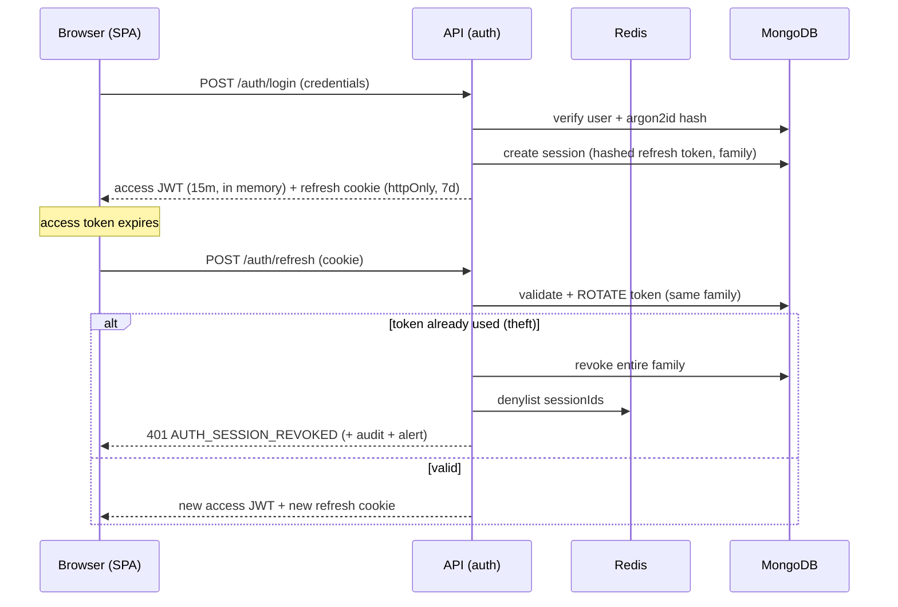

# Security Architecture

ECMS handles identity documents, salaries, and cash-operations data. Security is a platform
property — implemented once in Layer 1, inherited by every module. Aligned with OWASP ASVS L2.

## 1. Authentication

Design per [ADR-006](../03-decisions/ADR-006-jwt-refresh-tokens.md); summary:

```mermaid
sequenceDiagram
    participant B as Browser (SPA)
    participant A as API (auth)
    participant R as Redis
    participant M as MongoDB

    B->>A: POST /auth/login (credentials)
    A->>M: verify user + argon2id hash
    A->>M: create session (hashed refresh token, family)
    A-->>B: access JWT (15m, in memory) + refresh cookie (httpOnly, 7d)
    Note over B: access token expires
    B->>A: POST /auth/refresh (cookie)
    A->>M: validate + ROTATE token (same family)
    alt token already used (theft)
        A->>M: revoke entire family
        A->>R: denylist sessionIds
        A-->>B: 401 AUTH_SESSION_REVOKED (+ audit + alert)
    else valid
        A-->>B: new access JWT + new refresh cookie
    end
```

Controls: argon2id hashing · configurable password policy (settings) · per-IP and per-account
login rate limits · lockout with backoff · session list & revocation UI · **inactivity timeout**
· every auth event audited. Designed-in extension points: TOTP 2FA, OIDC SSO.

**Sign-in failures are named, not merged (owner's decision).** The login endpoint used to answer
an unknown identifier and a wrong password identically, so that nobody could learn which accounts
exist by trying addresses at the login page. It no longer does: `AUTH_IDENTIFIER_UNKNOWN` and
`AUTH_INVALID_CREDENTIALS` are distinct, and the screen tells the person which of the two boxes
was wrong. The owner weighed the enumeration risk against staff who could not tell why they were
refused, and chose to name it.

What carries the weight instead: the route's rate limit (**ten attempts per five minutes per
address**, `strictLimit('auth-login')`), an audit row and an `AuthLoginFailed` event for every
attempt, and account lockout with backoff after repeated failures. Every other account state
(locked, suspended, never activated) already had its own code and has only become visible in the
UI. **Revisit this if the login page is ever reachable from outside the company network**, where
the enumeration the merge prevented becomes cheap to run at scale.

**Inactivity timeout (`SESSION_IDLE_MINUTES`, default 10; `0` switches it off).** A session whose
`lastUsedAt` is older than the window is **revoked** at its next renewal — not merely refused,
because a valid cookie that survives the deadline is the hole the control exists to close. The
reason is recorded (`idle-timeout`) and a `sessionRevoked` row is written, so an administrator
reading the log can tell «stepped away» from «taken over» (`refresh-reuse`).

The clock is `lastUsedAt`, which the browser keeps fresh by renewing **while somebody is there**
and stops the moment they are not (`platform/auth/idle-session.ts`): a renewal only happens when
there has been activity since the previous one, so a working session never times out however long
it lasts, and an abandoned one is not held open by a timer. The window travels to the browser in
the refresh response, so the countdown on screen and the rule on the server are the same number,
and changing the variable is obeyed within one renewal cycle. The last minute is a warning with a
countdown, which is also what protects unsaved work from vanishing without notice.

## 2. Authorization

Model per [ADR-004](../03-decisions/ADR-004-permission-based-authorization.md); enforcement is
**layered — deny by default at every layer**:

| Layer | Check |
|---|---|
| Route middleware | `authenticate` → `authorize('applicant.edit')` — no route mounts without a permission declaration (kernel validates at boot) |
| Service | business-rule + record-level checks (e.g., transition guard permissions) |
| Repository | data scope (`own/branch/company/all`) applied automatically to every query |
| Frontend | `<Can>` gates (UX only — server remains the authority) |

Failure modes: 401 unauthenticated; 403 unauthorized; 404 where existence itself is sensitive.
All 403s are audited (permission probing is a signal).

## 3. Data protection

- **In transit:** TLS everywhere (Railway-terminated), HSTS.
- **At rest:** provider disk encryption; secrets (connector credentials) encrypted at
  application level (AES-256-GCM, key from environment) before storage in settings.
- **PII handling:** national IDs, phones, addresses classified as PII → redacted from system logs
  (Pino redaction paths), never in URLs, masked by default in list views
  (`298*******4567`) with `*.viewSensitive`-style permissions for full display where required.
- **Files:** no static serving; authorized endpoint + short-lived signed URLs; per-category mime
  and size validation; checksum integrity; **virus scanning by ClamAV** on every upload when
  `CLAMAV_HOST` is set (`platform/files/virus-scan.processor.ts` behind the `virusScan` extension
  point of [ADR-010](../03-decisions/ADR-010-file-storage.md)). The scan runs in the worker; a file
  is `pending` until the daemon answers and is **withheld from every download path** meanwhile
  (`FILE_SCAN_PENDING`), `blocked` on a hit (`FILE_BLOCKED`), and rescanned every fifteen minutes
  if the daemon was down. A scanner that could not answer never yields `clean`.

## 4. Application security controls

| Threat | Control |
|---|---|
| Injection (NoSQL operator) | Zod validation at edge; repositories accept typed filters only; `express-mongo-sanitize` as belt-and-braces |
| XSS | React escaping; no `dangerouslySetInnerHTML` (lint-banned); CSP via Helmet; access token never in storage APIs |
| CSRF | Refresh cookie `SameSite=Strict` + CORS allowlist; state changes require Bearer token (not cookie-authenticated) |
| SSRF | Every outbound request leaves through `infrastructure/http/outbound.ts` ([ADR-033](../03-decisions/ADR-033-outbound-http-one-door.md)): host allowlist (the configured base URLs, the SaaS hosts the code names, `OUTBOUND_HTTP_ALLOWLIST`), refusal of any destination resolving to a private/loopback/link-local address, redirects re-judged per hop; a guard spec forbids a bare `fetch` anywhere else. Browser-supplied Web Push endpoints must be public HTTPS |
| Brute force / abuse | Redis rate limiting per route class; lockouts; alerting |
| Mass assignment | DTOs are explicit Zod schemas — unknown keys stripped (`strict()`) |
| IDOR | Scope filtering in BaseRepository + record-level ownership checks in services |
| Dependency risk | Lockfile; `scripts/dependency-audit.mjs` fails CI on any **high or critical** advisory in production dependencies (waivable by id, with a reason and an expiry that itself fails CI once past) and **fails on a registry outage** unless a dated outage waiver is recorded; Dependabot (`.github/dependabot.yml`) opens weekly grouped updates and security PRs; minimal dependency policy |
| Secrets leakage | `.env` never committed; env schema validation; `scripts/check-secrets.mjs` scans every tracked file before `npm ci` and fails CI on a credential shape (private key, cloud/API keys, a connection string with a password, a JWT, a tracked `.env` or key file) — false positives are allowlisted by fingerprint with a reason |

## 5. Auditability & monitoring

- 100% of mutations and all security events (logins, failures, permission denials, exports,
  file downloads) audited with actor/IP/requestId ([ADR-012](../03-decisions/ADR-012-logging-audit.md)).
- Security alerts (worker jobs): refresh-token reuse, repeated 403s per user, lockout storms,
  export spikes, dead-letter growth. Each is an `alertRaised` audit row plus the
  `platform.audit.alertRaised` event, which the notifications service delivers as a **critical**
  notification (bypassing quiet hours) to everyone with organization-wide audit-log visibility.
- **Break-glass use pages at once.** `authorize()` writes a `breakGlassUsed` audit row when a
  break-glass key (`file.purge`, `user.setupLink`, `user.manageSessions`, or a module's) is the
  authority a request passed on, and raises the `breakGlassUsed` signal from the request itself —
  not from the hourly sweep, which is the net under it. One alert per person per hour; every use
  keeps its row, naming the key and the route.
- `Applicant.Export`/`Print`-class permissions exist precisely so bulk data egress is a
  *granted, audited* capability — every export records who, what filter, and when.

## 6. Secure development lifecycle

- Security review is part of the PR checklist ([Development Workflow](../09-guides/development-workflow.md));
  changes touching auth/rbac/files require a second reviewer.
- Threat-model note required in design docs for new platform services.
- Production data never used in development; seed data is synthetic.
