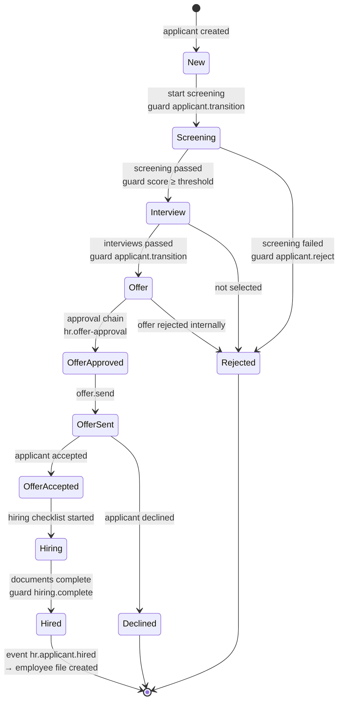
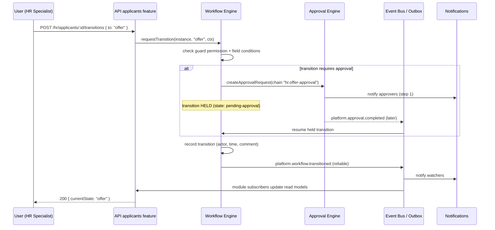
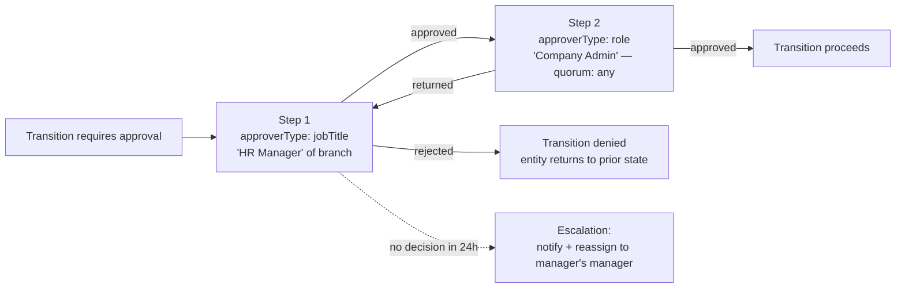

# Workflow & Approval Engine

Design of the platform's configurable process engine ([ADR-011](../03-decisions/ADR-011-workflow-engine.md))
and its first consumer, the recruitment pipeline. Schemas:
[Database Design §2](../05-database/database-design.md).

## 1. Concepts

| Concept | Definition |
|---|---|
| **Workflow definition** | Versioned, admin-editable description of a process: states, transitions, guards, actions, SLAs |
| **Workflow instance** | One entity's journey through a definition (pinned to the definition version it started on) |
| **Transition** | A recorded state change: actor, timestamp, comment; the entity's status history |
| **Guard** | Condition that must hold to allow a transition: required permission + declarative field conditions |
| **Action** | Side effect on transition: notify, assign, set field, emit event, request approval |
| **Approval chain** | Ordered approver steps (role / job title / org-manager / user), quorum, delegation, escalation |

## 2. Recruitment workflow (default definition, `hr.recruitment` v1)

Everything in this diagram is **data**: HR administrators can add a stage (e.g., "Medical Check"
before Hiring), change guard thresholds, or swap the approval chain — without a deployment.

## 3. Transition execution sequence

Key properties:

- The transition record + entity update + outbox entry are written in **one transaction**.
- SLA timers are repeatable worker jobs: a state with `sla.hours` schedules an escalation check;
  breach → escalation action (notify/assign) + activity-log entry.
- `workflowInstance.forceTransition` exists as an audited break-glass administrative permission.

## 4. Approval chain resolution

Approver resolution strategies: explicit user · role holders · job-title holders within the
entity's org scope · org-unit manager. Delegation windows (out-of-office) re-route steps and are
recorded on the decision (`delegatedFrom`).

## 5. Module integration contract

A module consuming workflows must:

1. Ship a default definition in its manifest (seeded once; DB-managed afterwards).
2. Create an instance when the entity is created (`workflow.start(entityRef, 'hr.recruitment')`).
3. Expose transitions through its own API (`POST …/:id/transitions`) delegating to the engine —
   so the module's permissions and validation wrap the engine.
4. Denormalize `currentState` onto the entity document (read model) — updated only by the
   engine's transition event.
5. React to states via events, never by polling and never by hard-coding state strings outside
   the definition's declared states.

## 6. Timeline composition (Applicant)

The applicant timeline required by the business is a merged, permission-filtered view:

| Source | Contributes |
|---|---|
| `workflow_transitions` | status history entries |
| `activity_logs` | business events ("Interview scheduled…") |
| `hr_applicant_notes` | notes |
| `files` (entityRef) | document upload entries |
| `approval_decisions` | approval trail |

One platform timeline component renders this for **any** entity — the same component later serves
contracts, fleet, and cash orders.
