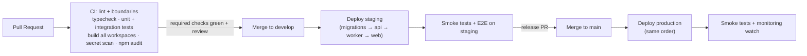

# Deployment Strategy

Target platform: **Railway** + **GitHub** (source + CI via GitHub Actions).

## 1. Runtime topology

| Railway service | Source | Process | Scaling |
|---|---|---|---|
| `ecms-api` | `apps/api` | `node dist/server.js` | Horizontal (stateless — JWT + Redis) |
| `ecms-worker` | `apps/api` | `node dist/worker.js` | Horizontal per queue load |
| `ecms-web` | `apps/web` | Static build (served by Railway/CDN) | N/A |
| MongoDB | Managed (Atlas or Railway plugin, **replica set required** for transactions) | — | Vertical + storage |
| Redis | Railway plugin / managed | — | Vertical |
| Volume | attached to `ecms-api` | file storage (until cloud adapter) | Storage |

Health: `/health/live` (process up) and `/health/ready` (Mongo + Redis reachable) wired to
Railway health checks. Graceful shutdown: stop accepting connections → drain sockets → let
in-flight jobs finish → close pools.

## 2. Environments

| Environment | Branch | Purpose | Data |
|---|---|---|---|
| **development** | local | Developer machines (docker-compose: Mongo replica set + Redis) | Synthetic seed |
| **staging** | `develop` | Integration testing, UAT, demo | Synthetic + anonymized |
| **production** | `main` | Live | Real (backed up, PITR) |

Environment parity: identical service topology in staging and production; configuration differs
only via environment variables (validated by the Zod env schema at boot — misconfig fails deploy,
not runtime).

## 3. CI/CD pipeline (GitHub Actions)

Rules:

- **Migrations run first**, as a release step, and must be backward-compatible with the previous
  app version (expand → migrate → contract pattern) so rollback is always safe.
- Deploy order: migrations → worker → api → web (workers must understand new job shapes before
  producers emit them).
- Rollback = redeploy previous image; DB rollback is never assumed (hence expand/contract).
- Path-filtered jobs keep CI fast (web changes don't run api integration tests, and vice versa).

## 4. Configuration & secrets

- All configuration via environment variables (Railway env groups per environment), documented in
  `.env.example`, validated at boot.
- Secrets (JWT secrets, DB credentials, connector keys) only in Railway secrets — never in git,
  never in logs. Application-level encryption key for stored connector credentials rotates on a
  documented schedule.

## 5. Observability & operations

| Concern | Approach |
|---|---|
| Logs | Pino JSON → Railway logs; `requestId` correlation across api/worker |
| Metrics | `/metrics` endpoint (Prometheus format): request latency, queue depth/lag, job failures, Mongo pool |
| Alerts | Dead-letter growth, health-check failures, refresh-token-reuse events, error-rate spikes |
| Uptime | External ping on `/health/live` per environment |
| Backups | Managed Mongo PITR; volume snapshot schedule for file storage until cloud adapter; quarterly restore drills |

## 6. Scaling path

1. **Now:** 1× api, 1× worker, static web.
2. **Load growth:** scale api replicas (stateless); split worker by queue (`ecms-worker-ocr`,
   `ecms-worker-reports`) — BullMQ supports this by configuration.
3. **Module extraction** (per [ADR-001](../03-decisions/ADR-001-modular-monolith.md)): promote a
   module to its own service behind the same `/api/v1/<module>` prefix; move its prefixed
   collections; switch its events to the broker tier.
