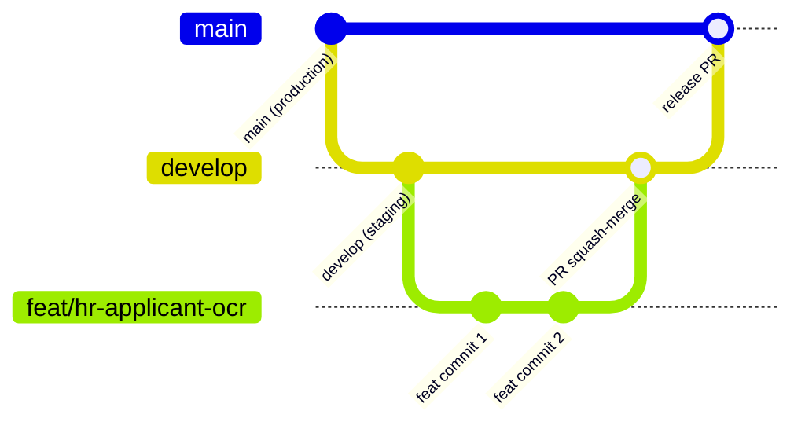
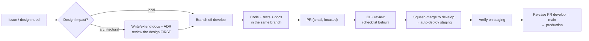

# Development Workflow

How a change travels from idea to production. Designed for a team that grows to 20+ developers:
short-lived branches, small PRs, docs and code in the same review, automation over convention.

## 1. Branching model

GitHub Flow with a staging trunk:



| Branch | Role | Protection |
|---|---|---|
| `main` | Production. Only release PRs from `develop`. | Required checks + review; no direct pushes |
| `develop` | Staging/integration trunk. | Required checks + review; no direct pushes |
| `feat/…`, `fix/…`, `chore/…`, `docs/…`, `refactor/…` | Short-lived work branches off `develop` (≤ a few days) | — |
| `hotfix/…` | Off `main` for urgent production fixes; merged back to both | Expedited review, checks still required |

Branch naming: `<type>/<scope>-<short-desc>` → `feat/hr-applicant-ocr`
([Naming Conventions §9](../04-standards/naming-conventions.md)).

## 2. Commits

**Conventional Commits**, enforced by commitlint:

```
feat(hr/applicants): add national ID OCR prefill
fix(platform/auth): revoke session family on refresh reuse
docs(adr): add ADR-015 …
```

Types: `feat` `fix` `docs` `refactor` `test` `chore` `perf` `ci`. Scope = module/service path.
PRs are **squash-merged** — the PR title becomes the commit, so PR titles follow the same format.

## 3. The lifecycle of a change



Rules:

- **Design before code** for anything architectural: platform services, new modules, schema
  changes, new permissions — documentation PR first (this is how Milestone 1 itself works).
- **Small PRs**: one feature-layer slice or one concern; > ~500 changed lines should be split.
- **Docs travel with code**: a PR that changes behavior updates the relevant doc in the same PR.

## 4. Code review

- 1 approval required; **2 for** `platform/auth`, `platform/rbac`, `platform/files`, migrations,
  and CI/deploy changes (CODEOWNERS enforces this).
- Review checklist (in the PR template):
  - [ ] Layer rules respected (thin controller, logic in service, data access in repository)
  - [ ] No cross-module imports; feature imported via `index.ts` only
  - [ ] Permissions declared + route `authorize(...)` present; frontend gated with `<Can>`
  - [ ] Zod validation at every new boundary; types inferred, not duplicated
  - [ ] Mutations audited; events named per convention; reliable tier where business-critical
  - [ ] Tests: unit for rules, integration for endpoints (happy + authZ + validation)
  - [ ] ar + en translations; RTL-safe layout
  - [ ] Docs updated (permission matrix, DB design, ADR if architectural)
- Reviews critique the code, not the author; requested changes come with reasons or references
  to the standards docs.

## 5. Definition of Done

A change is Done when: CI green (lint, boundaries, typecheck, tests, build) · reviewed ·
docs updated · deployed to staging · verified on staging (by the author or QA) · no new
warnings/silenced rules.

## 6. Releases & versioning

- Release = PR `develop → main`, title `release: YYYY-MM-DD`, auto-generated changelog from
  Conventional Commits.
- The platform follows **semver at the manifest level** (module manifests declare versions);
  breaking platform-contract changes require a deprecation window and a migration note.
- Hotfixes: `hotfix/…` off `main`, merged to `main` and back-merged to `develop` immediately.

## 7. Project rhythm

- Work is tracked as GitHub issues, labeled by module/service (`hr`, `platform/workflow`).
- Milestones group issues (Milestone 2: Platform Core skeleton → auth → rbac → org → files →
  audit → workflow …, ordered by the tier diagram in
  [Platform Core](../02-architecture/platform-core.md)).
- Every milestone ends with a design-review checkpoint before the next begins — the same
  documentation-first gate as Milestone 1.
