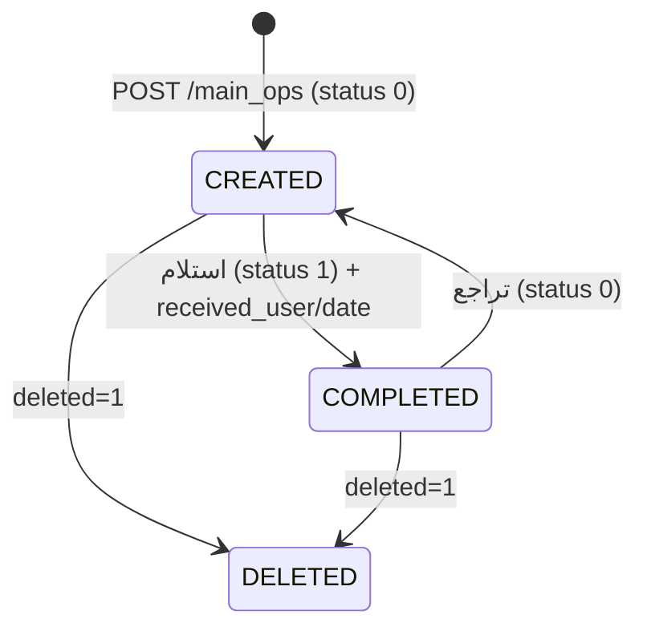
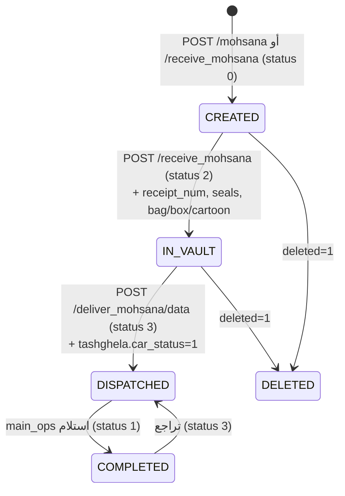
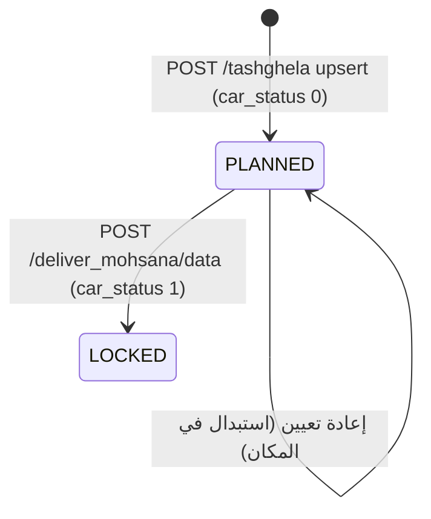

# Operations / Cash Transfer — Legacy Discovery (الهندسة العكسية للنظام القديم)

**Status:** Discovery — evidence base for `operations-module-design.md`. No implementation here.
**Source of truth:** legacy repo `egycashcompany-ops/fleet` @ `44654cd` — routes `contad_app.js`
(6,144 lines, read in full for every operations route), all models, and the client-side JS inside
every operations EJS view.
**Companion:** `docs/12-planning/operations-module-design.md` (the proposed ECMS design built on
this evidence). Section numbering (1–14, 18) follows the task's requested report outline; sections
12, 15–17, 19–20 live in the companion design doc.

> كل ادعاء في هذه الوثيقة مُوثّق بـ `file:line` من الكود الفعلي.
> ما لم يكن موثقًا بسطر كود مُعلَّم صراحةً بـ **(استنتاج)**.

---

## 1. معمارية النظام القديم (Legacy Operations Architecture)

نظام Legacy هو **Express monolith بملف واحد**:

| العنصر | الحقيقة |
|---|---|
| نقطة الدخول | `contad_app.js` — **6,144 سطر**، كل الـ routes inline بلا router/controller/service |
| نسخة قديمة | `contad_app copy.js` (2,903 سطر) — كود ميت، غير مُحمّل |
| الـ ORM | Mongoose 6.13 على MongoDB (`mongodb://192.168.9.141:27017/egycash`) — `config/database.js` |
| الـ Models | 25 ملف في `models/` — **schemas بلا validation، بلا index، بلا timestamps** |
| الـ UI | EJS server-rendered، 46 view في `views/events/` |
| الـ Session | `express-session` in-memory |
| طبقات | **لا يوجد**: لا service layer، لا repository، لا DTO، لا validation layer، لا tests |

**لا يوجد** أي من: cron، job queue، background worker، domain events، audit trail، migrations.
(تم التحقق: لا `node-cron`, لا `bull`, لا scheduler في `package.json`.)

### 1.1 نمط الكود المتكرر
كل route يتبع نفس الشكل: callback pyramid متداخل 5–6 مستويات، بلا `await`, بلا error handling
(انظر `contad_app.js:262-296` كمثال نموذجي — 6 مستويات تداخل).

---

## 2. كل الصفحات والـ Routes

إجمالي **86 route**. الجدول التالي يغطي نطاق Operations المطلوب فقط.

### 2.1 Operations الأساسية

| Route | Method | السطر | View | الغرض |
|---|---|---|---|---|
| `/main_ops` | GET | `253` | `main_ops.ejs` | لوحة اليوم التشغيلي |
| `/main_ops` | POST | `306` | — | إنشاء/تعديل/حذف/استلام شحنة |
| `/mohsana` | GET | `648` | `mohsana.ejs` | سجل المحصنات المفتوحة |
| `/mohsana` | POST | `700` | — | إنشاء/تعديل محصنة |
| `/receive_mohsana` | GET | `968` | `receive_mohsana.ejs` | استلام الخزينة |
| `/receive_mohsana` | POST | `1020` | — | تسجيل الاستلام + بيانات الخزينة |
| `/deliver_mohsana` | GET | `1624` | `deliver_mohsana.ejs` | تسليم/صرف المحصنات |
| `/deliver_mohsana/data` | POST | `1717` | — | صرف المحصنات لسيارة |
| `/tash4ela_mohasana` | GET | `4380` | `tash4ela_mohasana.ejs` | تشغيلة المحصنات |
| `/tash4ela_mohasana` | POST | `4476` | — | تعيين قائد+سيارة للمحصنة |
| `/tashghela` | GET | `2234` | `tashghela.ejs` | لوحة تعيين الأطقم |
| `/tashghela` | POST | `2400` | — | حفظ التعيينات |
| `/taeen_drivers` | GET | `4512` | `taeen_drivers.ejs` | تعيين السائقين |
| `/taeen_drivers` | POST | `4681` | — | حفظ تعيين السائقين |
| `/requirement` | GET | `4324` | `requirement.ejs` | مصفوفة متطلبات الموظفين |
| `/requirement` | POST | `4350` | — | حفظ الأعلام التسعة |
| `/vault1` | GET | `1338` | `vault1.ejs` | جرد الخزينة |
| `/vault1_reports` | GET | `1311` | `vault1_reports.ejs` | تقارير الخزينة |
| `/ops_report` | GET | `4837` | `ops_report.ejs` | تقرير القادة |
| `/ops_bank_report` | GET | `5173` | `ops_bank_report.ejs` | تقرير البنوك |
| `/data_edit` | GET | `1753` | `data_edit.ejs` | البيانات المرجعية |
| `/fleet_attendance` | GET | `3569` | `fleet_attendance.ejs` | غياب السائقين |

### 2.2 ⚠️ تصحيحان لنطاق المهمة

1. **`/ops_emp` و `/ops_attendance` غير موجودين كـ routes إطلاقًا.**
   - `ops_emp` هو **حقل رقمي على وثيقة الموظف**، يُفعَّل كـ checkbox في `/requirement` (`contad_app.js:4361`).
   - أقرب شاشة حضور هي **`/fleet_attendance`** (`3569`) — وهي لقسم **"الحركة" (السائقين)**، وليست لطاقم نقل الأموال.

2. **`/requirement` لا يحتوي أي أيقونات** — بل **9 checkboxes** (`requirement.ejs:393-417`).
   الأيقونات موجودة في **`/tashghela`** على كروت الموظفين (`tashghela.ejs:871-875`).

### 2.3 التوابع (`data_edit` sub-routes)
`data_edit_add_bank:1788` · `check_bank_exists:1845` · `data_edit_add_branche:1868` ·
`check_branch_exists:1935` · `data_edit_add_currency:1973` · `check_currency_exists:2015` ·
`data_edit_add_city:2033` · `check_city_exists:2086` · `data_edit_delete_bank:2109` ·
`data_edit_delete_branch:2154` · `data_edit_delete_city:2192`

---

## 3. الـ Models / Collections المستخدمة

| Model file | Collection | الدور في Operations |
|---|---|---|
| `transactions.js` | `transactions` | **الكيان المركزي** — الشحنة (يومي + محصنة معًا) |
| `tash4ela.js` | `tashghela` | صف التشغيل: (سيارة، يوم) → طاقم |
| `emp.js` | `employees` | الموظفون + أعلام المتطلبات |
| `car_lock.js` | `car_lock` | إتاحة السيارة ليوم محدد |
| `fleet.js` | `cars` | أسطول السيارات |
| `cars_maintenance.js` | `cars_maintenance` | الصيانة (تُقصي السيارة) |
| `absence.js` | `absence` | الغياب (للسائقين فقط) |
| `banks_contract.js` | `banks` | البنوك |
| `bank_branches.js` | `bank_branches` | فروع البنوك = **"المواقع"** |
| `cites.js` / `governorates.js` | `citys` / `governorates` | المدن/المحافظات |
| `data_lists.js` | `data_lists` | قوائم مرجعية (عملات، أنواع…) |
| `user_login.js` / `user_status.js` | `users` / `user_status` | الدخول والجلسة |

### 3.1 حقول `transactions` الحيّة مقابل الميتة

**تم التحقق بالعدّ الآلي** — الحقول التالية **لا تُكتب أبدًا بقيمة غير فارغة**:

```
spe1_1   spe1_2   spe2_1   spe2_2   driver1   driver2
```

(`driver2` له 4 كتابات غير فارغة لكنها كلها على collections أخرى:
`cars_log`/`cars_maintenance` — `3248, 3315, 3479, 3492`.)

الحقول الحيّة فعليًا للطاقم: `leader1` + `leader1_code` + `car_num1` (تُكتب عند الإنشاء)،
و `leader2` + `car_num2` (تُكتب **حصريًا** في `tash4ela_mohasana` POST — `4491`).

---

## 4. العلاقات بين البيانات

> ⚠️ **كل الروابط بالـ strings العربية المُسطّحة (denormalized) — لا يوجد ObjectId reference واحد.**

```
transactions.main_bank   ──str──►  banks.bank_name_ops
transactions.sec_bank    ──str──►  banks.bank_name_ops
transactions.from_name   ──str──►  bank_branches.branche_name   (from_code → branche_code)
transactions.to_name     ──str──►  bank_branches.branche_name   (to_code   → branche_code)
transactions.leader1     ──str──►  employees.employee_name      (leader1_code → employee_id)
transactions.car_num1    ──str──►  cars.car_code
transactions.area        ──str──►  bank_branches.area
```

### 4.1 🔑 العلاقة الأهم: كيف ترتبط الشحنة بالطاقم

الأخصائيون **ليسوا على الشحنة إطلاقًا**. الربط **غير مباشر عبر (سيارة، تاريخ)**:

```
shipment.leader1  ─────────────────────────►  القائد (الرجل الأول)
shipment.car_num1 ─────────┐
shipment.rec_date ─────────┤
                           ▼
              tashghela { car_num, date }
                           ├── leader  →  القائد على اللوحة
                           ├── emp1    →  أخصائي 1
                           └── emp2    →  أخصائي 2
```

الرجل الثاني (تسليم المحصنة): `shipment.leader2` + `shipment.car_num2`.

**هذه العلاقة هي أهم ما قد يضيع في migration من نوع CRUD.**

---

## 5. العمليات اليومية الفعلية

### 5.1 لا يوجد كيان "يوم تشغيلي"
**لا توجد collection أو وثيقة تمثل "يوم التشغيل".** اليوم **مُشتق بالكامل من الاستعلام**.

`main_ops` GET (`contad_app.js:260-268`):
```js
const today = new Date();
const formattedToday = new Date(today.toLocaleDateString('sv-SE'));  // "YYYY-MM-DD" → UTC midnight
Event_transactions.find({
  $or: [
    { rec_date: formattedToday, type: "يومي" },
    { del_date: formattedToday, type: "محصنة", status: [1, 3] }
  ],
  deleted: 0
}).sort({ input_date: -1 })
```

**قراءة دقيقة:**
- شحنات اليوم العادية = `rec_date == اليوم` و `type == "يومي"` — **مطابقة تساوٍ تامة**، لا نطاق.
- المحصنات المستحقة اليوم = `del_date == اليوم` و `type == "محصنة"` و الحالة ضمن `[1,3]`.
- `deleted: 0` دائمًا.

### 5.2 التخطيط ليوم الغد
`/tashghela` (`2239-2247`) و `/taeen_drivers` (`4517-4525`) **يفتحان على الغد افتراضيًا**:
```js
const tomorrow = new Date(); tomorrow.setDate(tomorrow.getDate() + 1);
if (!req.query.date_up) return res.redirect(`/tashghela?date_up=${tomorrow.toISOString().slice(0,10)}`);
```
→ **قاعدة عمل**: تعيين الأطقم يُخطَّط **قبل يوم**، بينما `main_ops` يعرض **اليوم**.

---

## 6. دورة حياة الشحنة (Shipment Lifecycle)

### 6.1 ⚠️ سُلّم الحالات **ليس تصاعديًا**

| القيمة | المعنى | تُكتب في |
|---|---|---|
| `0` | مُنشأة، لم تُستلم | `316,406` (main_ops) · `744,831` (mohsana) |
| `2` | **داخل الخزينة** | `1220, 1275` (receive_mohsana) |
| `3` | **مصروفة/خرجت للتسليم** | `1737` (deliver_mohsana) |
| `1` | **مكتملة/سُلّمت — حالة نهائية** | `564` (main_ops receive) |

```
يومي   :  0 ──────────────────────────► 1
محصنة  :  0 ──► 2 ──► 3 ──────────────► 1
             خزينة  صرف            تسليم
```

**`1` هو الحالة النهائية للنوعين** — وهذا يفسر لماذا التقارير تُصفّي على `status: 1` (`4880, 4927`).

### 6.2 التراجع عن الاستلام (`main_ops:555-566`)
```js
if (up_received == 1 && shipment__type == "يومي") → { received:0, status:0 }
if (up_received == 1 && shipment__type == "محصنة") → { received:0, status:3 }
if (up_received == 0)                              → { received:1, status:1, received_user, received_date }
```
→ التراجع يُعيد المحصنة إلى **3 (مصروفة)** لا إلى 0 — **متسق تمامًا** مع السلّم أعلاه.

### 6.3 `received` بُعد مستقل عن `status`
`received` (0/1) يُكتب أحيانًا **بدون** `status`:
`receive_mohsana:1294,1299` و `mohsana:950,955` يقلبان `received` فقط.
→ **بُعدان متعامدان**، ومصدر عدم اتساق محتمل.

---

## 7. دورة حياة المحصنة (Mohsana Lifecycle)

### 7.1 الفروق بين الشاشات الأربع

| الشاشة | الفلتر الفعلي | السطر | المسؤول |
|---|---|---|---|
| `/mohsana` | `type:"محصنة", status:{$ne:1}, deleted:0` — **بلا فلتر تاريخ** | `657-662` | إدخال/تعديل |
| `/receive_mohsana` | `type:"محصنة", status:{$nin:[1,2,3]}, deleted:0` ≡ حالة 0 — **بلا فلتر تاريخ** | `977-981` | أمين الخزينة — استلام |
| `/deliver_mohsana` | `type:"محصنة", status:{$nin:[0,1,3]}, deleted:0, del_date ∈ [يوم)` | `1687-1697` | أمين الخزينة — صرف |
| `/tash4ela_mohasana` | نفس فلتر deliver بالضبط | `4447-4459` | العمليات — تعيين قائد/سيارة |

`$nin:[0,1,3]` ≡ **الحالة 2 عمليًا** (داخل الخزينة).
⚠️ لكن `$nin` **يطابق أيضًا الوثائق التي ينقصها الحقل** — كوارك حقيقي.

### 7.1-ب حقيقة إضافية: `/receive_mohsana` يُنشئ محصنات أيضًا
المساران `1027` (أحادي العملة) و`1115` (متعدد) **ينشئان** وثيقة جديدة `type:"محصنة", status:0` —
تمامًا مثل `/mohsana`. أي أن الإدخال ممكن من الشاشتين. (المسار متعدد العملات في `1116`
**يُغفل `vault_receipt_num`** الموجود في `1033` — انحراف schema بسيط.)

كذلك: toggle الـ`received` في `/mohsana` (`948/953`) و`/receive_mohsana` (`1292/1297`)
**يقلب `received` فقط دون مساس بـ`status`** — بعكس `/main_ops` الذي يغيّر الاثنين معًا.

### 7.2 ما يُسجَّل عند الاستلام (`receive_mohsana:1197-1240`)
```js
treasurer_receive:      ""                    // ⚠️ دائمًا فارغ
treasurer_receive2:     req.body.user_name_del
treasurer_receive_date: Date.now()
bag, cartoon, box, bag_seals, box_seals, receipt_num
status: 2
serial: !!req.body.serial_check_edit
denominations: req.body.denominations_up
```
🐞 **`treasurer_receive` مكتوب `""` بشكل ثابت في المسارين (`1211, 1266`)** — قاعدة "الرجلين"
(dual control) **معطّلة فعليًا**؛ يُسجَّل أمين واحد فقط.

⚠️ **الاستلام مُنفَّذ كتعديل عام**: أي حفظ من نافذة التعديل في هذه الشاشة (بشرط
`deleted_dock == 0`) **يُعيد ختم `status: 2` و`treasurer_receive_date` من جديد** — حتى لو كان
القصد تصحيح ملاحظة. لا يوجد فحص للحالة السابقة، ولا حماية من "استلام" ما هو مستلَم.

### 7.3 ما يحدث عند الصرف (`deliver_mohsana/data:1717-1750`)
```js
await EventTash.findByIdAndUpdate(car_id, { car_status: 1 });          // قفل صف التشغيلة
await Promise.all(shipment_ids.map(id =>
        Event_transactions.findByIdAndUpdate(id, { status: 3 })));      // صرف
```
- **لا فحص** أن الشحنة كانت في الحالة 2.
- **لا transaction** — تحديثات متوازية مستقلة؛ فشل جزئي يترك حالة مختلطة.
- **لا يُسجَّل** `treasurer_delivery` ولا `treasurer_delivery_date` رغم وجودهما في الـ schema
  → **حقلان ميتان**.
- `res.status(200).json(...)` **معطّل بتعليق** (`1746`) — الـ endpoint لا يردّ شيئًا عند النجاح.

### 7.4 التعيين (`tash4ela_mohasana:4485-4499`)
```js
bulkOps = updates.map(item => ({ updateOne: {
  filter: { _id: item.id },
  update: { $set: { leader2: item.leader_name, car_num2: item.car_num } } } }));
await Event_transactions.bulkWrite(bulkOps);
```
بلا تحقق، بلا صلاحيات، بلا audit.

---

## 8. قواعد تعيين الأطقم (Crew Assignment)

### 8.1 مصدر السيارات — ليس `cars`
`/tashghela` (`2255`) يقرأ من **`car_lock`** لا من `cars`:
```js
CarLock.find({ date: dateUpp2, status: { $nin: ["", "ضم ATM"] } }).sort({ car_code: 1 })
```
ثم يستبعد الصيانة: `EventCarsMaintenance.find({ deleted:0, out_date:null })` (`2260-2263`)
و`"بدون سائق"` يُعامل كـ`"صيانة"` (`2288-2290`).

### 8.2 مصدر القادة والأخصائيين
```js
Emp.find({ work_status:1, deleted:0,
           employee_title: { $not: /الى/ },
           department: 'نقل الاموال', sub_department: "التشغيل" })
```
تحديد الدور **في المتصفح** (`tashghela.ejs:861-863`):
```js
if (data.leader && title.includes("اخص")) role = 'both';
else if (data.leader)                     role = 'leader';
else if (title.includes("اخص"))           role = 'specialist';
```
→ القائد = العلم الرقمي `leader`. الأخصائي = **مطابقة نصية جزئية** على `employee_title`.

### 8.3 🐞 منع الازدواجية — في المتصفح فقط
الفحص موجود في `tashghela.ejs:1332-1338` (`alreadyUsed`) — أي **JavaScript في المتصفح**.
بينما `POST /tashghela` (`2413-2429`) يُنفّذ upsert أعمى:
```js
await EventTash.findOneAndUpdate(
  { car_num: row.car_code, date: dateObj },
  { $set: { leader, emp1, emp2, direction, time, tybe, notes, car_status: 0 } },
  { upsert: true, new: true });
```
**لا تحقق من التكرار، لا تحقق من الغياب، لا صلاحيات، لا audit.**
→ استدعاء مباشر للـ API يسمح بتعيين نفس الموظف لعدة سيارات.

### 8.4 هل يمكن ترك الأخصائي فارغًا؟
نعم — `row.spe1 || ""` و `row.spe2 || ""` (`2419-2420`). **لا حد أدنى للطاقم.**

### 8.5 عند التغيير
upsert على المفتاح `(car_num, date)` → **الصف يُستبدل في مكانه، بلا تاريخ ولا نسخة سابقة.**

### 8.6 السحب والإفلات
HTML5 DnD يدوي بالكامل (`tashghela.ejs:1287-1310, 1361-1370`) — **بلا مكتبة**.
`POST` يرسل الجدول كاملًا كـ JSON في `req.body.tableData`.

---

## 9. قواعد المتطلبات (Requirements)

`POST /requirement` (`4358-4363`) يحدّث **9 أعلام** على `employees` بمفتاح `employee_id`:

| # | الحقل | المعنى | يُقرأ في استعلام server؟ | أيقونة |
|---|---|---|---|---|
| 1 | `selah` | سلاح | ❌ | `gun.png` |
| 2 | `tawqe3` | صحة التوقيع | ❌ | `signature.png` |
| 3 | `mozawla` | مزاولة المهنة | ❌ | `id.png` |
| 4 | `mozawla_mo` | مزاولة مؤقتة | ❌ | — |
| 5 | `ops_emp` | موظف عمليات | ❌ | — |
| 6 | `new` | جديد | ❌ | `new.gif` |
| 7 | `mohema` | مخصص | ❌ | — |
| 8 | `priority` | أولوية | ❌ | — |
| 9 | `leader` | قائد | ✅ **نعم** | لون الكرت |

### 9.1 الأيقونات — أين ومتى تظهر
`tashghela.ejs:871-875`:
```js
if (data.new     === 1) iconsHTML += ``;       // جديد
if (data.mozawla === 1) iconsHTML += ``;        // مزاولة
if (data.selah   === 1) iconsHTML += ``;       // سلاح
if (data.tawqe3  === 1) iconsHTML += ``; // توقيع
```
والأيقونات نفسها **أزرار فلترة** للمجمّع (`tashghela.ejs:1114-1116, 1140-1142`)
عبر `data-filter="mozawla|selah|tawqe3"`.

### 9.2 🔴 الحكم النهائي
**المتطلبات لا تحكم الأهلية على الخادم إطلاقًا.** هي **مساعدة بصرية + فلتر في المتصفح** فقط.
`leader` وحده يدخل في استعلام server (`main_ops:274`, `mohsana:667`).

**`mozawla_mo`, `ops_emp`, `mohema`, `priority` = بيانات تُكتب ولا تُقرأ أبدًا** (write-only)؛
لا تظهر إلا في `requirement.ejs` و`tash_cars.ejs` (وهي **view بلا route** — ميتة).

---

## 10. الموظفون والحضور

### 10.1 التصنيف بالقسم
| القسم | الاستخدام |
|---|---|
| `نقل الاموال` / `التشغيل` | طاقم نقل الأموال (قادة + أخصائيون) |
| `الحركة` | السائقون |

### 10.2 🔴 الحضور لا يحكم تعيين طاقم نقل الأموال
- `/fleet_attendance` (`3584`) يستعلم `absence` بـ **`department: "الحركة"` فقط**.
- `/taeen_drivers` (`4547-4552`) يستعلم `absence` بـ **`department: "الحركة"`** لفصل الحاضر/الغائب.
- **`/tashghela` لا يستعلم `absence` إطلاقًا.**

**تم التحقق:** `AbsenceEvent` يُستخدم في 6 مواضع فقط (`27, 3584, 3616, 3665, 3677, 4547`)،
**ولا واحد منها** يستعلم بـ `"نقل الاموال"` أو `"التشغيل"`.

→ **قائد أو أخصائي غائب يمكن تعيينه بالكامل دون أي اعتراض.** فجوة حقيقية.

### 10.3 نموذج الغياب
`absence`: `employee_id, reson, from, to, notes, department` + soft-delete.
**نطاقات فقط — لا سجل حضور يومي.** لا وقت دخول/خروج، لا ساعات.

---

## 11. نموذج العميل / الموقع

### 11.1 لا يوجد كيان "عميل"
**العميل = البنك. الموقع = فرع البنك.** لا collection باسم customer.

`bank_branches` (`models/bank_branches.js`) — الحقول **كاملةً**:
```
bank  bank_ops  branche_name  branche_code  area  area2
status  deleted  added_by  deleted_by  added_date  deleted_date
```

### 11.2 🔴 ما هو غير موجود إطلاقًا
تم فحص المستودع بالكامل: **لا يوجد أي** من التالي في أي ملف:
```
latitude · longitude · lat · lng · coordinate · geo · map · leaflet · mapbox
```
**ولا يوجد كذلك**: عنوان شارع، رقم هاتف للفرع، شخص اتصال، رمز بريدي.

→ **البيانات الجغرافية الوحيدة المتاحة هي `area` (اسم منطقة نصي) + اسم/كود الفرع.**
هذا يحدد سقف ما يمكن بناؤه في شاشة الخريطة للموبايل (القسم 17 في `operations-module-design.md`).

### 11.3 دلالات الحقول
- `bank` vs `bank_ops` — اسم محاسبي vs اسم تشغيلي. **العمليات تستخدم `bank_ops` حصريًا**
  (`main_ops:271`, `mohsana:668` يعرضان `bank_name_ops` فقط).
- `area` = **للعمليات**، `area2` = **للحسابات** (تعليق صريح في `models/bank_branches.js:9-10`).
- `area2` يُملأ بـ `area2 || area` عند الإضافة (`1909`) — ازدواج ضمني.
- الحذف **soft** (`deleted: 1`) — و**لا يوجد فحص مرجعي**: حذف فرع لا يمسّ الشحنات المرتبطة به،
  والارتباط بالاسم النصي فينكسر صامتًا.

---

## 13. الصلاحيات (Permissions)

### 13.1 🔴 التفويض معطّل عمليًا
| الحقيقة | الدليل |
|---|---|
| `users.privilege` موجود في الـ schema | `models/user_login.js:7` |
| **لا يُقرأ في أي route لاتخاذ قرار** | فحص شامل |
| 25 route يفحص جلسة **مستخدم ثابت بالاسم** | `EventUserStatus.find({status:1, user:"pola"})` |
| `checkAuthenticated` يُطبَّق على **7 routes فقط** | `104,253,2706,2777,2929,4837,5173` |
| في `main_ops` فحص الجلسة **مُعلَّق بالكامل** | `contad_app.js:258-259, 296-297` |
| و`user_data` مُمرَّر ثابتًا | `user_data: {user:"pola"}` — `contad_app.js:288` |

```js
function checkAuthenticated(req, res, next) {      // contad_app.js:93
  if (req.session.user) return next();
  res.redirect('/login');
}
```
→ **لا أدوار، لا صلاحيات دقيقة، لا فصل واجبات.** أي مستخدم مسجَّل يستطيع كل شيء.
كل قواعد العمل (الازدواجية، الأهلية) **في المتصفح فقط**.

**هذه ليست خاصية يجب نقلها — بل فجوة أمنية يجب سدّها بـ RBAC في ECMS.**

---

## 14. القواعد المخفية والكواركات (Legacy Quirks Register)

| # | الكوارك | الدليل | القرار |
|---|---|---|---|
| Q1 | سلّم الحالات غير تصاعدي؛ `1` نهائي | `564,1220,1737` | **PRESERVE المعنى / NORMALIZE الترميز** إلى enum نصي |
| Q2 | `treasurer_receive` دائمًا `""` | `1212,1267` | **NORMALIZE** — إصلاح dual control |
| Q3 | `treasurer_delivery*` لا تُكتب أبدًا | فحص شامل | **NORMALIZE** — تسجيل فعلي عند الصرف |
| Q4 | 6 حقول طاقم ميتة على الشحنة | عدّ آلي | **DROP** |
| Q5 | `currencies[]`/`values[]` مصفوفتان متوازيتان | `models/transactions.js:12-13` | **NORMALIZE** → `lines[{currency, amount}]` |
| Q6 | المسار أحادي العملة يكتب **قيمة مفردة** لا مصفوفة | `1201-1202` | **NORMALIZE** |
| Q7 | العملات مُثبّتة بـ 17 حقل form | `1230-1231` | **NORMALIZE** → مصفوفة ديناميكية |
| Q8 | `values` مخزّنة **نصوصًا**، تُحوَّل بـ `$convert onError:0` | `4895-4905` | **NORMALIZE** → `Decimal128` |
| Q9 | `$nin:[0,1,3]` يلتقط الوثائق ناقصة الحقل | `1690,4450` | **NORMALIZE** → `status: 'IN_VAULT'` صريح |
| Q10 | `status:[1,3]` (صيغة مصفوفة، تعتمد على cast الـ Mongoose) | `264` | **NORMALIZE** → `$in` صريح |
| Q11 | منع الازدواجية في المتصفح فقط | `tashghela.ejs:1332` vs `2400` | **NORMALIZE** — فرض في الـ domain |
| Q12 | الغياب لا يُفحص لطاقم نقل الأموال | القسم 10.2 | **NORMALIZE** (قرار عمل صريح) |
| Q13 | `branch:"المهندسين"` مُثبّت في الكود | `4533` | **NORMALIZE** → إعداد |
| Q14 | 25× `user:"pola"` مُثبّت | فحص شامل | **DROP** → RBAC |
| Q15 | مطابقة تاريخ بالتساوي التام مع UTC-midnight | `261-264` | **NORMALIZE** → نطاق يوم صريح |
| Q16 | GET يستعلم بنطاق Date، POST يكتب string مُحوَّل | `2274-2280` vs `2409` | **NORMALIZE** → UTC midnight |
| Q17 | الدور بمطابقة نصية `title.includes("اخص")` | `tashghela.ejs:861-863` | **NORMALIZE** → دور صريح |
| Q18 | لا transaction عند الصرف الجماعي | `1737-1740` | **NORMALIZE** → `unitOfWork` |
| Q19 | فلتر التاريخ في vault1 **مُعلَّق** | `1374` | **توثيق** — تأكيد نية العمل |
| Q20 | `/taeen_drivers` POST مُسجَّل **مرتين** (`4681`, `4728`) | — | **DROP** — الأول يفوز |
| Q21 | views بلا routes (`tash_cars.ejs` وغيرها) | القسم 2 | **DROP** |
| Q22 | لا فحص مرجعي عند حذف فرع | `2154` | **NORMALIZE** |
| Q23 | `received` مستقل عن `status` أحيانًا | `950,955,1294,1299` | **NORMALIZE** — دمج |
| Q24 | `area2 = area2 || area` | `1909` | **PRESERVE** مع توثيق |
| Q25 | 4 أعلام متطلبات write-only | القسم 9 | **PRESERVE الحقول / توثيق عدم الاستخدام** |
| Q26 | 🔴 **تقارير: العبوات تتضاعف × عدد العملات** — بعد `$unwind` لأزواج العملة، كل صف يحمل `bag/cartoon/box` كاملة ثم تُجمع | `5006-5023` (ops_report), `5315-5328` (bank) | **NORMALIZE** — جمع العبوات لكل وثيقة مرة واحدة؛ **توثيق فرق الأرقام عن Legacy** |
| Q27 | صف "الإجمالي العام" مُلحق داخل نفس مصفوفة النتائج | `5115-5145` | **NORMALIZE** — فصل الإجماليات في العقد |
| Q28 | وثيقة بحالة 1 و`currencies` فارغة **تسقط كليًا** من التقرير (`$zip` بلا `useLongestLength` + `$unwind` بلا preserve) | `4988-4996` | **NORMALIZE** مع توثيق |
| Q29 | استلام المحصنة "تعديل عام" يعيد ختم status:2 والتاريخ في كل حفظ | `1194-1240` | **NORMALIZE** — عملية receive صريحة منفصلة عن edit |
| Q30 | `status:1` يُكتب بلا حارس نوع — محصنة قد تُقفل و`leader2` فارغ → تظهر في تقرير القادة تحت قائد فارغ | `562-564` | **NORMALIZE** — إكمال المحصنة يتطلب تعيين leg 2 |
| Q31 | ترتيب البنوك في `/vault1` مُثبّت بـ`$switch` على **22 اسمًا عربيًا حرفيًا** (غير المدرج → 999) | `1449-1476` | **NORMALIZE** → `sortOrder` على كيان البنك |
| Q32 | فلاتر تاريخ `/vault1` مُعلَّقة بالكامل — الصفحة all-time دائمًا رغم الـ date picker | `1374, 1530-1533` | **PRESERVE السلوك (جرد حالي) / إزالة الـ picker الوهمي** |
| Q33 | العملات = مصفوفة نصوص في **وثيقة singleton** (`findOne({})`) في `data_lists` | `1985-2005` | **NORMALIZE** → كيان عملة |
| Q34 | حذف البنك/الفرع/المدينة **بالاسم العربي** لا بالمعرّف؛ و`deleted_date` يُخزَّن string للفرع وDate للبنك و`deleted_time` للمدينة | `2119, 2164-2181, 2202-2219` | **NORMALIZE** |
| Q35 | id المدينة = `countDocuments({}) + 1` — غير ذرّي ولا يستثني المحذوف → تكرارات محتملة | `2060-2061` | **DROP** → ObjectId |
| Q36 | `/ops_report` **بلا أي auth فعّال** والفحص الوحيد الحي للـ privilege في النظام كله هو `/vault1:1345` (يفحص privilege جلسة "pola" الثابتة لا الزائر) | `1345, 4844, 5180` | **DROP** → RBAC |
| Q37 | مسار receive متعدد العملات يُغفل `vault_receipt_num` | `1116` | **NORMALIZE** |
| Q38 | موديول ATM كامل كـ views ميتة بلا routes (6 ملفات) + 5 نسخ editor copies | القسم H في الملحق | **DROP** |

---

## 18. آلات الحالة (State Machines) — مستخرجة من الكود

### 18.1 الشحنة اليومية (يومي)


### 18.2 المحصنة (محصنة)

التعيين (`leader2`/`car_num2` عبر `/tash4ela_mohasana`) **لا يغيّر الحالة** — تعديل بيانات فقط
على شحنة في `IN_VAULT`.

### 18.3 صف التشغيلة (tashghela)

`car_status` له قيمتان فقط: `0` عند الحفظ (`2426`)، `1` عند الصرف (`1735`).

---

*(الأقسام 12، 15–17، 19–20 في الوثيقة المرافقة `operations-module-design.md`)*

---

# ملحق أ — تفاصيل الفروع والتجميعات (مستخرجة نصيًا من الكود)


## A. POST /mohsana (700–960)
Four+ mutually non-exclusive `if` blocks in one handler (no `return`s → multiple `res.redirect` possible).

1. **Create, single-currency** — `contad_app.js:707` guard: `mainBank && fromBranch && toBranch && currency1 && contractValue && teamLeader && shipmentDate && multi_currency != "on"`.
   - `type: "محصنة"` (719), `status: 0` (744) — quoted: `status: 0,`
   - `rec_date: req.body.shipmentDate` (714), `del_date: req.body.mohDate` (747)
   - `currencies: [\`${req.body.currency1}\`]` (720), `values: [ contractValue stripped of non-digits ]` (721)
   - `serial: !!req.body.serial_check` (765), `denominations: []` (766)
2. **Create, multi-currency** — `:795` same guard but `multi_currency == "on"` **and** additionally requires `shipmentType != null`.
   - Difference is ONLY the two array fields: `currencies: currency_Array_cont`, `values: contractValue_Array_cont` (807–808), built at 780–792 by walking `contractValue`..`contractValue17` / `currency1`..`currency17` and keeping index pairs whose value is non-empty. Everything else (type/status/dates/vault nulls) is byte-identical to branch 1.
3. **Edit, single-currency** — `:875` `_id_up != "" && deleted_dock == 0 && multi_currencyedit != "on"` → `updateOne $set` of main_bank, sec_bank, from_name, to_name, `currencies` (scalar string!), `values` (scalar string, 885), leader1, rec_date, del_date, car_num1, area, notes (878–893).
4. **Edit, multi-currency** — `:915` same but `multi_currencyedit == "on"`; sets `currencies`/`values` to the built arrays (926–927) and uses `shipment_notes_edit`.
5. **Soft delete** — `:941` `deleted_dock == 1` → `{deleted:1, deleted_user, deleted_date: Date.now()}` (943).
6. **received toggle** — `:948/:953` on `up_id`, flips `received` 1↔0 only. **Unlike /main_ops it does NOT touch `status`.**

**Vault fields:** creation writes them as *empty placeholders only* — `vault_receipt_num: ""` (713), `vault_no: null, Rack_no: null, bag: null, cartoon: null, box: null` (738–742), `bag_seals: [], box_seals: []` (745–746), `treasurer_receive*`/`treasurer_delivery*` empty/null (733–737). No edit branch here ever sets a real vault value. Vault population happens in POST /receive_mohsana (see B).

## B. /receive_mohsana
**GET (968–1014).** Exact filter, `contad_app.js:977-981`:
```js
Event_transactions.find({ type: "محصنة", status: { $nin: [1, 2, 3] }, deleted: 0 })
                  .sort({ input_date: -1 })
```
i.e. mohsana only, **status not in {1,2,3} → effectively status 0 (created, not yet in vault)**, not deleted. There is **no date filter at all** — `formattedToday` is computed at :976 and never used, so the queue is unbounded/all-time.

**POST insert path (1027–1183).** Yes — **receive_mohsana CREATES shipments as well as receiving them.** Two create branches, guards identical in shape to /mohsana:
- single-currency `:1027`, multi-currency `:1115`.
- New record: `type: "محصنة"` (1039/1125), **`status: 0`** (1064/1150), `rec_date: req.body.shipmentDate` (1034/1120), `del_date: req.body.mohDate` (1067/1153), `received: 0`, `deleted: 0`, all vault fields null/empty (1053–1066), `denominations: []`.
- Difference between the two: only `currencies`/`values` (single `[currency1]`/`[contractValue]` vs the 17-slot compacted arrays). The multi-currency branch at 1116 **omits `vault_receipt_num`** entirely (present at 1033 in the single branch) — minor schema drift.

**The actual "receive" is the edit branch**, `contad_app.js:1194` (single) / `:1247` (multi): `$set` writes `status: 2` (1220 / 1275), `treasurer_receive: ""` (1211/1266 — always blank), `treasurer_receive2: req.body.user_name_del`, `treasurer_receive_date: Date.now()`, `bag`/`cartoon`/`box` counts, `bag_seals`/`box_seals` barcodes, `receipt_num`, `serial`, `denominations`. So "receiving into vault" is implemented as a generic edit gated on `deleted_dock == 0`, meaning **any edit save from this page silently re-stamps status 2 and the receive timestamp.**
Also `:1285` soft-delete, `:1292/:1297` received toggle (no status change).

## C. /vault1 and /vault1_reports
**GET /vault1_reports (1311–1333):** auth check `EventUserStatus.find({status:1,user:"pola"})`, loads `DataLists.find({})` into `data_List` and then **discards it** — renders `events/vault1_reports` with only `{ user_data: check_session[0] }` (1324–1326). It is a pure shell page; all data comes from the client hitting /vault1.

**GET /vault1 (1338–1616):** privilege-gated (`creator`/`IT-admin`/`IT-user`, :1345) on top of the hardcoded `user:"pola"` lookup (:1340). `start_date` is parsed into `startDate`/`endDate` (1353–1357) but **`formatted` is only assigned in the `else` branch (1362)** — so when a `start_date` IS supplied, `formatted` stays `undefined` and is what gets rendered back (1604). **Both aggregations have their date filters commented out (1374, 1530–1533) — the page is all-time, never filtered by day, regardless of the picker.**

### dataTransaction1 (1368–1520) — "vault contents by bank"
Stages: `$match {type:"محصنة", status:2, deleted:0}` (1370) → `$project` main_bank, bag/box/cartoon `$toDouble($ifNull(…,0))`, and `pairs` = index-zip of currencies↔values with `$convert to double onError:0 onNull:0` (1378–1400) → then, after the $project:
1. `$addFields` (1403): `egp_doc` = sum of pair values whose currency ∈ `["EGP","مصري","جنيه","جنيه مصري"]`; `other_doc` = sum of the complement.
2. `$group _id: "$main_bank"` (1437): `count:{$sum:1}`, `totalEGP:{$sum:"$egp_doc"}`, `totalOther:{$sum:"$other_doc"}`, `totalBags:{$sum:"$bag"}`, `totalBoxes:{$sum:"$box"}`, `totalCartoons:{$sum:"$cartoon"}`.
3. `$addFields sortOrder` (1449): hardcoded `$switch` of 22 Arabic bank names → 1..22, `default: 999` (1453–1476). Any bank not in this literal list collapses to 999.
4. `$sort {sortOrder:1}` (1482).
5. `$group _id: null` (1485): `banks: {$push:{bank,count,totalEGP,totalOther,totalBags,totalBoxes,totalCartoons}}` plus `sumCount/sumEGP/sumOther/sumBags/sumBoxes/sumCartoons`.
6. `$project` (1507): `{ banks, totals:{count,totalEGP,totalOther,totalBags,totalBoxes,totalCartoons} }`.
Note: bags/boxes/cartons are computed **per document** here (before any currency unwind), so they are NOT inflated by multi-currency — contrast with D.

### dataTransaction2 (1524–1598) — "non-EGP currency breakdown of the same vault set"
Same `$match {type:"محصنة", status:2, deleted:0}` (1526). Stages after its `$project`:
1. `$project currencyValuePairs: {$zip:{inputs:["$currencies","$values"]}}` (1539).
2. `$unwind` with `preserveNullAndEmptyArrays: true` (1546).
3. `$project currency = pair[0]`, `value = $toDouble($ifNull(pair[1],0))` (1549).
4. `$match` excluding EGP synonyms, `$or` with `{currency:null}` to keep currency-less docs (1559–1565).
5. `$group _id:"$currency", total:{$sum:"$value"}` (1569).
6. `$group _id:null, currencies:{$push:{currency,total}}, totalOther:{$sum:"$total"}` (1577).
7. `$project` defaulting empty to `[{currency:null,total:0}]`, `totalOther:{$ifNull:…,0}` (1586).
**Difference between the two:** identical filter set (type محصنة + status 2 + deleted 0, no dates). #1 = per-bank rollup incl. EGP and physical package counts; #2 = per-foreign-currency rollup, EGP deliberately excluded. They are two views of the same document set, not two different statuses. `$zip` truncates to the shorter of currencies/values (no `useLongestLength`), so a currency without a matching value is silently dropped.

## D. /ops_report and /ops_bank_report
### /ops_report (≈4840–5168)
`$facet` (4874): `daily` = `$match {type:'يومي', rec_date ∈ [startDate,endDate], status:1, deleted:0}` (4877–4889) → `$project {leader:'$leader1', currencies, values mapped to double, bag/cartoon/box $ifNull 0}` (4892). `secured` = `$match {type:'محصنة', del_date ∈ range, status:1, deleted:0}` (4919–4931) → same `$project` but `leader:'$leader2'` (4935).
Stages after `$facet`/`$concatArrays`:
1. `$project all: {$concatArrays:['$daily','$secured']}` (4962) → `$unwind '$all'` (4968).
2. `$group _id:'$all.leader'` (4970): `docs_count:{$sum:1}`, `all_docs:{$push:'$all'}`.
3. `$unwind '$all_docs'` (4976) → `$replaceRoot {$mergeObjects:['$all_docs',{docs_count}]}` (4978) — re-explodes docs while stamping the leader's doc count on each.
4. `$addFields combined: {$zip:{inputs:['$currencies','$values']}}` (4988) → `$unwind '$combined'` (4996) → `$addFields currency = combined[0], value = combined[1]` (4998).
5. `$group _id:{leader,currency}` (5006): `total_value:{$sum:'$value'}`, `docs_count:{$first:'$docs_count'}`, `total_bag/{cartoon}/{box}: {$sum:{$toDouble:…}}`.
6. `$group _id:'$_id.leader'` (5023): `docs_count:{$first}`, `total_bag/cartoon/box:{$sum}`, and the per-currency buckets via `$cond`+`$in`: `total_egp` for `['مصري','جنيه','EGP']` (5029), `total_usd` for `['دولار','USD']` (5043), `total_other` = everything else (5057), plus `all_currencies:{$push:{currency,value}}` (5077).
7. `$facet` (5086): `leaders` = `[{$project:{all_currencies:0}}]`; `totals` = unwind all_currencies → `$group _id:'$all_currencies.currency', value:{$sum}` → `$group _id:'الإجمالي العام', currencies_totals:{$push:{currency,value}}`.
8. `$project result: $concatArrays['$leaders', [ synthetic grand-total row ]]` (5115–5145) with `_id:'الإجمالي العام'`, `docs_count/total_bag/total_cartoon/total_box` = `$sum` over the leaders array, `currencies_totals` = `$arrayElemAt('$totals.currencies_totals',0)`.
9. `$unwind '$result'` → `$replaceRoot` → `$sort {_id:1}` (5146–5148). Output: a flat array of per-leader rows **plus one grand-total row inside the same array**.
Rendered as `data1` JSON to `events/ops_report` with `start_date`/`end_date` (5155–5162). Default range = current calendar month (4862–4867). Note the whole handler's auth is commented out (5164–5167 mirror at 4960 region; `/ops_bank_report` uses `checkAuthenticated`, `/ops_report` does not).

### /ops_bank_report (5173–5440)
Structurally identical, keyed on bank: `$facet.daily` `$match {type:'يومي', rec_date ∈ range, status:1, deleted:0}` → `$project main_bank,…` (5213–5242); `$facet.secured` `$match {type:'محصنة', del_date ∈ range, status:1, deleted:0}` → `$project main_bank,…` (5246–5275). Then `$concatArrays` (5281) → `$unwind` → `$group _id:'$all.main_bank'` (5286) → `$unwind`/`$replaceRoot` (5292–5299) → `$zip`/`$unwind`/currency+value (5301–5313) → `$group _id:{main_bank,currency}` (5315) → `$group _id:'$_id.main_bank'` with the same `total_egp`/`total_usd`/`total_other` `$cond`s and `all_currencies` (5328–5372) → `$facet {banks, totals}` (5375) → `$concatArrays` with the synthetic `'الإجمالي العام'` row (5397–5416) → `$unwind`/`$replaceRoot`/`$sort` (5417–5419). Default range = current month (5195–5204).

**Can a single transaction be counted more than once?**
- **Across the two facets: no.** `type` is `'يومي'` XOR `'محصنة'`, so a doc matches at most one facet. `docs_count` uses `{$sum:1}` before any currency unwind and is carried forward with `{$first}`, so **docs_count is not inflated.**
- **Within money totals: no** — each currency/value pair contributes to exactly one currency bucket.
- **Yes, for `total_bag` / `total_cartoon` / `total_box`.** After `$unwind '$combined'` (5307 / 4996) a multi-currency document becomes N rows, each still carrying the full `bag`/`cartoon`/`box`. Grouping by `{key, currency}` puts those rows in N distinct buckets, each summing the package counts once; the next `$group` sums across currencies → **packages are multiplied by the number of currencies on the document.** A 3-currency mohsana with 10 bags reports 30 bags.
- **Yes, at the consumer level:** the grand-total row is appended into the same result array (5117 / 5399), so anything that naively sums all returned rows double-counts everything.
- Additional loss: `$zip` without `useLongestLength` truncates to the shorter array, and `$unwind '$combined'` has no `preserveNullAndEmptyArrays`, so a status-1 document with an **empty `currencies` array is dropped entirely** — including its `docs_count` contribution if it is the leader's/bank's only doc.

## E. POST /main_ops (306–569) — every branch
Sequential, non-exclusive `if`s; no `return` after `res.redirect`.
1. **Create daily, single-currency** — `:313` `mainBank && fromBranch && toBranch && currency1 && contractValue && teamLeader && shipmentDate && multi_currency != "on"` → new doc `type:"يومي"` (325), `status:0` (350), `rec_date: shipmentDate` (320), **`del_date: ""`** (353, cast to null by the Date schema path), `serial:false` (371), `currencies:[currency1]`, `values:[stripped]` (326–327).
2. **Create daily, multi-currency** — `:401` same guard with `multi_currency == "on"` **plus `shipmentType != null`** → identical doc except `currencies: currency_Array_cont` / `values: contractValue_Array_cont` (413–414) built at 386–398.
3. **Edit, single-currency** — `:481` `_id_up != null && != "" && deleted_dock == 0 && multi_currencyedit != "on"` → `$set` main_bank, sec_bank, from_name, to_name, `currencies` (scalar), `values` (scalar string, 491), leader1, rec_date, car_num1, area, `notes: req.body.shipment_notes` (496 — note: reads the *create* field name, not `shipment_notes_edit`). **No `del_date`** (unlike /mohsana:888).
4. **Edit, multi-currency** — `:520` same but `multi_currencyedit == "on"`; arrays at 531–532, `notes: shipment_notes_edit` (537).
5. **Soft delete** — `:545` `deleted_dock == 1` → `{deleted:1, deleted_user: user_name_del, deleted_date: Date.now()}` (547). Note branches 3/4 are gated on `deleted_dock == 0` so they don't co-fire with this one.
6. **Un-receive, daily** — `:553` `up_received == 1 && shipment__type == "يومي"` → `{received:0, received_user:"", received_date:null, status:0}` (555).
7. **Un-receive, mohsana** — `:557` `up_received == 1 && shipment__type == "محصنة"` → `{received:0, received_user:"", received_date:null, status:3}` (559) — rewinds to "dispatched", not to 0.
8. **Receive (mark delivered)** — `:562` `up_received == 0` → `{received:1, received_user: user_name_rec, received_date: Date.now(), status:1}` (564). **This is the only place a transaction reaches terminal status 1, and it applies to both types with no type guard** — a mohsana can be jumped to status 1 from here regardless of whether leg 2 (leader2/car_num2) was ever assigned, which is exactly what makes ops_report's `secured` facet group under an empty `leader2`.

## F. Remaining /data_edit endpoints (1973–2227)
- **Currency add — `POST /data_edit_add_currency` (1973).** Currencies live as a **plain string array `currencys` on the single `data_lists` document** (`models/data_lists.js:6`, collection `data_lists`, line 28). The handler does `DataLists.findOne({})` (1985), creates one if absent (1988), case-insensitive dup check (1992), `dataList.currencys.push(newCurrency)` + `save()` (2002–2005). Companion AJAX probe `POST /check_currency_exists` (2015). **Singleton-document design: `findOne({})` with no key — a second data_lists doc would be invisible.**
- **City add — `POST /data_edit_add_city` (2033).** Cities are real docs in `Event_cites` (`models/cites.js` → collection **`citys`**). Requires `governorate_id`, `city_name_ar`, `city_name_en` (2042); dup check by anchored case-insensitive regex within the same governorate (2047–2053). **ID generation is `countDocuments({}) + 1` (2060–2061) — not deleted-aware and not atomic, so soft-deleted rows and concurrent inserts produce duplicate `id`s.** Companion `POST /check_city_exists` (2086). Note the regex is built from unescaped user input (2050–2051).
- **Deletes — all three are SOFT, and none has any referential check:**
  - `POST /data_edit_delete_bank` (2109): finds `EventBanks {bank_name_arabic: delete_Bran, deleted: {$ne:1}}` (2119), `$set {deleted:1, deleted_by, deleted_date: new Date()}` (2133–2142). Matched **by Arabic name, not by `_id`/`bank_code`.**
  - `POST /data_edit_delete_branch` (2154): `EventBank_Branches {branche_name, deleted:{$ne:1}}` (2164), `$set {deleted:1, deleted_by, deleted_date: new Date().toISOString()}` (2172–2181) — **stored as a string here vs a Date for banks/cities: inconsistent type.**
  - `POST /data_edit_delete_city` (2192): `Event_cites {city_name_ar, deleted:{$ne:1}}` (2202), `$set {deleted:1, deleted_by, deleted_time: new Date()}` (2210–2219) — field is `deleted_time`, not `deleted_date`.
  - **No endpoint checks whether transactions/branches reference the row being deleted**, and transactions store bank/branch as denormalized name strings (`main_bank`, `from_name`) — deleting a bank orphans nothing but silently removes it from future dropdowns while historical reports keep grouping on the stale string. All three fail silently (`res.redirect('/data_edit')`) when the name doesn't match.

## G. `absence` collection with department "نقل الاموال" / "التشغيل"?
**No.** Grep over `*.js` + `*.ejs` shows every touch of `AbsenceEvent` (model `models/absence.js:21` → collection `absence`) uses **only `department: "الحركة"`**:
- `contad_app.js:3584` — `AbsenceEvent.find({ department: "الحركة", deleted: 0 })` (fleet_attendance GET)
- `contad_app.js:3616-3622` — insert hardcodes `department: "الحركة"` (fleet_attendance POST); nothing else writes the field
- `contad_app.js:4547-4551` — `AbsenceEvent.find({ department: "الحركة", deleted: 0, from: {$lte: dateUpp}, to: {$gte: dateUpp} })` (the taeen_drivers date-overlap query)
- `contad_app.js:3665`, `:3677` — `findByIdAndUpdate` (edit/soft-delete), no department filter
- Only view usage: `views/events/fleet_attendance.ejs:560`.
There is **zero** occurrence of `"نقل الاموال"` or `"التشغيل"` in any absence query. Consequence: the CIT/ops side (crew leaders, specialists) has **no absence awareness at all** — `/tashghela` and `/taeen_drivers` can assign a crew member who is on leave, since the only absence overlap check (4547) is scoped to drivers in الحركة.

## H. Views in `views/events/` with no `app.get` route (dead views)
45 `.ejs` files vs 36 `app.get` routes. No `<%- include %>` anywhere, so these are not partials. Dead (no route, no `res.render` reference):
1. `views/events/atm_maintenance.ejs`
2. `views/events/atm_maintenance_done.ejs`
3. `views/events/data_edit_atm.ejs`
4. `views/events/reports_atm.ejs`
5. `views/events/settings.ejs`
6. `views/events/tash_cars.ejs`
7. `views/events/main_ops - Copy.ejs`
8. `views/events/mohsana copy.ejs`
9. `views/events/tashghela copy.ejs`
10. `views/events/tashghela copy 2.ejs`
11. `views/events/vault_mohsana copy.ejs`

(1–6 are orphaned features — an entire ATM module with no server routes; 7–11 are literal editor copies left in the tree. `index.ejs` initially looked routeless but is rendered by the `/` handler at `contad_app.js:113`, so it is NOT dead.)
