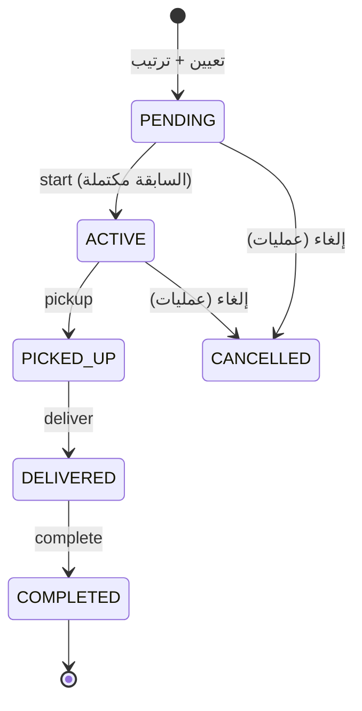

# Operations Module — Cash Transfer Design

**Status:** APPROVED v1.0 (2026-08-17) — implementation started (OP-1). Built strictly on the
evidence in `docs/12-planning/operations-legacy-discovery.md`; no business rule here is invented.
**Approved decisions (2026-08-17), binding for this phase — Legacy parity first, improvements second:**
1. **Attendance/absence is NOT an assignment eligibility gate** for the cash-transfer crew, exactly
   as in legacy (discovery §10.2, quirk Q12). Assignment is never blocked by absence. Recorded as a
   FUTURE BUSINESS IMPROVEMENT, to be activated only by a separate explicit decision.
2. **Requirements flags stay metadata / visual indicators / pool filters** exactly where legacy used
   them (discovery §9). No flag (`leader`, weapon, signature, mozawla, …) becomes a server-side
   eligibility rule, because none was one in legacy — the only server-side use of any flag is
   `leader: 1` inside the captain-picker queries, which is preserved as a QUERY FILTER, not a guard.
   Any strengthening is a separate future decision.
3. Legacy quirks are handled per the PRESERVE / NORMALIZE / DROP register in the discovery doc —
   nothing is silently fixed; every normalization is named in the PR that performs it.
**Source of business logic:** legacy repo `egycashcompany-ops/fleet` @ `44654cd`.
**Boundary:** conforms to the frozen `fleet-module-design.md` §9.4 OPS boundary as-is.
**Section numbering** (12, 15–21) continues the task's requested report outline; sections 1–14
and 18 (legacy state machines) live in the discovery doc.

> **OBSERVED** = سلوك موثّق من كود Legacy · **PROPOSED** = تصميم ECMS جديد ·
> **NEW** = متطلب جديد بلا نظير في Legacy

---

## 12. منطق التقارير (Reports Logic) — OBSERVED

التقريران **متطابقان بنيويًا** ويختلفان في مفتاح التجميع فقط.

### 12.1 المشترك بينهما
```js
$facet: {
  daily:   [{ $match: { type:'يومي',   rec_date: {$gte:startDate,$lte:endDate}, status:1, deleted:0 } }, …],
  secured: [{ $match: { type:'محصنة', del_date: {$gte:startDate,$lte:endDate}, status:1, deleted:0 } }, …]
}
→ $project { all: $concatArrays['$daily','$secured'] } → $unwind '$all'
```
`ops_report:4871-4960` · `ops_bank_report:5207-5290`

| القاعدة | القيمة |
|---|---|
| الحالة المحسوبة | **`status: 1` فقط** (= مكتملة) |
| المحذوفات | `deleted: 0` |
| تاريخ اليومي | `rec_date` |
| تاريخ المحصنة | `del_date` |
| النطاق الافتراضي | **الشهر الميلادي الحالي**: أول يوم 00:00:00.000 → آخر يوم 23:59:59.999 (توقيت محلي) `4860-4866` |
| تحويل القيم | `$convert to:'double', onError:0, onNull:0` — **أي قيمة غير رقمية تصبح صفرًا صامتًا** |
| العبوات | `$ifNull['$bag',0]`, `$ifNull['$cartoon',0]`, `$ifNull['$box',0]` |

### 12.2 الفرق الجوهري
| | `ops_report` (القادة) | `ops_bank_report` (البنوك) |
|---|---|---|
| مفتاح التجميع | `leader` | `main_bank` |
| اليومي يُنسب إلى | **`leader1`** (`4894`) | `main_bank` (`5222`) |
| المحصنة تُنسب إلى | **`leader2`** (`4931`) | `main_bank` (`5256`) |

🔑 **هذا هو الدليل القاطع على نموذج "الرجلين"**: التقرير ينسب الشحنة اليومية للقائد الأول
والمحصنة للقائد الثاني — فهما رحلتان مختلفتان بطاقمين مختلفين.

⚠️ تقرير البنوك يجمع على `main_bank` **للنوعين معًا** — أي أن `sec_bank` (بنك الوجهة)
لا يظهر في أي تجميع. **قيد معروف يجب تأكيده مع العمل.**

### 12.3 قاعدة التطابق (Parity) الملزمة لـ ECMS
> شحنة تُحتسب **مرة واحدة** في تقرير القادة، تحت `leader1` إن كانت يومية وتحت `leader2` إن كانت
> محصنة، وبتاريخ `rec_date` أو `del_date` على الترتيب، وفقط إذا كانت `status=1, deleted=0`.

### 12.4 ⚠️ ثلاثة أخطاء موثّقة في حسابات Legacy — قرارات parity واجبة
1. **العبوات تتضاعف × عدد العملات** (Q26): بعد `$unwind` للأزواج، وثيقة بـ3 عملات و10 أكياس
   تُحسب **30 كيسًا** (`5006-5023`). المبالغ و`docs_count` سليمة. **القرار: نصحح في ECMS
   ونوثّق أن أرقام العبوات ستختلف عن تقارير Legacy القديمة.**
2. **وثيقة بلا عملات تسقط كليًا** (Q28): `$zip` + `$unwind` بلا preserve يُسقطان الوثيقة
   حتى من عدّ الشحنات. **القرار: تُحتسب في ECMS.**
3. **صف الإجمالي داخل مصفوفة الصفوف** (Q27): مستهلك ساذج يجمع الكل مرتين.
   **القرار: عقد ECMS يفصل `rows` عن `totals`.**

كذلك تصنيف العملات في Legacy بالمرادفات الحرفية (`['مصري','جنيه','EGP']`, `['دولار','USD']`،
والباقي "أخرى") — يُستبدل بمعرّف عملة صريح، مع جدول مطابقة عند الترحيل.

---

## 15. خريطة Legacy → ECMS

| Legacy | المفهوم | وجهة ECMS | القرار |
|---|---|---|---|
| `transactions` (يومي) | شحنة نقل يومية | `operations_shipments` | **SPLIT** |
| `transactions` (محصنة) | شحنة محصنة | `operations_shipments` + `operations_vault_custody` | **SPLIT** |
| `transactions.leader1/car_num1` | الرحلة الأولى | `operations_shipment_assignments{leg:'PICKUP'}` | **SPLIT** |
| `transactions.leader2/car_num2` | رحلة التسليم | `operations_shipment_assignments{leg:'DELIVERY'}` | **SPLIT** |
| `transactions.currencies[]/values[]` | مبالغ | `shipment.lines[{currencyId, amount:Decimal128}]` | **NORMALIZE** |
| `transactions.status` (0/1/2/3) | الحالة | enum نصي صريح | **NORMALIZE الترميز، PRESERVE المعنى** |
| `transactions.vault_no/Rack_no/bag/box/seals` | عهدة الخزينة | `operations_vault_custody` | **SPLIT** |
| `tashghela` | صف (سيارة، يوم) + طاقم | `operations_crew_assignments` | **NEW + ربط بـ fleet** |
| `tashghela.car_status` | قفل بعد الصرف | مشتق من حالة الشحنات | **NORMALIZE** |
| `car_lock` | إتاحة السيارة ليوم | `fleet` (موجود) | **REUSE** |
| `cars` | السيارات | `fleet_vehicles` | **REUSE** |
| `cars_maintenance` | الصيانة | `fleet_maintenance_visits` | **REUSE** |
| `employees` | الموظفون | HR employee | **REUSE** |
| `employees.leader` | علم القائد | دور عمليات صريح | **NORMALIZE** |
| `employees.selah/tawqe3/mozawla/mozawla_mo` | مؤهلات | `operations_crew_qualifications` | **PRESERVE + تفعيل** |
| `employees.ops_emp/mohema/priority/new` | أعلام write-only | تُنقل كـ metadata، غير مُفعِّلة | **PRESERVE موثّقًا** |
| `absence` | الغياب | `fleet_driver_unavailability` + HR attendance | **REUSE** |
| `banks` | البنوك (العميل) | `operations_banks` | **NEW** (غير موجود في ECMS) |
| `bank_branches` | فروع = المواقع | `operations_bank_branches` | **NEW** |
| `citys` / `governorates` | جغرافيا | platform/organization إن وُجد، وإلا `operations_*` | **تحقق ثم REUSE** |
| `data_lists.currencys` | العملات | `operations_currencies` أو platform settings | **NEW** |
| `users.privilege` | صلاحية اسمية | ECMS RBAC | **DROP → إعادة بناء** |
| — | **يوم التشغيل** | `operations_days` | **NEW** (لا نظير) |
| — | **ترتيب التنفيذ** | `shipment_assignments.sequence` | **NEW** |

---

## 16. نموذج الـ Domain المقترح — PROPOSED

**اسم الموديول**: `operations` — `{ en: 'Operations', ar: 'العمليات' }`
(يطابق نمط ECMS أحادي الكلمة: `hr`, `fleet`, `it`؛ الـ collections تحمل بادئة `operations_`
كما يفرض `module-registry.ts`.)

### 16.1 الكيانات

#### `OperationsDay` — `operations_days` — **NEW**
| الحقل | النوع | ملاحظة |
|---|---|---|
| `date` | Date | **UTC midnight** — الهوية |
| `status` | `PLANNING\|OPEN\|CLOSED` | Legacy لا يملك هذا |
| `openedAt/By`, `closedAt/By` | — | |

يجعل حدود اليوم **صريحة** بدل اشتقاقها من مطابقة تاريخ هشة (Q15).
فهرس فريد على `date`.

#### `CashShipment` — `operations_shipments`
| الحقل | أصل Legacy |
|---|---|
| `shipmentType` | `type` (`يومي`→`DAILY`, `محصنة`→`SECURED`) |
| `mainBankId` / `secondaryBankId` | `main_bank` / `sec_bank` (نص → ref) |
| `originBranchId` / `destinationBranchId` | `from_code`+`from_name` / `to_code`+`to_name` |
| `areaCode` | `area` |
| `lines[{currencyId, amount:Decimal128, denominations}]` | `currencies[]`+`values[]`+`denominations[]` **مدموجة** |
| `collectionDate` / `deliveryDate` | `rec_date` / `del_date` |
| `status` | `DRAFT\|IN_VAULT\|DISPATCHED\|COMPLETED` (+`isDeleted`) |
| `receiptNumber` / `vaultReceiptNumber` | `receipt_num` / `vault_receipt_num` |
| `notes` | `notes` |
| `serialTracked` | `serial` |

فهارس: `(collectionDate, shipmentType)`, `(deliveryDate, shipmentType, status)`, `(status)`.

#### `ShipmentAssignment` — `operations_shipment_assignments` — **يستبدل leg1/leg2**
| الحقل | ملاحظة |
|---|---|
| `shipmentId` | ref |
| `operationsDayId` | ref |
| `leg` | `PICKUP \| DELIVERY` — **يستبدل ازدواج leader1/leader2** |
| `captainEmployeeId` | `leader1` أو `leader2` |
| `vehicleId` | `car_num1` أو `car_num2` → `fleet_vehicles` |
| `crewAssignmentId` | ref → طاقم اليوم |
| **`sequence`** | **NEW** — ترتيب التنفيذ (1..N) |
| `executionStatus` | **NEW** — `PENDING\|ACTIVE\|PICKED_UP\|DELIVERED\|COMPLETED\|CANCELLED` |
| `startedAt/pickedUpAt/deliveredAt/completedAt` | **NEW** |
| `version` | تفاؤلي للـ reorder |

فهرس فريد: `(operationsDayId, captainEmployeeId, sequence)` — يمنع التكرار في الترتيب.
فهرس فريد: `(shipmentId, leg)`.

#### `OperationsCrewAssignment` — `operations_crew_assignments`
| الحقل | أصل |
|---|---|
| `operationsDayId`, `vehicleId` | `tashghela.date` + `car_num` |
| `fleetDutyAssignmentId` | 🔗 ربط بـ `fleet_duty_assignments` |
| `captainEmployeeId` | `tashghela.leader` |
| `specialist1EmployeeId` / `specialist2EmployeeId` | `emp1` / `emp2` (**nullable** — Legacy يسمح) |
| `direction`, `plannedTime`, `missionType`, `notes` | `direction`,`time`,`tybe`,`notes` |

فهرس فريد: `(operationsDayId, vehicleId)` — يعكس `ux_vehicle_date` في fleet.

> ✅ **حدّ معماري مُقرَّر سلفًا — ليس اقتراحًا جديدًا**: التصميم المجمَّد
> `docs/12-planning/fleet-module-design.md §9.4` ينصّ حرفيًا:
> *"OPS reads `fleet_duty_assignments` by date and attaches work orders to `assignmentId`;
> mission-type catalog is Fleet-owned, OPS-readable. Fleet never knows what the mission did."*
> وتعليق `duty-assignment.model.ts:1-6` يكرّره: *"This row is the OPS boundary"*.
> إذن: **Fleet يملك (سيارة، سائقان، نوع المهمة)/يوم؛ Operations يملك طاقم النقد
> (قائد + أخصائيان) والتنفيذ، ويشير إلى صف Fleet عبر `fleetDutyAssignmentId`.**
> هذا التصميم يلتزم بالحد المجمَّد كما هو.

#### `VaultCustodyRecord` — `operations_vault_custody`
| الحقل | أصل |
|---|---|
| `shipmentId` | ref (1:1 مع SECURED) |
| `vaultNumber`, `rackNumber` | `vault_no`, `Rack_no` |
| `bagCount`,`cartonCount`,`boxCount` | `bag`,`cartoon`,`box` |
| `bagSeals[]`,`boxSeals[]` | `bag_seals`,`box_seals` |
| `receivedByPrimaryId` **+** `receivedBySecondaryId` | 🐞 يُصلح Q2 — **كلاهما مطلوب** |
| `receivedAt` | `treasurer_receive_date` |
| `deliveredById`, `deliveredAt` | 🐞 يُصلح Q3 — يُكتبان فعليًا |

### 16.2 الصلاحيات المقترحة (بعُرف `declarePermissions` في ECMS)

> **ملاحظة تنفيذ (OP-1):** أسماء الـ resources أدناه مختصرة بـ `ops*` للعرض؛ عند التنفيذ تُسمّى
> بالبادئة الكاملة `operations*` (مثل `operationsShipment.view`) اتباعًا لسابقة fleet/it
> (`fleetVehicle.*`, `itAsset.*`)، وتُعلَن كل صلاحية **مع** الـ slice الذي يخدمها لا قبله.

Legacy لا يملك أدوارًا (القسم 13 في Part 1) — لذا هذه **مصفوفة جديدة** مبنية على الأدوار الضمنية
في الشاشات (عمليات / أمين خزينة / قائد):

| Permission key | المعنى | Ops planner | Ops supervisor | Treasurer | Captain |
|---|---|:-:|:-:|:-:|:-:|
| `opsShipment.view` | عرض الشحنات | ✅ | ✅ | ✅ | — |
| `opsShipment.create` | إنشاء شحنة/محصنة | ✅ | ✅ | ✅¹ | — |
| `opsShipment.edit` | تعديل | ✅ | ✅ | — | — |
| `opsShipment.delete` | حذف (soft) | — | ✅ | — | — |
| `opsShipment.complete` | تأكيد التسليم النهائي (شاشة العمليات) | — | ✅ | — | — |
| `opsCrew.view` / `opsCrew.plan` | لوحة التشغيلة | ✅ | ✅ | — | — |
| `opsCrew.reorder` | **إعادة ترتيب شحنات القائد** | ✅ | ✅ | — | — |
| `opsVault.view` | جرد الخزينة | — | ✅ | ✅ | — |
| `opsVault.receive` | استلام محصنة (بأمينين) | — | — | ✅ | — |
| `opsVault.dispatch` | صرف محصنات لسيارة | — | — | ✅ | — |
| `opsRequirements.manage` | مصفوفة المتطلبات | — | ✅ | — | — |
| `opsReport.view` | التقارير | ✅ | ✅ | ✅ | — |
| `opsExecution.own` | **start/pickup/deliver/complete لشحنات القائد نفسه فقط** | — | — | — | ✅ |
| `opsDay.manage` | فتح/إغلاق يوم التشغيل | — | ✅ | — | — |

¹ `/receive_mohsana` في Legacy يُنشئ محصنات أيضًا (OBSERVED) — نحافظ على ذلك.
`opsExecution.own` **مقيّدة بالكيان**: الحارس في الـ service يتحقق أن الفاعل هو
`captainEmployeeId` المعيَّن — الصلاحية وحدها لا تكفي.

#### مرجعية: `operations_banks`, `operations_bank_branches`, `operations_currencies`
`BankBranch`: `bankId, name, code, opsAreaCode, financeAreaCode, cityId, isActive` +
**`location: { addressLine?, coordinates?: {lat,lng} } | null`** ← **abstraction للمستقبل**
(القسم 17.4).

---

## 17. Captain Mobile Workflow — **NEW** (بلا نظير في Legacy)

### 17.1 الترتيب المحفوظ في الـ backend
`ShipmentAssignment.sequence` عدد صحيح `1..N` فريد لكل `(operationsDayId, captainEmployeeId)`.

**API إعادة الترتيب** — دفعة كاملة، لا تبديل عنصر بعنصر:
```
PUT /api/v1/operations/days/:dayId/captains/:employeeId/shipment-order
{ "version": 7, "order": ["<assignmentId1>", "<assignmentId2>", "<assignmentId3>"] }
```
- الدفعة الكاملة تجعل العملية **idempotent** وتزيل فجوات/تعادلات الترتيب.
- `version` = تحكّم تفاؤلي على نمط `roster.service.ts` (version-aware) → `ConflictError` عند التضارب.
- تُنفَّذ داخل `unitOfWork` (معاملة Mongo فعلية).
- تُرفض إعادة ترتيب أي شحنة **بدأ تنفيذها** (`executionStatus ≠ PENDING`) — الترتيب يُعاد
  للمعلّقات فقط، والمنفّذة تحتفظ بمواضعها.

### 17.2 🔴 التنفيذ التتابعي — القاعدة الأساسية
**مكان الفرض**: طبقة الـ **service/domain** (`shipment-execution.service.ts`) — **ليس** الـ controller
ولا الـ UI، التزامًا بطبقات ECMS.

```ts
// PSEUDO — operations/execution/shipment-execution.service.ts
const assertMayStart = async (assignment, session) => {
  if (assignment.executionStatus !== 'PENDING')
    throw new BusinessRuleError('Shipment already started', 'SHIPMENT_ALREADY_STARTED');

  const blocking = await repo.findFirstIncompleteBefore({
    operationsDayId:  assignment.operationsDayId,
    captainEmployeeId: assignment.captainEmployeeId,
    sequenceLt:        assignment.sequence,
  }, session);

  if (blocking !== null)
    throw new BusinessRuleError(
      `Shipment #${blocking.sequence} must be completed before #${assignment.sequence}`,
      'PREVIOUS_SHIPMENT_INCOMPLETE');
};

export const startShipment = (assignmentId, actor) => unitOfWork(async (session) => {
  const a = await repo.findByIdForUpdate(assignmentId, session);
  assertActorIsAssignedCaptain(a, actor);          // القائد المعيَّن فقط
  assertDayIsOpen(a.operationsDayId, session);
  await assertMayStart(a, session);

  const updated = await repo.transitionStatus(
      assignmentId, 'PENDING', 'ACTIVE', { startedAt: now }, session);  // CAS
  if (updated === null) throw new ConflictError('Concurrent start');    // ⇐ سباق البدء المزدوج

  pendingAudit = { entityRef: ref(assignmentId), action: 'update', changes };
  return updated;
});
// audit + emit بعد الـ commit فقط — نمط roster.service.ts:272 حرفيًا
```
- **الحارس**: "لا توجد شحنة بترتيب أقل لنفس (اليوم، القائد) حالتها ≠ `COMPLETED`/`CANCELLED`".
- **CAS** (`transitionStatus` بشرط الحالة القديمة) يمنع البدء المزدوج المتزامن.
- **أنواع الأخطاء وفق عُرف ECMS** (`shared/errors`):
  - خرق قاعدة التتابع / بدء ما بُدئ → `BusinessRuleError` → **HTTP 422** (قاعدة domain، ليست تصادمًا)
  - سباق CAS متزامن → `ConflictError` → **HTTP 409**
  - `version` قديم في إعادة الترتيب → `StaleDocumentError` → **HTTP 409** `STALE_DOCUMENT`
- نفس الحارس على `/pickup`, `/deliver`, `/complete` بالتسلسل المناسب.
- **الترتيب الإلزامي**: audit + events **بعد** الـ commit فقط (نمط `roster.service.ts:272`).

**حالات حدّية مُعالَجة**
| الحالة | السلوك |
|---|---|
| إلغاء شحنة في المنتصف | `CANCELLED` لا تحجب التالية (تُعامل كمكتملة للحجب) |
| إعادة تعيين القائد أثناء اليوم | الترتيب يتبع `(day, captain)` — التعيين الجديد يُعيد ترقيم قائمة القائد الجديد |
| إعادة ترتيب بعد بدء التنفيذ | مرفوضة للشحنات غير المعلّقة (17.1) |
| استدعاء API مباشر | مرفوض — الفحص في الـ domain لا في الواجهة |

### 17.3 عقد شاشة الموبايل
```
GET /api/v1/operations/me/day            → يوم القائد الحالي
{ day: { date, status },
  shipments: [ { assignmentId, sequence, executionStatus,
                 locked: boolean,            // مشتق: هل السابقة غير مكتملة
                 shipmentType, referenceNumber,
                 pickup:   { branchName, bankName, areaCode, address?, coordinates? },
                 delivery: { branchName, bankName, areaCode, address?, coordinates? },
                 lines: [{ currency, amount }], packaging: { bags, boxes, cartons } } ] }

POST /api/v1/operations/assignments/:id/start
POST /api/v1/operations/assignments/:id/pickup
POST /api/v1/operations/assignments/:id/deliver
POST /api/v1/operations/assignments/:id/complete
```
`locked` **مشتق في الـ backend** — الواجهة لا تحسبه ولا تُوثق به.

### 17.4 الموقع والخريطة — قيد واقعي
> **الحقيقة**: Legacy **لا يحتوي أي إحداثيات ولا عناوين ولا هواتف للفروع** (القسم 11.2).
> البيانات الجغرافية الوحيدة هي `area` (اسم منطقة) + اسم/كود الفرع.

**التصميم**: `BankBranch.location` كائن **اختياري**:
```ts
location: { addressLine: string | null,
            coordinates: { lat: number, lng: number } | null } | null
```
- **اليوم الأول**: `coordinates = null` لكل الفروع. الشاشة تعرض اسم الفرع + البنك + المنطقة،
  وتُخفي الخريطة والمسار بلا كسر.
- **لاحقًا**: تعبئة الإحداثيات تُفعّل الخريطة تلقائيًا بلا تغيير عقد الـ API.
- **لا يُنشأ نظام مواقع موازٍ** — الموقع يسكن على الفرع المرجعي نفسه.
- إضافة مكتبة خرائط مؤجَّلة حتى تتوفر إحداثيات فعلية (لا توجد مكتبة خرائط في `apps/web` اليوم).

### 17.5 آلة حالة تنفيذ الشحنة — **NEW**


---

## 19. تحليل الفجوات (Gap Analysis)

| القدرة | Legacy | ECMS اليوم | النوع |
|---|---|---|---|
| لوحة اليوم التشغيلي | ✅ `/main_ops` | ❌ | **PORT** |
| كيان يوم تشغيلي صريح | ❌ مشتق | ❌ | **NEW** |
| شحنة يومية | ✅ | ❌ | **PORT** |
| محصنة + خزينة | ✅ | ❌ | **PORT** |
| تعيين طاقم (سيارة/يوم) | ✅ `/tashghela` | ⚠️ `fleet/roster` (سائقين فقط) | **EXTEND** |
| السيارات/الصيانة/الإتاحة | ✅ | ✅ `fleet_*` | **REUSE** |
| الموظفون | ✅ | ✅ HR | **REUSE** |
| حضور يومي | ❌ نطاقات فقط | ✅ `hr/attendance/day-records` | **REUSE (تحسين)** |
| البنوك والفروع | ✅ | ❌ لا يوجد | **NEW** |
| إحداثيات/عناوين | ❌ | ❌ | **NEW (مؤجَّل)** |
| تقرير القادة/البنوك | ✅ | ❌ | **PORT (بتطابق)** |
| RBAC | ❌ مُثبّت `"pola"` | ✅ ناضج | **BUILD NEW** |
| Audit trail | ❌ | ✅ `platform/audit` | **REUSE** |
| Domain events + outbox | ❌ | ✅ `event-bus` | **REUSE** |
| معاملات | ❌ | ✅ `unitOfWork` | **REUSE** |
| ترتيب تنفيذ الشحنات | ❌ | ❌ | **NEW** |
| تنفيذ تتابعي مُلزَم | ❌ | ❌ | **NEW** |
| شاشة موبايل للقائد | ❌ | ❌ | **NEW** |
| Drag & drop | ⚠️ يدوي | ❌ لا مكتبة | **NEW** |
| اختبارات | ❌ | ✅ | **NEW** |

### 19.1 ما في Legacy وليس له مكان في التصميم (قرارات صريحة)
| العنصر | القرار |
|---|---|
| `spe1_*`, `spe2_*`, `driver1/2` على الشحنة | **DROP** — ميتة (Q4) |
| `mozawla_mo`, `ops_emp`, `mohema`, `priority` | **PRESERVE كـ metadata** بلا تفعيل (Q25) |
| `tash_cars.ejs` و views بلا routes | **DROP** (Q21) |
| `/taeen_drivers` POST المكرر | **DROP** (Q20) |
| `users.privilege` | **DROP** → RBAC |
| `area2` (للحسابات) | **PRESERVE** كحقل مالي منفصل (Q24) |

---

## 20. خطة التنفيذ — PRs صغيرة

| PR | العنوان | النطاق | يعتمد على |
|---|---|---|---|
| **1** | Module foundation | `operations.module.ts` + تسجيل في `modules/index.ts` + contracts vocabulary (الأنواع/الحالات + خريطة legacy) + اختباراتها. **بلا صلاحيات وبلا صفحات وبلا routes** — القاعدة الملزمة في ECMS (سابقة IT): "a grant is declared WITH its operation, never ahead of it"، فالصلاحيات والصفحات تصل مع الـ slice الذي يخدمها (OP-2+). | — |
| **2** | Reference data **+ Shipments core** *(دُمجا في OP-2 بقرار المالك، 2026-08-17)* | `operations_banks/_bank_branches/_currencies` + CRUD + `location` abstraction + `operations_shipments` بدورة حياته المرصودة (complete/reopen بحارس Q30) + صلاحيات `operationsShipment.*`/`operationsCatalog.manage` + أحداث الشحنة الخمسة | 1 |
| **3** | Operations day **+ Crew assignment** *(دُمجا في OP-3 بقرار المالك، 2026-08-17)* | `operations_days` (planning→open→closed، بلا بوابات على التخطيط — parity) + `operations_crew_assignments` على حدّ §9.4 (`fleetDutyAssignmentId` إلزامي = بوابة car_lock مطبَّعة) + فرض Q11 نهاية-الحالة + لوحة الغد الافتراضية (parity :2239) + صلاحيات `operationsCrew.view/plan` و`operationsDay.manage` | 1 |
| **4** | ~~Shipments core~~ *(نُفِّذ ضمن OP-2 أعلاه)* — يتبقى منه فقط ربط الشحنة بيوم التشغيل عند وصول PR 3 | 2,3 |
| **5** | ~~Crew assignment~~ *(نُفِّذ backend ضمن OP-3 أعلاه)* — يتبقى لوحة الواجهة (UI) مع شرائح الواجهات | 3 |
| **6** | Vault / mohsana ✅ *(نُفِّذ كـ OP-4، 2026-08-17)* | `operations_vault_custody` + **Treasury port** (`treasury-boundary.ts` — ECMS بلا موديول خزينة، فالحدّ واجهة مُسجَّلة والتنفيذ مؤقت داخل Operations لحين وجود مالك) + `operations_shipment_assignments` (leg=delivery = leader2/car_num2) + receive بأمينين مختلفين + assign + dispatch داخل transaction واحدة | 4,5 |
| **7** | Shipment assignment + sequencing ✅ *(نُفِّذ كـ OP-5، 2026-08-17)* | `sequence` على `operations_shipment_assignments` + فهرس فريد `(day, captain, leg, sequence)` + تعيين leg 1 (pickup — موجود على **النوعين**) + `PUT /assignments/order` بترتيب كامل وversion لكل عنصر داخل transaction (park سالب ثم النهائي) + قراءة مسار القائد للموبايل | 4,5 |
| **8** | Sequential execution | `start/pickup/deliver/complete` + الحارس التتابعي في الـ domain + CAS | 7 |
| **9** | Captain mobile surface — **الجزء الخلفي نُفِّذ كـ OP-6 (2026-08-17)**: `GET /operations/mobile/my-day` (قراءة فقط) + هوية القائد من الـtoken عبر seam جديد `registerSelfEmployeeLookup` + تمثيل completed/current/locked مشتق + المواقع من `BankBranch.location`. تبقّى: شاشة الموبايل نفسها. | 8 |
| **10** | Reports | تقرير القادة + تقرير البنوك بتطابق Legacy | 4,6 |
| **11** | Events / audit / outbox | نشر أحداث الموديول + audit شامل + اشتراكات | 4–8 |
| **12** | E2E tests | سيناريو يوم كامل | الكل |

كل PR **يُدمج مستقلًا ويترك النظام أخضر**.

---

## 20-ب. سجل قرارات OP-4 (المحصنات) — PRESERVE / NORMALIZE / DROP

| السلوك القديم | الدليل | القرار | السبب |
|---|---|---|---|
| سُلّم `0→2→3→1` غير تصاعدي و`1` نهائي | `:1220,:1737,:564` | **PRESERVE** (المعنى) | الترميز فقط طُبِّع؛ الخريطة الرقمية مثبَّتة في contracts ومُختبَرة |
| `/mohsana` = المتراكم المفتوح بلا فلتر تاريخ | `:657` | **PRESERVE** | «كل ما لم يكتمل» — شحنة استُلمت قبل أسابيع تظل ظاهرة |
| `/vault1` = الجرد الحالي، فلاتر التاريخ **مُعلَّقة** | `:1374,:1530` | **PRESERVE** (Q32) | الخزينة تجيب «ما الموجود الآن»؛ الـ date picker الوهمي أُسقط |
| `/tash4ela_mohasana` يكتب `leader2`+`car_num2` فقط بلا مساس بالحالة | `:4491` | **PRESERVE** | التعيين ليس صرفًا — مُختبَر صراحةً |
| `$nin:[0,1,3]` للقائمة المستحقة | `:4447,:1690` | **NORMALIZE** (Q9) | `$nin` يلتقط الوثائق ناقصة الحقل؛ استُبدل بـ`status:'inVault'` صريح |
| `treasurer_receive` يُكتب `""` دائمًا (رجل واحد فعليًا) | `:1211,:1266` | **NORMALIZE** (Q2) | أمينان **مختلفان** إلزاميان — الحقل كان يصف قاعدة لم تُنفَّذ قط |
| `treasurer_delivery*` مُعلَنة ولا تُكتب أبدًا | فحص شامل | **NORMALIZE** (Q3) | `releasedBy/releasedAt` تُكتبان فعليًا عند الصرف |
| الاستلام = تعديل عام يعيد ختم الحالة والتاريخ كل حفظ | `:1194-1240` | **NORMALIZE** (Q29) | العهدة تُؤخذ مرة واحدة (فهرس فريد على الشحنة) |
| الصرف بلا فحص حالة ولا transaction (`Promise.all`) | `:1735-1740` | **NORMALIZE** (Q18) | `unitOfWork` واحدة + حارس الحالة — الفشل الجزئي كان يترك حالة مختلطة |
| الصرف بلا تحقق من `leader2` | `:1737` | **NORMALIZE** (Q30) | الصرف يتطلب leg 2 مُعيَّنًا على **نفس** صف التشغيلة — هذا ما كان يُنتج محصنة مكتملة بقائد فارغ في التقرير |
| الصرف يُطلَق من زر **الطباعة** | `deliver_mohsana.ejs:1249` | **DROP** | الطباعة عرض؛ الصرف عملية لها endpoint وصلاحية |
| `vault_no` · `Rack_no` · `vault_receipt_num` | لا تُكتب أبدًا (فحص) | **DROP** | أعمدة ميتة؛ موقع الخزينة يعود كحقل حقيقي يوم يطلبه العمل |
| `car_status:1` على صف التشغيلة عند الصرف | `:1735` | **NORMALIZE** | الحالة مشتقة من حالات الشحنات، لا عَلَم مكرَّر يمكن أن يتعارض |

## 20-د. الحدّ بين النقل والجديد — يبدأ عند OP-6

| الشرائح | الطبيعة | المرجعية |
|---|---|---|
| OP-1 … OP-5 | **نقل/تطبيع من Legacy** — كل قاعدة مستشهَدة بسطر في `contad_app.js`، وكل انحراف مصنَّف PRESERVE/NORMALIZE/DROP | `operations-legacy-discovery.md` |
| **OP-6 فصاعدًا** | **قدرة ECMS جديدة** — لا نظير لها في Legacy إطلاقًا | التصميم وحده |

**الحقيقة المثبتة:** النظام القديم **لا يملك أي واجهة للقائد**: القائد لم يكن يسجّل دخولًا، ولا يرى مسارًا، ولا يسجّل شيئًا — لا يوجد بين الـ86 route أي شاشة من هذا النوع. لذلك **لا يُقاس أي شيء في OP-6 بسلوك قديم**، ولا يصح البحث عن نظير له.

قرارات OP-6 (كلها تصميم جديد، لا parity):
- **الهوية من الـtoken**: لا يوجد بارامتر `captainId` في أي endpoint ⇒ العزل بين القادة خاصية بنيوية لا فلتر يُنسى.
- **query لا projection**: لا collection خاصة بالموبايل؛ القراءة تركيب على الكيانات المالكة (assignment→shipment→crew→branch→bank). أي read model مادي لاحقًا = قرار موثّق منفصل.
- **`progress` مشتق لا مخزَّن**: `completed` من حالة الشحنة، `current` أول غير مكتملة، والباقي `locked` — الشكل الذي تحتاجه شريحة التنفيذ، دون أن تكون القاعدة نفسها هنا.
- **المواقع**: `BankBranch.location` من OP-2 كما هي، اختيارية؛ لا كيان مواقع ثانٍ، ولا إحداثيات مخترعة.

## 20-هـ. نموذج هوية القائد — **قيد معماري** (قرار المالك، 2026-08-17)

> واجهة القائد على الموبايل **ليست** مستخدمًا ولا حسابًا ولا كيانًا منفصلًا. القائد **موظف ECMS عادي** بهويته المعتادة، وتجربة الموبايل مجرد **قدرة (capability) خاصة بالقائد معروضة داخل ملف ذلك الموظف المُوثَّق**.

هذا **قيد معماري**، لا تفصيلة واجهة، ولا يجوز لأي شريحة لاحقة أن تخالفه ضمنيًا.

**السلسلة، وتُحَل كلها على الخادم:**

```
المستخدم المُوثَّق (token)
  → الموظف            (عبر seam المنصّة registerSelfEmployeeLookup — لا استيراد بين الموديولات)
  → تعيين القائد ليوم التشغيل   (صف الطاقم (يوم، مركبة) — هو المرساة)
  → الشحنات المرتَّبة
  → (لاحقًا) سير التنفيذ التتابعي
```

| ممنوع | مضمون بماذا |
|---|---|
| `MobileUser` أو حساب/تسجيل دخول منفصل للقائد | لا يوجد أي كيان كهذا في الموديول؛ المُعاد هو `employeeId` **نفسه** الذي تستخدمه شاشات الديسكتوب |
| نموذج هوية ثانٍ للموبايل | الهوية `DirectoryEmployee` من المنصّة — نفس النوع الذي تستهلكه الموديولات الأخرى |
| أن يرسل العميل `captainId` | لا يوجد بارامتر كهذا أصلًا، و`OperationsMobileDayQuerySchema` مُعرَّف `.strict()` ⇒ حقنه يُرَدّ بـ400 لا يُتجاهَل بصمت |
| أن تُشتقّ قيادة اليوم من الحساب أو من الصلاحية | `isCaptainOnDay` يُجاب من **صف الطاقم**، لا من RBAC ولا من الحساب |

**فصل جوهري — القدرة ≠ القيادة:**

- **القدرة (capability)**: هل يفتح هذا الموظف واجهة القائد أصلًا؟ ⟵ **RBAC** (`operationsExecution.own`) — دائمة.
- **القيادة (captaincy)**: هل هو قائد **اليوم**، وعلى أي مركبة؟ ⟵ **بيانات خطة اليوم** (صف `(يوم، مركبة)`) — متغيّرة يوميًا.

لذلك موظف قد يحمل الصلاحية بشكل دائم ولا يكون قائدًا في يوم بعينه. ولهذا السبب `isCaptainOnDay` موجود: «مخطَّط اليوم بلا محطات بعد» و«ليس قائدًا اليوم» يعطيان `stops` فارغة، وهما **حقيقتان مختلفتان**؛ عميل يخلط بينهما يقول لقائد مخطَّط إنه بلا مهمة.

**نفس الهوية عبر السطحين:** الموظف نفسه يعمل على Desktop ECMS وعلى واجهة القائد بلا أي ازدواج — ويحرس ذلك اختبار تكامل يثبت أن `employeeId` المُعاد من الموبايل هو عين سجل الموظف المرتبط بذلك الـlogin.

## 20-ج. سجل قرارات OP-5 (التعيين والترتيب) — PRESERVE / NORMALIZE / DROP

| السلوك القديم | الدليل | القرار | السبب |
|---|---|---|---|
| leg 1 (`leader1`+`car_num1`) يُكتب عند الإنشاء **للنوعين** يومي ومحصنة | `:330/:336` و`:725/:733` | **PRESERVE** | التعيين متاح للنوعين؛ لم نقصره على اليومي |
| leg 2 (`leader2`+`car_num2`) للمحصنات فقط | `:4491` | **PRESERVE** | الفصل مُثبت بتقرير القادة (`:4894` يومي بـleader1، `:4931` محصنة بـleader2) |
| الأخصائيون ليسوا على الشحنة إطلاقًا | §3.1 (حقول ميتة) | **PRESERVE** | يُحلّون عبر `crewAssignmentId` → صف (يوم، سيارة)؛ اختبار انحدار يمنع التسريب |
| التعيين لا يغيّر حالة الشحنة | `:4491` | **PRESERVE** | assign ≠ dispatch ≠ complete |
| إعادة التعيين تكتب في المكان (bulkWrite) | `:4491` | **PRESERVE** | فهرس فريد `(shipment, leg)` — لا تكرار بنيويًا |
| لا يوجد ترتيب تنفيذ في Legacy إطلاقًا | فحص شامل | **NEW** | `sequence` 1..N فريد لكل (يوم، قائد، leg) — القدرة الجديدة المطلوبة |
| — | — | **NEW** | إعادة الترتيب: حمولة كاملة (المواضع من ترتيب المصفوفة ⇒ يستحيل التعبير عن موضع مكرر)، فحص الاكتمال، version لكل عنصر، transaction واحدة بـpark سالب قبل النهائي |

## 21. الاختبارات الإلزامية (Test Plan)

**الاختبار الأهم على الإطلاق**
```
✅ captain cannot start shipment N+1 while shipment N is not completed
   → POST /assignments/:id/start يُرجع 422 BusinessRuleError (PREVIOUS_SHIPMENT_INCOMPLETE)
   → مُختبَر integration في tests/integration/operations.spec.ts
     على نمط اختبار FR-7 في tests/integration/fleet.spec.ts:949
```

| المجال | حالات محددة |
|---|---|
| التتابع | بدء #2 و#1 معلّقة → 409 · بدء #2 بعد إكمال #1 → 200 · بدء #3 و#2 ملغاة و#1 مكتملة → 200 |
| السباق | استدعاءان متزامنان لـ `start` على نفس الشحنة → واحد ينجح فقط |
| إعادة الترتيب | ترتيب كامل صحيح → 200 · version قديم → 409 · إعادة ترتيب شحنة نشطة → 422 · معرّف ناقص → 422 |
| الطاقم | نفس الموظف لسيارتين في نفس اليوم → رفض · أخصائي فارغ → مقبول · قائد غائب → **مقبول** (Legacy parity — القرار المعتمد 1؛ تحسين مستقبلي موثّق) |
| حدود اليوم | إجراء على يوم `CLOSED` → رفض · شحنة خارج اليوم → غير مرئية |
| المحصنة | `receive` بأمين واحد → رفض · `dispatch` من حالة ≠ `IN_VAULT` → رفض · استلام مزدوج → رفض |
| الصلاحيات | كل endpoint بلا الصلاحية → 403 · قائد يبدأ شحنة قائد آخر → 403 |
| التواريخ | UTC midnight · تخطيط الغد · حدود الشهر في التقارير |
| التقارير | تطابق: شحنة محصنة تُحتسب على `leader2` بـ `del_date` مرة واحدة فقط |
| Audit | كل انتقال حالة يُنتج قيد audit |

---

# Appendix B — ECMS binding conventions the module must follow


All paths relative to `/home/user/egycash`. Every rule below is quoted from live code.

## 1. Vertical slice anatomy

Folder = one feature inside the module: `apps/api/src/modules/<module>/<feature>/`.
Fleet examples: `fleet/vehicles/` (full CRUD slice), `fleet/roster/` (behaviour slice).
File set: `X.model.ts`, `X.repository.ts`, `X.service.ts`, `X.controller.ts`, `X.routes.ts`,
optional `index.ts` barrel, optional pure-function file + `.spec.ts` beside it
(`vehicles/vehicle-status.ts` + `vehicles/vehicle-status.spec.ts`).

**`.model.ts`** — Mongoose only. Exports `interface XDoc extends BaseDocFields`, a private
`Schema<XDoc>` spreading `...baseFields` and passing `baseSchemaOptions`, all `schema.index(...)`
declarations with explicit `name:`, and `export const XModel = model<XDoc>('Name', schema,
'<moduleid>_collection')`. Never imports service/repository. `roster/duty-assignment.model.ts:41-66`:

```ts
const dutyAssignmentSchema = new Schema<FleetDutyAssignmentDoc>(
  { vehicleId: { type: Schema.Types.ObjectId, required: true },
    date: { type: Date, required: true }, ... ...baseFields },
  baseSchemaOptions,
);
dutyAssignmentSchema.index({ vehicleId: 1, date: 1 },
  { unique: true, name: 'ux_vehicle_date', partialFilterExpression: { isDeleted: false } });
export const FleetDutyAssignmentModel = model<FleetDutyAssignmentDoc>(
  'FleetDutyAssignment', dutyAssignmentSchema, 'fleet_duty_assignments');
```

Uniqueness always uses `partialFilterExpression: { isDeleted: false }` so a soft-deleted row frees
its key (`vehicles/vehicle.model.ts:150-160`). Derived facts are NEVER stored — `vehicle.model.ts:100-103`:
"no `driver` (a roster fact), no `inWorkshop` (derived...) A stored copy of any of those is a copy
that goes stale."

**`.repository.ts`** — one class `extends BaseRepository<XDoc>`, constructor calls `super(Model,
options)` declaring scope fields, plus named query methods that wrap `this.list/this.model`.
Exports a singleton at the bottom. `vehicles/vehicle.repository.ts:173-197`:

```ts
class FleetVehicleRepository extends BaseRepository<FleetVehicleDoc> {
  constructor() { super(FleetVehicleModel, { branchField: 'branchId', departmentField: 'departmentId' }); }
  async listVehicles(params: ListParams<FleetVehicleDoc>): Promise<Paginated<FleetVehicleDoc>> {
    return this.list({ ...params, sortableFields: ['code', 'createdAt', 'licenseExpiresAt'] });
  }
}
export const fleetVehicleRepository = new FleetVehicleRepository();
```

**`.service.ts`** — all business rules, transactions, audit, events. Imports repositories (own and
other features'), `platform/audit`, `platform/kernel/event-bus`, `platform/kernel/unit-of-work`,
`shared/errors`, `shared/utils/diff`. Exports a singleton (`export const fleetRosterService = new
FleetRosterService()`, `roster.service.ts:323`). Never touches `Request`/`Response`.

**`.controller.ts`** — "Thin HTTP mapping only (ADR-003)" (`roster.controller.ts:1`). Reads
`validated<TBody, TQuery, TParams>(req)`, builds a `ScopeSelector` via `scopeSelector(authContext(req),
'<permission>')`, calls the service, responds with `ok/okPage/created/noContent`. Full file
`roster.controller.ts:10-22`:

```ts
export const planRoster = async (req: Request, res: Response): Promise<void> => {
  const { body } = validated<PlanFleetRoster>(req);
  const ctx = authContext(req);
  const scope = scopeSelector(ctx, 'fleetRoster.plan');
  const { changedCount } = await fleetRosterService.plan(body, ctx.userId, scope);
  ok(res, { ...(await fleetRosterService.board(body.date, scope)), changedCount });
};
```

**`.routes.ts`** — exports `buildXRouter = (): Router` only (see §2).

**Import direction (machine-enforced, `eslint.config.js:63-76`)**:
`{ from: 'modules', allow: ['modules', 'platform', 'shared'] }` — a module may NOT import
`infrastructure`. Within a slice: routes → controller → service → repository → model, never
backwards. `platform/web/index.ts:1-8` exists precisely to keep that boundary: it re-exports
`asyncHandler`, `validate`, `validated`, `ok/okPage/created/noContent` from infrastructure.
Also enforced: no `any`, no floating promises, no `console.*` (use the Pino logger), inline type imports.

**`shared/base/base.model.ts` (36 lines, quoted in full for the three exports)**:

```ts
export interface BaseDocFields {
  _id: Types.ObjectId; schemaVersion: number; isDeleted: boolean;
  deletedAt: Date | null; deletedBy: Types.ObjectId | null;
  createdBy: Types.ObjectId | null; updatedBy: Types.ObjectId | null;
  createdAt: Date; updatedAt: Date; __v: number;
}
export const baseFields = {
  schemaVersion: { type: Number, required: true, default: 1 },
  isDeleted: { type: Boolean, required: true, default: false },
  deletedAt: { type: Date, default: null },
  deletedBy: { type: Schema.Types.ObjectId, default: null },
  createdBy: { type: Schema.Types.ObjectId, default: null },
  updatedBy: { type: Schema.Types.ObjectId, default: null },
} as const;
export const baseSchemaOptions = { timestamps: true, strict: true as const };
```
Plus `assigneeFields` (`base.model.ts:32-36`) for assignable entities (`userId`, `role` of
`owner|assignee|watcher`, `at`).

**`shared/base/base.repository.ts` (307 lines)** gives, for free: `BaseRepositoryOptions`
(`branchField`, `departmentField`, `sectionField`, `hasAssignees`, `ownerUserField`, `softDelete`),
`ListParams<T>`, scope filtering (`scopeFilter`/`baseFilter`, own|section|department|branch|organization),
and methods `findById`, `getById` (throws `NotFoundError`), `findOne`, `exists`, `count`,
`countByStatus`, `countByStatusGrouped`, `list` (returns `Paginated<T>`, caps at `MAX_PAGE_SIZE`,
whitelists `sortableFields`, falls back to `createdAt`), `create` (maps duplicate key 11000 →
`ConflictError`), `updateById` (optimistic concurrency, see §7), `softDeleteById`, and two override
hooks `writeConditions()` / `assertWritable(current)` for rows that must be permanently unwritable.
Header rule (`base.repository.ts:1-4`): "Repositories accept typed filters only — never raw user
input (NoSQL-injection defense)."

## 2. Routes + validation

`apps/api/src/modules/fleet/roster/roster.routes.ts`, complete (25 lines):

```ts
import { Router } from 'express';
import { FleetRosterQuerySchema, PlanFleetRosterSchema } from '@ecms/contracts';
import { authenticate } from '../../../platform/auth';
import { authorize } from '../../../platform/rbac';
import { asyncHandler, validate } from '../../../platform/web';
import { getRosterDay, planRoster } from './roster.controller';

export const buildFleetRosterRouter = (): Router => {
  const router = Router();
  router.get('/', authenticate, authorize('fleetRoster.view'),
    validate({ query: FleetRosterQuerySchema }), asyncHandler(getRosterDay));
  router.post('/', authenticate, authorize('fleetRoster.plan'),
    validate({ body: PlanFleetRosterSchema }), asyncHandler(planRoster));
  return router;
};
```

Middleware order is invariant: `authenticate` → `authorize('<key>')` → `validate({...})` →
`asyncHandler(controller)`. Permission gate: `authorize = (permissionKey: string): RequestHandler`
(`platform/rbac/rbac.middleware.ts:9`); it 401s when unauthenticated, and on denial writes an audit
row `action: 'permissionDenied'` then `next(new ForbiddenError())` (`:16-24`). `authorizeAny(...keys)`
(`:35`) exists for record-dependent permissions. Path params get their own local schema
(`vehicle.routes.ts:22`): `const IdParamSchema = z.object({ id: objectId() }).strict();`

Zod wiring: `validate({ body?, query?, params? })` (`infrastructure/http/validate.ts:25-61`)
safe-parses each source, collects `ApiErrorDetail[]` with `field: 'body.rows.missionTypeId'`-style
paths, throws `ValidationError` on any failure, else stashes `req.validated`. Controllers read it
through `validated<TBody, TQuery, TParams>(req)` (`:64-67`) — "controllers and services receive
already-parsed, typed input and never re-validate" (`:1-2`).

Response envelope (`infrastructure/http/respond.ts`): success is `{ success: true, data }` at 200
(`ok`), `{ success: true, data, meta }` when paginated (`okPage(res, page, mapFn)` maps `Paginated<T>`
→ DTOs and passes `page.meta`), `created` = 201 + optional `Location`, `noContent` = 204. Errors are
rendered once, centrally, from `error.httpStatus` in `infrastructure/http/error-handler.ts:50`.

## 3. Errors — `apps/api/src/shared/errors/index.ts` (87 lines)

| Export | HTTP | Notes |
|---|---|---|
| `AppError(code, httpStatus, message, {details, cause, expected})` | any | base; `expected` → logged at info |
| `ValidationError(details, message?)` | 400 | `VALIDATION_FAILED` |
| `UnauthenticatedError(code?, message?)` | 401 | `UNAUTHENTICATED` |
| `ForbiddenError(message?)` | 403 | `FORBIDDEN` |
| `NotFoundError(message?)` | 404 | `NOT_FOUND` |
| `ConflictError(message?, code?)` | 409 | `DUPLICATE` — state conflicts, dup keys |
| `StaleDocumentError(message?)` | 409 | `STALE_DOCUMENT` |
| `BusinessRuleError(message, code?)` | 422 | `BUSINESS_RULE_VIOLATION` |
| `RateLimitedError(retryAfterSeconds)` | 429 | carries `retryAfterSeconds` |
| `IntegrationError(message?)` | 503 | `expected: false` |
| `InternalError(cause?)` | 500 | `expected: false` |

**"Cannot start shipment N+1 before N completes" → `BusinessRuleError`** (422). Reserve
`ConflictError` (409) for "the resource is in a state that collides with this write / a duplicate
exists" — which is what roster uses for FR-5/6/7 (`roster.service.ts:144,158,168,208`) — and
`StaleDocumentError` for version conflicts. A sequencing rule is a domain invariant, not a
collision: 422.

## 4. Contracts — `packages/contracts/src/modules/fleet.ts` (883 lines)

One file per module under `packages/contracts/src/modules/`, re-exported from
`packages/contracts/src/index.ts:43` as `export * from './modules/fleet.js';` (note the `.js`
extension). Add `export * from './modules/operations.js';` there for the new module.

Order inside the file, per section banner `// ── Vehicles ─────`:
1. Enum + schema + type triple: `export const FLEET_VEHICLE_STATUSES = ['active','outOfService','disposed'] as const;`
   / `export const FleetVehicleStatusSchema = z.enum(FLEET_VEHICLE_STATUSES);` /
   `export type FleetVehicleStatus = z.infer<typeof FleetVehicleStatusSchema>;` (`fleet.ts:107-109`).
2. `export interface XDto` — hand-written, all ids/dates as `string`, always ends
   `version: number; createdAt: string; updatedAt: string;` (`fleet.ts:111-131`). Derived fields
   are documented as derived: `/** DERIVED (FR-12): an open maintenance visit exists. Never stored. */`.
3. Input schemas: a shared `const xCore = {...}` object, then
   `export const CreateFleetVehicleSchema = z.object(vehicleCore).strict();` and
   `UpdateFleetVehicleSchema = z.object(vehicleCore).partial().extend({ version: z.number().int().min(0) }).strict();`
   (`fleet.ts:154-162`). Every mutation schema is `.strict()`; every update/state-change carries
   `version`. Cross-field rules use `.superRefine` with `ctx.addIssue({ code: z.ZodIssueCode.custom,
   path: [...], message })` — e.g. `PlanFleetRosterRowSchema` rejecting the same driver in both
   slots (`fleet.ts:496-508`) and `PlanFleetRosterSchema` rejecting a vehicle twice per plan
   (`fleet.ts:518-542`).
4. `export type X = z.infer<typeof XSchema>;` directly under each schema.
5. Query schemas: `z.object({ date: z.coerce.date() }).strict()` (`fleet.ts:545`), or built from the
   shared `PaginationQuerySchema` / `listQuery` / `booleanQuery` / `objectId()` helpers imported
   from `../common/index.js` (`fleet.ts:6-10`).
6. Events last, under `// ── Events (ADR-008 `<module>.<entity>.<event>`) ──` (`fleet.ts:719-751`):

```ts
export const FleetEvents = {
  RosterPlanned: 'fleet.roster.planned',
  AssignmentChanged: 'fleet.assignment.changed',
} as const;
export type FleetEventName = (typeof FleetEvents)[keyof typeof FleetEvents];
export const FleetVehicleEventPayloadV1 = z.object({ vehicleId: objectId(), code: z.string(), typeId: objectId() });
```
Payload schemas are named `...PayloadV1` — versioned in the name.

For Operations: `OperationsEvents = { ShipmentCreated: 'operations.shipment.created',
ShipmentStarted: 'operations.shipment.started', ... } as const`.

## 5. Events + audit

```ts
export const emit = async (name: string, payload: unknown, options: EmitOptions = {}): Promise<void>
export interface EmitOptions { reliable?: boolean; session?: ClientSession; actorId?: string; }
```
(`platform/kernel/event-bus.ts:61-73`). `reliable: true` writes the outbox row inside the given
`session` (required for reliable emission in a transaction, `:64-65`); otherwise it is
fire-and-forget in-process. Real call, `roster.service.ts:281-290`:

```ts
await emit(FleetEvents.AssignmentChanged, {
  vehicleId: row.vehicleId, code: row.code, date: day,
  missionTypeId: row.missionTypeId, driver1EmployeeId: row.driver1EmployeeId,
  driver2EmployeeId: row.driver2EmployeeId,
});
await emit(FleetEvents.RosterPlanned, { date: day, changedCount: outcome.changed.length });
```

Audit: `auditService.record(entry: AuditEntry)` where
`AuditEntry = { entityRef: EntityRef; action: AuditAction; changes?: AuditChange[]; actor?: {...} }`
(`platform/audit/audit.service.ts:34-40,161`); the actor defaults to the request context. Real call,
`roster.service.ts:274-278`:

```ts
await auditService.record({
  entityRef: entityRef(audit.entityId), action: audit.action, changes: audit.changes,
});
```
with the module-local helper `roster.service.ts:34-38`:
```ts
const entityRef = (id: string) => ({ moduleId: 'fleet', entityType: 'dutyAssignment', entityId: id });
```
`EntityRef` is the shared reference shape used by audit, files and workflow alike
(`packages/contracts/src/common/index.ts:124-129`): `{ moduleId, entityType, entityId }`, all
non-empty strings. `changes` come from `diffChanges(before, after)` (`shared/utils/diff.ts`), fed by
a private `snapshot(doc)` that returns only the audited surface (`roster.service.ts:45-50`).

**Ordering rule, `roster.service.ts:272`: "Point 6 — audit + events only after the transaction has
committed."** The whole write happens in `await unitOfWork(async (session) => {...})`
(`roster.service.ts:194`), which returns `{ changed, audits }`; the loops that audit and emit run
after it resolves. Copy this exactly.

## 6. Testing

- **Unit/pure tests live beside the code**: `<name>.spec.ts` in the feature folder —
  `fleet/violations/violation-rollup.spec.ts`, `fleet/maintenance/maintenance-alarm.spec.ts`,
  `fleet/vehicles/vehicle-status.spec.ts`. Extract pure logic into `<name>.ts` and test it there.
- **Integration/business-rule tests**: `apps/api/tests/integration/<module>.spec.ts` — one file per
  module (`tests/integration/fleet.spec.ts`, 47 files total). New module → `tests/integration/operations.spec.ts`.
- **Runner**: Vitest 3. `apps/api/vitest.config.ts` → `include: ['src/**/*.spec.ts', 'tests/**/*.spec.ts']`,
  `pool: 'forks'`, `testTimeout: 60_000`, `hookTimeout: 120_000`, `NODE_ENV=test`.
- **Mongo**: `mongodb-memory-server`'s `MongoMemoryReplSet` (a replica set, because `unitOfWork` needs
  real transactions), overridable by `MONGO_TEST_URI`, one fresh db name per run
  (`tests/integration/fleet.spec.ts:51-62`):
```ts
const resolveMongoUri = async (): Promise<string> => {
  const external = process.env.MONGO_TEST_URI;
  const dbName = `ecms-fleet-test-${Date.now()}`;
  if (external !== undefined && external !== '') { const url = new URL(external); url.pathname = `/${dbName}`; return url.toString(); }
  replSet = await MongoMemoryReplSet.create({ replSet: { count: 1 } });
  return replSet.getUri(dbName);
};
```
  The suite then `bootPlatform()` + `buildApp()` + `moduleManifests`, logs in real users over
  supertest, and subscribes to the bus into a `seenEvents` array (`fleet.spec.ts:20-48`).
- **Template test** (`tests/integration/fleet.spec.ts:949-971`) — this is the shape to copy for
  "shipment N+1 cannot start before N":
```ts
it('FR-7 — one vehicle per driver per date; a move must carry the releasing row too', async () => {
  const vA = data<FleetVehicleDto>(await createVehicle(adminToken));
  const vB = data<FleetVehicleDto>(await createVehicle(adminToken));
  const driver = await mkDriver();
  const date = '2026-11-02';

  expect((await savePlan(date, [{ vehicleId: vA.id, driver1EmployeeId: driver }])).status).toBe(200);
  // Taking the driver on B while A still holds them is refused…
  const steal = await savePlan(date, [{ vehicleId: vB.id, driver1EmployeeId: driver }]);
  expect(steal.status).toBe(409);
  // …but the drag shape — both rows in one save — moves them atomically.
  const move = await savePlan(date, [
    { vehicleId: vA.id },
    { vehicleId: vB.id, driver1EmployeeId: driver },
  ]);
  expect(move.status).toBe(200);
  const rows = data<BoardDto>(move).rows;
  expect(rows.find((r) => r.vehicleId === vA.id)?.driver1EmployeeId).toBeNull();
  expect(rows.find((r) => r.vehicleId === vB.id)?.driver1EmployeeId).toBe(driver);
});
```
  Note the helpers every suite defines: `const data = <T>(res) => (res.body as { data: T }).data;`
  (`fleet.spec.ts:86`), and per-endpoint `savePlan`/`getBoard` closures. Events are asserted by
  polling `seenEvents`, never immediately after `await emit` (`fleet.spec.ts:88-90`).
- **Scripts (repo root)**: `npm run typecheck`, `npm run lint` (`npm run lint:fix`),
  `npm test` (all workspaces), `npm run test:unit` (`vitest run src` in api + contracts),
  `npm run test:integration` (`vitest run tests`). Each builds `packages/contracts` first — always
  run through the root scripts, not bare `vitest`. Also relevant when adding pages/permissions:
  `npm run check:permission-matrix` and `npm run check:page-registry`.

## 7. Optimistic concurrency — the pattern the reorder endpoint must copy

Two halves.

**Client half**: the mutation schema carries `version` (`fleet.ts:157-162`,
`ChangeFleetVehicleStatusSchema` at `:165-170`), and the service passes it straight through
(`vehicles/vehicle.service.ts:152-156`):
```ts
const updated = await fleetVehicleRepository.updateById(id, set, { by, version: input.version, scope });
```

**Server half** — `BaseRepository.updateById` (`shared/base/base.repository.ts:242-278`) puts `__v`
in the *filter*, so the check and the write are one atomic `findOneAndUpdate`:
```ts
const filter = this.baseFilter(meta.scope, {
  _id: new Types.ObjectId(id), __v: meta.version, ...this.writeConditions(),
} as FilterQuery<T>);
const updated = await this.model.findOneAndUpdate(
  filter, { $set: { ...set, updatedBy: by }, $inc: { __v: 1 } } as UpdateQuery<T>,
  { new: true, session: meta.session ?? null }).lean<T>().exec();
if (updated !== null) return updated;
const current = await this.findById(id, meta.scope);
if (current === null) throw new NotFoundError();
this.assertWritable(current);
throw new StaleDocumentError();
```
A miss is disambiguated in order of precision: gone → 404; permanently unwritable → whatever
`assertWritable` throws; otherwise → `StaleDocumentError` (409 `STALE_DOCUMENT`).

**Roster's variant** — it did not read the version from the client at all; it re-reads the rows
*inside the transaction* and checks each write against the version it just read
(`roster.service.ts:195-196, 250-256`):
```ts
const existing = await fleetDutyAssignmentRepository.findForDate(day, session);
...
const before = snapshot(current);
if (JSON.stringify(before) === JSON.stringify(next)) continue;   // unchanged → no write, no audit, no event
doc = await fleetDutyAssignmentRepository.updateById(String(current._id), set, {
  by, version: current.__v, session,
});
```
For the shipment-reorder endpoint: accept the whole desired ordering as one payload, open one
`unitOfWork`, re-read the affected rows *in the session*, skip rows whose snapshot is unchanged,
and write each changed row with `version: current.__v` + `session`. A concurrent reorder loses with
`StaleDocumentError` → 409. The unique index (`ux_vehicle_date` analogue: e.g. `ux_transfer_seq` on
`(transferId, sequence)` with `partialFilterExpression: { isDeleted: false }`) is the second, DB-level
guard. Audit and emit after commit.

## 8. Frontend module anatomy

Layout — `apps/web/src/modules/fleet/`:
```
routes.tsx                 default-exported <Routes> subtree, lazy-loaded
api/fleet-api.ts           one typed fn per backend endpoint
api/fleet-queries.ts       react-query hooks (the only thing pages import)
pages/<Name>Page.tsx       one file per routed screen (named export)
components/<Name>.tsx      module-local dialogs/selects/badges
```

**Router**: `apps/web/src/platform/app/App.tsx:29` `const FleetRoutes = lazy(() =>
import('../../modules/fleet/routes'));` mounted at `:205` as `<Route path="/fleet/*" element={
<RequireAuth><Suspense fallback={...}><FleetRoutes /></Suspense></RequireAuth>} />`. Inside
`modules/fleet/routes.tsx:38-58` every screen sits under `<Route element={<AppShell />}>` and is
wrapped individually:
```tsx
<Route path="vehicles" element={
  <RequirePermission permission="fleetVehicle.view"><VehiclesListPage /></RequirePermission>} />
```
`RequirePermission` (`platform/router/RequirePermission.tsx:7-16`) uses `useCan()` and renders
`<ForbiddenPage />` otherwise — "UX only — every underlying API call is independently authorized
server-side" (`:1-2`). In-page conditional UI uses the same `const can = useCan()`
(`pages/RosterPage.tsx:52`). Standing rule at `routes.tsx:4-7`: **no placeholder surface is ever
reachable** — a screen is routed in the same slice that ships it.

**Navigation** is derived, not hand-written: the backend manifest's `pages: PageDef[]` drives it.
`fleet.module.ts:192-220`:
```ts
export const fleetPages: PageDef[] = [
  { id: 'fleet.roster', moduleId: 'fleet', name: { en: 'Daily roster', ar: 'الجدول اليومي' },
    route: '/fleet/roster', sortOrder: 40 },
];
```
The `pageId` argument of `declarePermissions('fleet','fleetVehicle',{en:'vehicles',ar:'السيارات'},
['view','create','edit','delete'],[...],'fleet.vehicles')` (`fleet.module.ts:23-37`) ties a page to
its permissions; keep `PageDef.id` and the frontend route string in lockstep, then run
`npm run check:page-registry`.

**Data fetching** (`api/fleet-queries.ts`): keys come from the platform factory
`featureKey/listKey/detailKey` in `shared/lib/query-keys` — `['fleet', feature, kind, params]`;
the `fleetKeys` map is file-internal, "every consumer outside this file goes through the hooks,
never the keys" (`:41-42`). Reads use `placeholderData: (prev) => prev` and an `enabled` flag
mirroring the caller's permission. Mutations own their invalidation
(`fleet-queries.ts:342-367`):
```ts
export const useRosterDay = (date: string) =>
  useQuery({ queryKey: rosterDayKey(date), queryFn: () => api.getRosterDay(date),
    enabled: date !== '', placeholderData: (prev) => prev });

export const usePlanRoster = () => {
  const qc = useQueryClient();
  return useMutation({
    mutationFn: (input: { dateKey: string; body: PlanFleetRoster }) => api.planRoster(input.body),
    onSuccess: (board, { dateKey }) => { qc.setQueryData(rosterDayKey(dateKey), {...} satisfies FleetRosterDayDto); },
    onError: () => void qc.invalidateQueries({ queryKey: fleetKeys.roster }),
  });
};
```
Design rule the endpoint must support: a write answers with the refreshed view in the same
round-trip, so `onSuccess` seeds the cache with no refetch. Mirror this for shipment reorder.

**Shared UI to reuse** — import from `shared/ui/index.ts` (barrel; never reach into a component
file). Available: `Button`, `Badge`/`StatusBadge`, `Card`/`CardHeader`/`CardBody`, `DataTable`
(+`Column`, `SortState`), `ListView`, `FilterBar`, `SearchInput`, `Pagination`, `Dialog`,
`Combobox`, `MultiSelect`, `BulkActionBar` + `useTableSelection`, `StatStrip`/`StatCard`,
`RowActions`, `Timeline`, `FileUpload`, `Spinner`, `Skeleton`, form kit (`Field, Input, Textarea,
Select, Checkbox, Form, FormActions`), states (`LoadingState, EmptyState, ErrorState, SuccessState`),
`toast`, `icons`. Layout comes from `platform/layout/PageContainer` (`PageContainer`, `PageHeader`)
and `platform/layout/AppShell`. `RosterPage.tsx:16-29` is the canonical import block.

**RTL / Arabic: yes, fully.** `App.tsx:43-47` sets direction globally from Redux:
```ts
const { locale, dir } = useAppSelector((state) => state.locale);
document.documentElement.lang = locale;
document.documentElement.dir = dir;
```
Strings are keys, never literals: `const t = useT()` (`platform/localization/useT.ts`), then
`t('fleet.roster.date')` / `t('fleet.roster.summary', { total, assigned, workshop })` with
`{{name}}` interpolation. The catalog is `platform/localization/i18n.ts` — one flat `const en:
Record<string,string>` (line 6) and one `const ar` (line 4405), both keyed
`'<module>.<feature>.<thing>'`; e.g. `'fleet.roster.date': 'Date'` (:2962) and `'fleet.roster.date':
'التاريخ'` (:7300). **Every key must exist in both maps** — modules ship an i18n parity spec
(`modules/it/it-i18n.spec.ts`, `modules/hr/payroll/payroll-i18n.spec.ts`); write
`modules/operations/operations-i18n.spec.ts` too. Localized data from the API uses
`LocalizedStringSchema` (`{ ar, en }`) and is rendered with `localized(value, locale)` from
`shared/lib/format`; direction-sensitive chrome uses the logical icons `ChevronStartIcon` /
`ChevronEndIcon`, not left/right.
