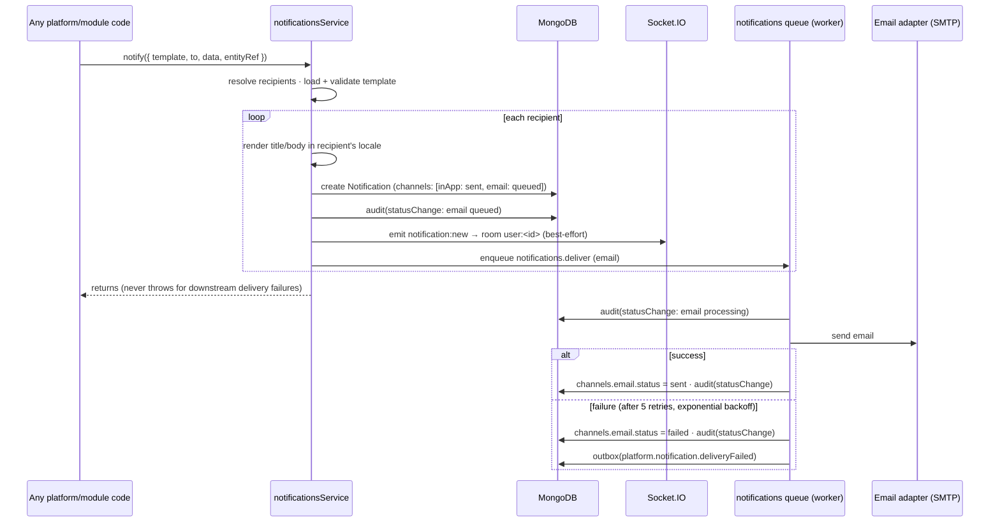
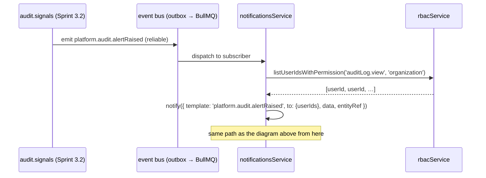

# Sprint 3.3 Planning — Notifications Service

**Release:** v0.5.0 · **Capability:** one — Notifications (BD-006) ·
**Status:** 🧊 Frozen 2026-07-09 (EGYCASH-approved, fully specified) — implementation
awaiting GO · **Design
authority:** [Platform Core §6](../02-architecture/platform-core.md#6-notifications-notifications),
[Domain Model §2.7 Communication](../01-domain/domain-model.md),
[Bounded Contexts](../01-domain/bounded-contexts.md), ADR-008, ADR-009

> **Amended 2026-07-09** (pre-implementation, still documentation-only): ten additional
> design decisions folded in below — template versioning/preview, the full channel list
> (+ WhatsApp), a 7-state auditable delivery-status lifecycle, an explicit retry/
> dead-letter policy, category- and quiet-hours-aware preferences, a closed notification-
> category vocabulary, real-time delivery details, performance targets, multi-branch
> fan-out, and an explicit provider-agnostic commitment. Two places **supersede** the
> original draft (called out inline where they do): preferences now key on **category**
> instead of `templateKey`, and delivery-status transitions **are** audited (originally
> scoped as not-audited for volume reasons — see §8).
>
> **Amended again 2026-07-09** (same day, still pre-implementation): ten more decisions —
> idempotency (§2a), the template rendering engine spec (§2b), scheduled/recurring
> delivery (§2c), expiration (§2d), an attachment-reference strategy (§3f), first-read
> semantics made explicit (§6), a future administration console (new section), an
> observability approach (new section), and sender-validation/channel-authorization
> (§12). One place **supersedes** the previous amendment: `priority` is now the
> **four-tier `low | normal | high | critical`** (previously a two-tier `normal | urgent`)
> — **`critical`** is the level that bypasses quiet hours, replacing `urgent` everywhere
> it appeared. With this amendment, **Release v0.5.0 Planning is frozen** — see the
> closing note after the Acceptance Criteria.

> **Honest starting point:** unlike Files (Sprint 3.1) and Audit (Sprint 3.2), which
> extended patterns already proven on this platform (storage adapters, queued writes),
> Notifications introduces genuinely new infrastructure: **the first stateful, long-lived
> connection in the API process (Socket.IO)** and **the first outbound network dependency
> to a mail transport (SMTP)**. This plan is written with that honestly in mind — the
> design reuses every existing seam it can (event bus, queue, settings, audit) and keeps
> the new surface (channel adapters, sockets) as small and swappable as the storage
> provider abstraction it mirrors.

## 1. Functional requirements

- **One internal capability for the whole platform:** `notificationsService.notify({ template, to, data, entityRef }, { session? })`
  — an in-process function call, exactly as scoped in Platform Core §6 ("modules never
  touch Socket.IO or SMTP directly"). Not an HTTP endpoint; callers are trusted
  platform/module code, the same trust boundary as `auditService.record()`.
- **Recipients (`to`)** resolve to one or more users: a single `userId`, an explicit
  `userIds[]`, or a **permission-based fan-out** (`{ permission, scope }` — "everyone
  holding `auditLog.view` at organization scope"), needed for the Sprint 3.2 follow-up
  (security signals → the people who can act on them).
- **Templates** are admin-managed, **versioned** data: a unique `key`, both languages
  required (ar/en) per the Domain Model invariant, a declared variable list, per-channel
  bodies (in-app is a short text string; email has subject + body), and a **category**
  (§3a). Every edit creates a new version (history retained, mirroring the Files version
  group pattern — Sprint 3.1); a **preview** endpoint renders a version without sending
  it, a separate **test-send** endpoint actually delivers a rendered preview to the
  caller only (§5/§6 — two distinct capabilities, not one).
- **Rendering happens once, at send time**, in the recipient's own `User.locale`, and is
  **snapshotted onto the notification** — editing a template (i.e. publishing a new
  version) or deactivating it later never changes what a past notification said (a
  support/compliance expectation, and it removes any need to reconstruct history from
  template versions).
- **Delivery channels:** **in-app** and **email** are required at launch (In-app is the
  source of truth — a persisted inbox; Socket.IO is *live push only*, a missed push is
  not a lost notification, the next inbox load shows it). **SMS, push, and WhatsApp are
  future channel adapters** — declared in the interface, not built: the channel-adapter
  interface accommodates them exactly the way `StorageProvider` accommodates future
  storage backends, but no adapter for any of the three ships this sprint (§2, "Every
  channel... goes through this interface").
- **Inbox:** list mine (paginated, unread-first available), unread count, mark one/all
  read, archive/delete mine — all scoped to the caller's own identity, like the existing
  "my sessions" endpoints.
- **Preferences** (§3c): per user × **notification category** (not per individual
  template — see the superseding note in the header) × channel, opt-in/opt-out, with an
  organization-wide default (settings-driven) when the user hasn't set one; plus
  **quiet hours** (a per-user local time window that defers non-`critical` channels) and
  a **digest mode** flag reserved for a future release (not built now).
- **Priority** (§3, four levels: `low | normal | high | critical`) is a property of the
  **template**, not the individual send — every notification created from a template
  inherits its priority. Only `critical` has behavioral consequences this sprint: it
  bypasses quiet hours (§3c). `low`/`high` are informational (future UI sort/grouping
  hooks) and carry no delivery-path behavior yet — declared now so the enum doesn't need
  a breaking change when a real use for them shows up.
- **Idempotency** (§2a), **scheduled delivery** (§2c), **expiration** (§2d), and
  **attachment references** (§3f) are documented in the architecture/database sections
  below — each is a property of a single `notify()` call, not a separate capability.
- **Delivery is always asynchronous** for real (network) channels and **never blocks or
  fails the caller's business operation** — the same non-blocking invariant ADR-012
  established for audit, extended here because a stalled SMTP server must not stall HR,
  Fleet, or any future module's write path.
- **No business content in this sprint.** This is the platform capability; the first real
  business-module consumer (e.g. Recruitment) arrives with its own module later. The one
  concrete consumer wired up now is the Sprint 3.2 follow-up:
  `platform.audit.alertRaised` → notify the people who can act on it.

## 2. Architecture design

A new Tier-2 platform feature, `platform/notifications`, in the existing boot order
(after settings/audit → users/organization/rbac/auth, alongside `files`), built on the
established feature shape (routes → controller → service → repository → model +
validation + events, `index.ts`-only exports — ADR-003).

```
platform/notifications/
├── notification.model.ts            # Notification, NotificationTemplate, ChannelPreference
├── notification.repository.ts
├── notification.service.ts          # notify(), inbox queries, mark-read
├── notification-template.service.ts # template CRUD (audited)
├── notification-preference.service.ts
├── channel-adapters/
│   ├── channel-adapter.ts           # the interface + registry (extension point)
│   ├── in-app.adapter.ts            # writes the Notification doc + emits the socket push
│   └── email.adapter.ts             # nodemailer over SMTP, queued
├── notification.socket.ts           # Socket.IO auth middleware + room join
├── notification.routes.ts / .controller.ts / .validation.ts
└── index.ts
```

**Channel adapter interface** (the same extension-point shape as
`registerFileProcessor`, Sprint 3.1):

```ts
interface ChannelAdapter {
  id: 'inApp' | 'email' | string; // future: 'sms' | 'push' | 'whatsapp'
  send(notification: NotificationDoc, rendered: RenderedContent): Promise<ChannelResult>;
}
registerChannelAdapter(adapter: ChannelAdapter): void; // duplicate id throws, mirrors registerFileProcessor
```

Two adapters ship this sprint (`inApp`, `email`); the registry itself is generic —
adding `sms`, `push`, or `whatsapp` later is a new adapter file, zero changes to
`notify()` or any caller. **Every channel, including the two required ones, goes through
this interface** — `notify()` and its callers never see SMTP, a carrier API, or a
WhatsApp Business API client directly. Swapping the email transport (Mailpit in dev →
SendGrid/SES in production, say) is a new/reconfigured adapter, not a call-site change —
the same guarantee `StorageProvider` already makes for Local/S3/Azure (Sprint 3.1).

**`notify()` sequence** (mirrors the two-tier idea already used by files' upload path —
synchronous, reliable core; queued, best-effort fan-out):

1. Resolve recipients (`to`) → a set of `userId`s (permission-based `to` calls the new
   RBAC query described in §8, optionally branch-scoped — §11).
2. Load + validate the active template version (unknown `key` is a caller bug → throws;
   missing declared variables → throws — fail fast, this runs in trusted platform code).
3. For each recipient: render title/body in their locale, **create the `Notification`
   document synchronously** with `channels[inApp].status = 'sent'` (this *is* the in-app
   delivery — see §3b for the full status lifecycle) — no queue needed for the channel
   that's just a database write.
4. Emit `notification:new` on the in-process Socket.IO server to room `user:<id>`
   (best-effort — a disconnected client just sees it on next inbox load; details in §6).
5. For every *other* enabled, non-opted-out, **not-in-quiet-hours** channel (email
   today), enqueue one `notifications.deliver` job per (notification, channel) with
   status `queued` — never looped synchronously in the caller's path, however many
   recipients there are. A channel deferred by quiet hours stays `queued` and is
   re-enqueued when the recipient's quiet-hours window ends (§3c); **`priority: critical`
   templates bypass quiet hours** — a security alert must not wait until morning.
6. `notify()` itself never throws for delivery failures downstream of step 3 — the
   Notification row existing **is** the guarantee; channel delivery failure is recorded
   on that row, not surfaced to the caller (same non-blocking invariant as audit writes).

### 2a. Idempotency

"Prevent duplicate notifications caused by event retries" is handled at **three
independent layers**, each covering a different failure mode — no single mechanism
covers all of them:

1. **Event-level (the primary guarantee for this sprint's actual consumers).** The
   kernel event bus already deduplicates reliable-tier delivery by event ID
   (`ProcessedEventModel`, ADR-008) — a redelivered `platform.audit.alertRaised` or
   `platform.roleAssignment.changed` **never re-invokes** the notifications subscriber a
   second time. This is an existing platform guarantee, not something built here; both
   of this sprint's wired-up subscriptions (§4) rely on it entirely.
2. **Caller-level (for future, non-event-bus callers).** `notify()` accepts an optional
   `idempotencyKey`: `notify(input, { session?, idempotencyKey? })`. When supplied, a
   unique index `(recipientUserId, idempotencyKey)` on `notifications` makes a second
   logical call for the same key a no-op (returns the existing notification instead of
   creating a duplicate). Optional and unused by this sprint's two subscribers (event-
   level dedup already covers them) — available for any future direct caller (e.g. an
   HTTP-triggered business action that might itself be retried by a client) that needs
   the stronger guarantee.
3. **Delivery-job-level (protects against queue-infrastructure retries specifically).**
   BullMQ's at-least-once job execution means a `notifications.deliver` job could in
   theory be attempted again after a worker crash mid-send. The worker checks the
   notification's **persisted channel status** before calling the channel adapter — a
   channel already at `sent`/`delivered`/`failed`/`cancelled` (§2's status lifecycle) is
   a no-op on a re-attempt, never a second real send. No extra table or dedup collection
   needed; the status field the lifecycle already tracks *is* the idempotency guard.

### 2b. Template rendering engine

- **Placeholder syntax:** `{{variableName}}` — alphanumeric + underscore names only,
  matched against the template's declared `variables` list. Deliberately **not** a full
  templating language (no conditionals, loops, or expressions) — find-and-replace only,
  which keeps rendering trivially safe to audit and impossible to use for anything more
  than text substitution.
- **Missing variables:** `notify()` validates the caller's `data` against the template's
  declared `variables` **before** rendering — a required variable missing from `data`
  throws (fail fast, this runs in trusted platform code, §1). An **extra** key in `data`
  that isn't a declared variable is silently ignored, not an error (callers commonly pass
  a superset for their own logging/debugging needs, per §3's `data` field).
- **Escaping rules:** interpolated values are **HTML-escaped** (`& < > " '`) when
  rendering the email HTML part (§2b below); the in-app channel and the email
  plain-text part never interpret the result as markup, so no escaping is needed there
  beyond passing the raw string through. This is the concrete implementation of the
  template-injection mitigation already noted in §10.
- **HTML and plain-text rendering:** a template author writes **one** plain-text `body`
  per language (§3) — not two parallel bodies to maintain. The email adapter sends a
  **multipart message**: the plain-text part is the rendered body verbatim; the HTML part
  wraps the same rendered (and HTML-escaped) body in one **code-owned, generic HTML
  shell** (brand header/footer, not authored per-template). This is the standard
  email-deliverability practice of always sending a plain-text alternative, without
  doubling every template author's workload. In-app is **always** plain text — there is
  no HTML part for that channel, ever (client renders it as text, never as markup).

### 2c. Scheduling

- **Send now** (default, unchanged): `notify(input)` with no timing option runs the §2
  sequence immediately.
- **Scheduled delivery:** `notify(input, { sendAt? })`. When `sendAt` is a future `Date`,
  `notify()` does **not** run the sequence immediately — it enqueues a single BullMQ
  **delayed** job (`notifications.scheduledSend`, using BullMQ's native `delay` option,
  no new queue infrastructure) carrying the original input. When that job fires at
  `sendAt`, it runs the normal §2 sequence exactly as if `notify()` had been called at
  that moment — **including the expiration check (§2d)**, so a schedule that outlives its
  own expiry is skipped, not delivered stale. Nothing (not even the in-app row) is
  created before `sendAt` — a scheduled notification does not appear in anyone's inbox
  early.
- **Recurring delivery is declared, not built.** A future capability would need a
  cron-like declaration generating repeated `notify()` calls (conceptually similar to
  the scheduler feature's task registry, Sprint 2.1/§3.2's pattern) — out of scope this
  sprint (§ Out of scope). Stated here only so `sendAt` (singular) doesn't need to become
  a breaking shape change if/when recurrence arrives (it would be a separate field, e.g.
  `recurrence`, additive).

### 2d. Expiration

- Notifications may optionally carry `expiresAt: Date | null` (§3), set by the caller
  (via `notify()`) or defaulted from the template's `defaultExpiryHours` (§3) when the
  caller doesn't specify one.
- **Enforcement — expired notifications are never delivered:**
  - If `expiresAt` is already in the past when `notify()` runs (a caller bug, or a
    scheduled send whose `sendAt` job fired late — §2c), the call is a **no-op**: no
    Notification document is created, on any channel, in-app included.
  - For a channel still `queued` when its delivery job is picked up, the worker checks
    `expiresAt` before calling the adapter; if expired, the channel transitions straight
    to `cancelled` (§3b's status lifecycle) — never `sent`, never attempted.
  - An in-app row that was already created and later passes its `expiresAt` is **not**
    retroactively hidden or deleted by this backend capability — "never delivered" is
    about gating (further) send attempts, not about pruning an inbox the frontend already
    rendered. Any UI treatment of an expired-but-already-shown entry is a frontend
    concern, out of scope here (consistent with the inbox UI being out of scope entirely,
    §8).

**Socket.IO:** mounted on the same HTTP server as Express (per
[Software Architecture](../02-architecture/software-architecture.md) — "same API process
initially"). Connection auth reuses `authService.buildAuthContext(token)` — the same
verification the HTTP `authenticate` middleware uses, not a parallel auth path. Each
authenticated socket joins exactly one room, `user:<userId>`; no room ever mixes users.
Full reconnect/missed-notification/acknowledgement/multi-tab behavior is specified in §6
(kept there, next to the rest of the real-time API surface, rather than split across two
sections).

**Queue:** a new `notifications` queue added to the existing `QUEUES` tuple
(`infrastructure/queue/jobs.ts`), one job (`notifications.deliver`) processed by the
worker, inline in test mode (existing pattern — no new test infrastructure needed). Retry
behavior is specified in §3d.

## 3. Database model

Three collections — **exactly** the three already named in Platform Core §12 and Domain
Model §2.7; no new entities invented here. (One of the three, `notification_templates`,
now carries version history — still one logical entity, per §3's own note below, not a
fourth collection.)

### `notifications`

| Field | Type | Notes |
| --- | --- | --- |
| `_id` | ObjectId | |
| `recipientUserId` | ObjectId | indexed |
| `entityRef` | `{moduleId, entityType, entityId}` | **required** — shared kernel, "always references its origin entity" |
| `templateKey`, `templateVersion` | string, number | which template + version produced this (§3's template versioning) |
| `category` | string | denormalized from the template at send time — fast preference filtering/display without a join (§3a) |
| `priority` | `'low' \| 'normal' \| 'high' \| 'critical'` | denormalized from the template (§1); `critical` bypasses quiet hours (§3c) |
| `data` | Mixed | the variables passed to `notify()`, kept for support/debugging |
| `title`, `body` | `{ar, en}` | **rendered and snapshotted at send time** — template edits never retroactively change history |
| `channels` | `[{ channel, status, statusHistory: [{status, at}], sentAt, deliveredAt, readAt, error }]` | one entry per channel this notification was sent on — see §3b for the status enum |
| `readAt` | Date \| null | top-level convenience mirror of the in-app channel's `readAt`, set **only once** (§6 — first-read wins) — what the inbox queries against |
| `archivedAt` | Date \| null | soft "delete" — same never-hard-delete rule as everywhere else |
| `expiresAt` | Date \| null | §2d — caller-supplied or defaulted from the template; enforcement happens at delivery time, not by a background sweep |
| `idempotencyKey` | string \| null | §2a — optional, caller-supplied |
| `attachments` | `ObjectId[]` | §3f — **references** into the `files` collection; no binary data stored here |
| `createdAt` | Date | |

Indexes: `{recipientUserId, createdAt: -1}` (inbox listing), `{recipientUserId, readAt: 1}`
(unread count), `{entityRef.entityType, entityRef.entityId}` (entity-scoped lookups — the
same shape as the audit/activity `ix_entityRef_at` index, see §8 for why this matters),
`{recipientUserId, category}` (category-filtered inbox views), unique partial index
`{recipientUserId, idempotencyKey}` where `idempotencyKey` exists (§2a).

### 3a. Notification categories (closed vocabulary)

A fixed, code-declared list — the same closed-vocabulary pattern as `AUDIT_ACTIONS` — not
a DB-managed catalog, so no CRUD surface is needed for it:

```
security · hr · workflow · approval · system · contracts · fleet · vault · atm · finance
```

Every template declares exactly one `category`; it drives preference grouping (§3c) and
inbox filtering. The list matches the business/platform areas already named in
[Module Hierarchy](../01-business/module-hierarchy.md) and the Bounded Contexts map, so a
future module's templates slot into an existing category rather than inventing a new one
per module. Extending the list is a small, reviewable code change (new templates simply
can't declare a category that isn't in it — the same closed-vocabulary discipline as
`AUDIT_ACTIONS` and `PERMISSION_ACTIONS`), not an ADR-gated decision like the permission
action vocabulary, since it carries no authorization weight.

### 3b. Delivery status lifecycle

Per-channel status, replacing the earlier three-state draft:

```
queued → processing → sent → delivered → read → [terminal]
                          ↘ failed → [terminal]
queued/processing → cancelled → [terminal]
```

| Status | Meaning | Set by |
| --- | --- | --- |
| `queued` | Job enqueued (or deferred by quiet hours), not yet picked up | `notify()` / quiet-hours re-enqueue |
| `processing` | Worker picked up the delivery job | worker, on job start |
| `sent` | Handed off successfully to the channel (SMTP accepted it; in-app row created) | channel adapter |
| `delivered` | Channel confirmed receipt, where the channel can report it (e.g. a future provider webhook) — **for email/in-app this sprint, `sent` is the last automatically-observable state**; `delivered` is modeled now so a future provider integration doesn't need a schema change | channel adapter, when the channel supports it |
| `read` | Recipient marked it read (in-app only — the meaningful "read" signal doesn't exist for email) | `POST /notifications/:id/read` |
| `failed` | All retries exhausted (§3d) | worker, after final attempt |
| `cancelled` | Superseded before delivery (e.g. quiet-hours deferral expired without ever sending — not a planned path this sprint, modeled for completeness) | — |

**Every transition is audited** (`auditService.record()`, `action: 'statusChange'`,
`entityRef: {entityType: 'notification', entityId}`, `changes: [{field: 'channels.<n>.status', old, new}]`)
— reusing the existing `statusChange` action, no new audit-action enum value needed. This
is an explicit **supersession** of the original draft, which scoped delivery as
not-audited for volume reasons; see §8 for the honest volume trade-off this creates and
why it's still the right call.

### `notification_templates` (versioned)

| Field | Type | Notes |
| --- | --- | --- |
| `key` | string | stable identity across versions, e.g. `platform.audit.alertRaised` |
| `version` | number | **monotonically increasing per `key`** — every edit creates a new version row rather than mutating in place, mirroring the Files version-group pattern (Sprint 3.1); `(key, version)` is the real identity of a specific rendering |
| `isLatest` | boolean | exactly one `true` row per `key` — mirrors `FileDoc.isLatest` exactly |
| `category` | string | one of §3a's closed vocabulary |
| `priority` | `'low' \| 'normal' \| 'high' \| 'critical'` | default `normal`; `critical` bypasses quiet hours (§1, §2c) |
| `subject` | `{ar, en}` | email only; null if the template has no email channel |
| `body` | `{ar, en}` | `{{variable}}` placeholders — one plain-text body per language (§2b), not separate HTML/text variants |
| `channels` | `string[]` | which channels this template supports — the channel-authorization boundary (§12) |
| `variables` | `string[]` | declared variable names — `notify()` validates `data` against this (§2b) |
| `defaultExpiryHours` | number \| null | §2d — used when a `notify()` call doesn't supply its own `expiresAt` |
| `status` | `'active' \| 'inactive'` | deactivation, not deletion; applies to the `key` (via the latest version), not per-version |
| `createdBy`, `createdAt` | | who/when this **version** was created |

Unique index `(key, version)`; `notify()` always resolves the `isLatest: true` row for a
`key`. `GET /notification-templates/:id/versions` lists history (§6) — same shape as the
files version-history endpoint. Optimistic concurrency isn't needed on top of this: a
concurrent edit simply creates the next version, it can't silently clobber another edit
(stronger guarantee than the plain `version` counter the original draft proposed).

### `notification_preferences`

| Field | Type | Notes |
| --- | --- | --- |
| `userId` | ObjectId | |
| `category` | string | **supersedes the original draft**, which keyed on `templateKey`. Ten example categories (§3a) make a manageable preferences UI (toggle "Fleet notifications", not fifty individual templates); a template-level override is a natural future refinement if a real need for finer granularity shows up — not built speculatively now. |
| `channel` | string | |
| `enabled` | boolean | |

Unique compound index `(userId, category, channel)`. Absence of a row = fall back to the
settings-driven organization default for that channel (§8).

### 3c. Quiet hours & digest mode

Added to the **user's own profile-adjacent preference state** (a small `quietHours`
sub-document alongside their per-category rows, same collection):

| Field | Type | Notes |
| --- | --- | --- |
| `quietHours.enabled` | boolean | default from `notifications.quietHours.enabledByDefault` (settings, §8) |
| `quietHours.start`, `quietHours.end` | `"HH:mm"` | interpreted in the user's own locale/timezone context (same timezone handling the platform already assumes for `User.locale` — no new timezone model introduced) |

**Scope:** quiet hours defer non-`critical`, *external* channel delivery only (email
today); the in-app row is still created immediately (step 3 of §2's sequence) — quiet
hours is about not buzzing someone's phone at 2am, not about hiding information from
their inbox. `priority: critical` templates (e.g. security alerts) always bypass it.

**Digest mode is a documented placeholder, not built:** a future toggle that would batch
a user's non-`critical` notifications into one periodic (daily/weekly) email instead of
one-per-event. It needs a scheduled aggregation job (mirroring Sprint 3.2's retention
task shape) that does not exist yet. Declared here so the preference schema doesn't need
a breaking change when it arrives; **the `digestMode` field is reserved and unused** this
sprint (always resolves to "off").

### 3d. Retry policy

Delivery jobs (`notifications.deliver`) use the **same BullMQ defaults every other queue
in this platform already uses** (`infrastructure/queue/jobs.ts`) — no special-casing:

- **Retry count:** 5 attempts.
- **Backoff:** exponential, 2s base (2s, 4s, 8s, 16s, 32s between attempts).
- **Dead-letter handling:** BullMQ's own failed-job set is the dead letter queue —
  `removeOnFail: false` (already the platform default) means exhausted jobs are **kept**,
  not discarded, and remain inspectable; no separate dead-letter collection is introduced.
- **Permanent failure behavior:** after the 5th attempt fails, the channel's status is
  set to `failed` (terminal — §3b), `platform.notification.deliveryFailed` fires
  (reliable tier), and the row stops retrying automatically. A manual re-send is an
  admin action **not built this sprint** (out of scope) — today, re-sending means the
  business event that originally triggered `notify()` would need to fire again, or a
  future admin "retry delivery" action is added as its own small capability when there's
  a real operational need for it.

### 3f. Attachment strategy

`notify()` accepts an optional `attachments: fileId[]` — **references** to existing
`files` documents (Sprint 3.1), never embedded binary data. Consistent with how every
other part of the platform treats files (ADR-010): a notification never becomes the
system of record for a binary, it just points at one.

**Scope this sprint: the schema/interface accepts the reference, delivery does not yet
attach anything.** Stored on the `notifications` document (§3) so the shape doesn't need
a breaking change later; the email adapter does not fetch or attach the referenced file
this sprint (§ Out of scope, unchanged from the previous amendment). When attachment
delivery is built, the natural shape is already implied: the email adapter calls the
existing `fileService` to stream the binary at send time — no new file-handling code in
the notifications feature itself, the same "modules never touch storage directly, they
call the owning service" rule Platform Core already enforces everywhere else.

**Authorization note:** referencing a file does **not** grant the recipient access to it
beyond what the Files service's own visibility/authorization rules (Sprint 3.1) already
allow — a notification pointing at a `private` file the recipient can't otherwise
download doesn't change that; this plan introduces no new file-access path.

## 4. Event contracts

**Inbound — Notifications subscribes to existing reliable events (no changes to the
emitting services):**

| Event | Recipients | Purpose |
| --- | --- | --- |
| `platform.audit.alertRaised` *(Sprint 3.2)* | everyone holding `auditLog.view` @ organization | closes the Sprint 3.2 backlog item — this is the event's first consumer |
| `platform.roleAssignment.changed` *(Sprint 2.1)* | the affected `userId` | proves the general subscription seam with one clear, low-risk, human-facing example beyond security signals |

Deliberately a **short initial list** — BD-006 discipline applies to what this sprint
*wires up*, not just what it *builds*. Additional subscriptions (e.g. lockout, session
revocation) are natural follow-ups, added when a real need is identified, not spun up
speculatively.

**Outbound — new events Notifications emits:**

| Event | Tier | Payload v1 |
| --- | --- | --- |
| `platform.notification.created` *(new)* | in-process | `{ notificationId, recipientUserId, templateKey }` — cache-invalidation/live-UI seam only |
| `platform.notification.deliveryFailed` *(new)* | reliable (outbox) | `{ notificationId, recipientUserId, channel, templateKey, error }` + `schemaVersion` |

`deliveryFailed` is reliable because it has a business consequence a future capability may
act on (e.g. a delivery-health dashboard, or feeding the Sprint 3.2 signal detectors) —
`created` does not, it is a same-process nudge only.

## 5. Permission catalog

| Resource | Actions | Notes |
| --- | --- | --- |
| `notificationTemplate` | `view`, `create`, `edit`, `delete` | matches the Milestone 1 Permission Matrix design row exactly — no surprises. `view` also gates the render-only **preview** endpoint (§6) — previewing is reading, not a new capability. |
| `notificationTemplate.test` *(special)* | — | **test-send**: actually deliver a rendered preview to the caller only, needed to see how a channel *really* renders it (e.g. an email client) before publishing; same pattern as `role.assign`, `fileCategory.manage` |

**No permission for the inbox or preferences.** Both are scoped by identity
(`authenticate` only), the same deliberate choice already made for session
self-management in `auth` — a user's own inbox is not organization data that RBAC needs
to gate, and gating it would be security theater, not security.

**No permission for `notify()`** — it is a function call inside trusted platform code, the
same trust boundary as `auditService.record()`; it is not reachable over HTTP.

**No break-glass permission.** Nothing here is a privileged bypass of a normal control.

Net new permission-matrix entries: 2 (`notificationTemplate` view/create/edit/delete +
one special). The generated matrix (`docs/06-security/permission-matrix.generated.md`)
will be regenerated at implementation time.

## 6. API specification

Base: `/api/v1/platform` · standard envelope, pagination, error codes (API Standards).

### Admin — template catalog

| Endpoint | Permission | Notes |
| --- | --- | --- |
| `GET /notification-templates` | `notificationTemplate.view` | list latest versions, filter by `status`/`category` |
| `POST /notification-templates` | `notificationTemplate.create` | creates version 1 |
| `GET /notification-templates/:id` | `notificationTemplate.view` | reads one version |
| `GET /notification-templates/:id/versions` | `notificationTemplate.view` | version history for the `key` — same shape as the files version-history endpoint |
| `PATCH /notification-templates/:id` | `notificationTemplate.edit` | **creates a new version** (§3), not an in-place mutation |
| `DELETE /notification-templates/:id` | `notificationTemplate.delete` | sets `status: inactive` on the `key` — never a hard delete |
| `POST /notification-templates/:id/preview` | `notificationTemplate.view` | **renders** the template against caller-supplied sample `data` and returns the result — **does not send anything**, on any channel |
| `POST /notification-templates/:id/test` | `notificationTemplate.test` | **sends** a rendered preview to the caller only, on the requested channel — the only endpoint in this table that has a real delivery side effect |

### Self-service — inbox & preferences (`authenticate` only)

| Endpoint | Notes |
| --- | --- |
| `GET /notifications` | mine; filters: `unreadOnly`, `entityType`, `entityId`; paginated |
| `GET /notifications/unread-count` | badge count |
| `POST /notifications/:id/read` | mine only (ownership checked, not permission) |
| `POST /notifications/read-all` | mine |
| `DELETE /notifications/:id` | archive mine |
| `GET /notification-preferences` | mine — per-category rows + `quietHours` |
| `PUT /notification-preferences` | upsert mine, one `{category, channel, enabled}` at a time |
| `PUT /notification-preferences/quiet-hours` | upsert mine — `{enabled, start, end}` (§3c) |

**Read tracking, explicitly:**

- **Read timestamp:** `readAt` (§3), set by `POST /notifications/:id/read`.
- **First read wins:** the write is conditional — `readAt` is only set if currently
  `null`. A second `POST .../read` on an already-read notification is a no-op that
  returns success without changing the timestamp (idempotent, same principle as §2a).
- **Unread counters:** `GET /notifications/unread-count` is a **live query**
  (`{recipientUserId, readAt: null, archivedAt: null}` count), not a maintained counter
  field — no risk of a denormalized counter drifting from reality.
- **Mark single:** `POST /notifications/:id/read` — one notification, ownership-checked.
- **Mark all:** `POST /notifications/read-all` — sets `readAt: now` on every currently-
  unread, non-archived notification belonging to the caller; each is its own "first read"
  (they were all unread beforehand, so the conditional-write rule above is trivially
  satisfied for all of them).

### Real-time

`Socket.IO` namespace `/notifications`, server → client event `notification:new` with
the `NotificationDto` payload, plus a lightweight `notification:read` event so other open
tabs update without a full re-fetch (server-emitted after the REST mark-read call
succeeds — see multi-tab below).

- **Authentication:** JWT-authenticated on connect (handshake `auth.token`), reusing
  `authService.buildAuthContext(token)` — the same verification as the HTTP
  `authenticate` middleware, not a parallel path (§2). An invalid/expired token is
  rejected at connect; there is no separate re-auth message.
- **Reconnect:** the client's normal Socket.IO auto-reconnect re-runs the same
  handshake/auth and rejoins `user:<id>`. The server holds no per-connection state beyond
  room membership, so a reconnect is indistinguishable from a fresh connect.
- **Missed notifications:** Socket.IO does **not** buffer events for a disconnected
  client — a notification created while offline is simply not pushed live. This is
  deliberate, not a gap: the client is expected to re-fetch `GET /notifications/unread-count`
  (and the list, if the inbox is open) on connect/reconnect, exactly as it would on a
  fresh page load. The persisted inbox, not the socket, is the delivery guarantee (§1).
- **Acknowledgement:** none, by design. `notification:new` is fire-and-forget live push;
  read state is only ever changed through the REST `POST /notifications/:id/read`
  endpoint, which is the one source of truth for that state. Building a redelivery/ack
  protocol on top of the socket would duplicate that source of truth for no real benefit
  at this platform's scale.
- **Multi-tab / multi-device:** the room is keyed by `user:<id>`, not by connection — every
  open tab or signed-in device joins the same room and receives every push
  simultaneously. Marking a notification read in one tab calls the REST endpoint, which
  (after the DB write) emits `notification:read` back to the same room so sibling tabs
  update their badge without polling.

## 7. Sequence diagrams

**`notify()` — the general path (module or platform service calls in-process):**



**Event-driven consumer — the Sprint 3.2 follow-up closes here:**



## 8. Integration points with existing Platform Core

| Service | Integration | Status |
| --- | --- | --- |
| **kernel event bus** | subscribes to 2 existing reliable events; emits 2 new ones | primary integration — no changes to the event bus itself |
| **rbac** | needs one new read query: `listUserIdsWithPermission(key, scope, branchId?)` — a straightforward query over existing `role_assignments`/`roles` collections, **not** a schema or model change; the optional `branchId` supports branch-scoped fan-out (§11) | **flagged dependency** — small addition to RBAC's public contract, to confirm at implementation time |
| **settings** | organization-wide defaults: `notifications.email.enabled` (kill switch), per-channel default opt-in, `notifications.quietHours.enabledByDefault` | new settings declared by the notifications feature, same pattern as every other service |
| **audit** | every template version CRUD mutation audited (ground rule: every mutation is audited) **and, per this amendment, every delivery-status transition is audited too** (§3b) — **this supersedes the original draft**, which scoped delivery as not-audited for volume reasons. Honest trade-off: a busy day could add several `statusChange` rows per notification per recipient, materially more volume than any other audit consumer today. Kept anyway because it was an explicit design decision (this amendment), and because it's cheap to carry — audit writes are already queued/fire-and-forget with a fallback (ADR-012), so added volume costs storage, not latency. If volume ever becomes a real operational problem, the fix is narrowing *which* transitions are audited (e.g. drop the routine `read` transition, keep the rest) — not rearchitecting the write path. | notifications is a new (heavier) consumer of `auditService.record()`; no change to audit itself |
| **users / organization** | recipient existence + `User.locale` for bilingual rendering | read-only dependency, existing contract |
| **queue / scheduler** | new `notifications` queue (delivery jobs); **no new scheduled task this sprint** — a future digest job (§3c) or a quiet-hours-expiry sweep are natural extensions, not built now | infra addition only (`QUEUES` tuple) |
| **files** | none this sprint (attachments are a plausible future extension of the email adapter — deferred) | no coupling |
| **web (frontend)** | Socket.IO client + inbox UI are **out of scope** for this plan — this is the backend capability, matching how Sprint 3.1/3.2 also shipped API-only | deferred to a UI-focused pass |
| **Sprint 3.2 audit timeline** | `notifications`' `entityRef` index uses the identical shape as `audit_logs`/`activity_logs` — a future release could fold notifications in as a third timeline source; **not proposed now**, just noted as a design consequence of reusing the shared kernel | forward-looking note only |

## 9. Testing strategy

- **Unit:** template rendering (variable interpolation, missing-variable failure, extra-
  variable tolerance, HTML-escaping on the email HTML part, no escaping on plain-text —
  §2b), the status-transition table (§3b — only the documented transitions are legal;
  e.g. `read` is unreachable from `failed`), retry/backoff configuration sanity,
  quiet-hours window math (in-window/out-of-window edges, `critical`-priority bypass),
  the delivery-job idempotency guard (a job re-attempted after the channel is already
  `sent` is a no-op — §2a), preference resolution (explicit category row → settings
  default → hard-coded fallback), channel adapter registry (duplicate-id guard, mirrors
  `registerFileProcessor`'s test), Socket.IO auth middleware (valid/expired/tampered
  token — pure function, no live socket needed).
- **Integration:** `notify()` end-to-end (in-app doc created, inbox list/unread-count/
  mark-read/archive, category filter), a repeated `idempotencyKey` produces exactly one
  notification (§2a), preference opt-out suppresses a channel, quiet hours defers a
  `normal`-priority email but not a `critical` one, an `expiresAt` already in the past
  makes `notify()` a full no-op and a channel that expires while still `queued` is
  `cancelled` not `sent` (§2d), a `sendAt` in the future creates nothing until it fires
  (§2c), template versioning (edit creates a new version, `isLatest` moves, old
  notifications keep their snapshot, `/versions` returns history) + its audit trail,
  preview renders without sending, test-send actually delivers to the caller only, every
  delivery-status transition produces its own audit row (§3b/§8), the two event
  subscriptions (emitting `platform.audit.alertRaised` / `platform.roleAssignment.changed`
  in a test produces the expected notification for the expected recipients), Socket.IO
  connect/auth (valid token joins the room; invalid token is rejected), `notification:read`
  reaching a second simulated tab, a second `POST .../read` call not overwriting the
  original timestamp (§6), using a real Socket.IO client against the test server.
- **Known, stated limitation (planned, not hidden):** the email adapter will be tested
  against nodemailer's in-memory/JSON transport in CI, **not a live SMTP server** — the
  same honest limitation Sprint 3.1 logged for cloud storage drivers ("configuration-
  tested, not live-tested"). A Mailpit smoke test against the dev docker-compose stack is
  a manual/staging verification step, not a CI gate.
- Same harness as prior sprints: in-memory Mongo replica set in CI, `MONGO_TEST_URI`
  local escape hatch, inline queue driver in test mode — no new test infrastructure
  required.

## 10. Risks and migration considerations

| Risk | Notes / mitigation |
| --- | --- |
| **First stateful component in the API process** | Socket.IO holds open connections; today's stateless-API assumption (Software Architecture §NFR: "Stateless API → horizontal scaling") gets its first exception. Single-instance is fine at current scale; horizontal scaling later needs the Socket.IO Redis adapter — Redis is already in the stack, so this is a configuration addition later, not a redesign now. Flagged, not built. |
| **Email deliverability** (SPF/DKIM, provider reputation) | Outside this sprint's control — dev uses Mailpit; production SMTP provider selection is a deployment decision (configuration-driven, no code change to switch providers), out of scope for this plan. |
| **Template injection** | Templates are admin-authored freeform text with variable interpolation. Email bodies HTML-escape interpolated variables; in-app text is rendered as plain text client-side, never as HTML. A Security Architecture consideration to carry into implementation review. |
| **Fan-out volume** | A permission-based `to` could in theory resolve to many recipients; at EGYCASH's actual scale (single organization, ~6 branches) this is not a real concern, but the design already avoids synchronous per-recipient loops in the request path — each channel delivery is its own queued job regardless of recipient count. |
| **No data migration** | New capability, new collections — zero migration risk for this sprint. |
| **Template changes vs. history** | Mitigated by design: rendering is snapshotted onto the notification at send time (§2), and every edit is a new version (§3), so editing or deactivating a template never rewrites history; template version creation is itself audited so "why did this message say X" stays answerable. |
| **Audit volume from delivery-status tracking** | This amendment's explicit choice to audit every transition (§3b/§8) is the single biggest volume increase any sprint has added to `audit_logs` so far. Mitigated structurally (queued writes, non-blocking, ADR-012) rather than by skipping the requirement; a narrower audit selection is the fallback if it becomes an operational cost, not a redesign. |
| **Retry exhaustion / dead letters going unnoticed** | §3d's dead-letter set is BullMQ's own failed-job store — nothing this sprint actively pages on it beyond the `deliveryFailed` event. Acceptable for launch (the event is a seam a future dashboard/alerting capability can consume); a human isn't watching that queue day-to-day yet. |
| **`notify()` contract stability** | Once modules start calling it, its shape is effectively load-bearing across the codebase. Kept intentionally small this sprint and Zod-validated at the boundary so mistakes fail fast at the caller rather than surfacing as a silent no-op notification. |
| **Multi-branch fan-out correctness** | Getting `to: {permission, scope: 'branch', branchId}` wrong (e.g. a caller forgetting to scope a branch-specific event) silently over- or under-notifies. Mitigated by keeping branch-scoping the *caller's* explicit choice (§11) rather than something the service infers — an explicit, testable input, not implicit magic. |

## Performance targets

Deliberately conservative, grounded in EGYCASH's actual scale (one organization, ~6
branches — ADR-015), not generic SaaS numbers. Stated as **initial targets to validate
during implementation**, not guarantees carved in stone:

| Dimension | Target | Basis |
| --- | --- | --- |
| Notifications/day | comfortably handles 50,000/day; realistic expected load is a low thousands/day | headroom over any plausible single-organization, 6-branch cash-logistics workload |
| Concurrent Socket.IO connections | low hundreds | roughly total headcount ballpark for a company this size — not a consumer-scale product |
| Queue throughput | tens of jobs/sec sustained on a single worker | each job is a small DB write or an SMTP handoff — no CPU-heavy work, unlike PDF rendering (`reports`) |
| Latency — in-app + live push | p95 < 500 ms from `notify()` call to socket emit | bounded mostly by the Mongo write; matches the platform-wide p95 < 300 ms API target with headroom for the render step |
| Latency — email handoff | p95 < 30 s from enqueue to SMTP acceptance | bounded by the external provider, not fully in this service's control — stated as a target, not a guarantee |

No load testing is part of this sprint's testing strategy (§9) — these targets exist to
catch an obviously wrong design (e.g. a synchronous per-recipient loop) during
implementation review, not to be benchmarked against this release.

## 11. Multi-branch considerations

Per ADR-015 (single organization, branch is the primary operational scope), recipient
resolution is **always by user**, never implicitly by branch — the Notifications Service
does not itself infer "who's in this branch." Two supported shapes for `to`:

- **Organization-wide:** `to: { permission, scope: 'organization' }` — e.g. the Sprint
  3.2 security-signal notification, which must reach every qualifying user regardless of
  branch.
- **Branch-scoped:** `to: { permission, scope: 'branch', branchId }` — for events that are
  inherently local (e.g. a future branch-specific approval). The **caller** decides this,
  using its own knowledge of the triggering event's branch — the Notifications Service
  just resolves the recipient set RBAC already knows how to compute (the same
  `branch`-scope semantics `rbac`/`BaseRepository` already enforce everywhere else on the
  platform — no new scoping concept introduced).

**Locale is per-user, not per-branch** — ADR-015 doesn't introduce a per-branch locale,
so rendering always uses the recipient's own `User.locale` regardless of which branch
triggered the event.

**Quiet hours and preferences are per-user, not per-branch** — a branch doesn't have
"office hours" in this model; each recipient's own quiet-hours window applies
individually, consistent with them being personal preference state (§3c).

## Future administration console

Documented intent for a later capability — **nothing in this section is built this
sprint**; it exists so the schema/API choices already made don't foreclose it.

| Capability | Shape | Status |
| --- | --- | --- |
| Template management | `GET/POST/PATCH/DELETE /notification-templates` + preview/test | **this sprint** (§6) — the only item in this table not deferred |
| Queue monitoring | A view over the `notifications` BullMQ queue's depth/active/failed counts | future — no dedicated queue-monitoring UI exists on this platform yet (a platform-wide gap, not specific to notifications) |
| Failed notifications view | Query `notifications` where any `channels[].status = 'failed'`, filterable by category/channel/date | future — needs its own permission when built (not decided now; likely `notificationTemplate.view`-adjacent or a new admin-scoped read) |
| Resend / retry | A manual "retry this delivery" action | future — explicitly out of scope this sprint (§3d) |
| Statistics | Delivery success rate, volume by category/channel, retry rate | future — see Observability below; the underlying data (status + `statusHistory`, §3b) already exists once this sprint ships, a reporting *view* over it does not |

## Observability

- **Metrics** (delivery success rate, retry rate, queue depth, time-to-delivery per
  channel): **no dedicated metrics backend (e.g. Prometheus/StatsD) exists on this
  platform yet** — that's a platform-wide gap, not something this sprint introduces just
  for notifications. Near-term substitute: every number above is derivable via a MongoDB
  aggregation over `notifications.channels` (status distribution, `statusHistory` timing
  deltas) — an ops/support query, not a live dashboard, until real metrics
  infrastructure exists platform-wide.
- **Structured logs:** reuse the existing Pino logger (already platform-wide, PII-
  redacted) — no new logging system. Key lifecycle events (job picked up, sent, failed)
  logged at the same levels the rest of the platform already uses (info for success,
  warn/error for failure), matching the outbox relay's existing logging pattern.
- **Tracing:** already solved, not a gap — `requestId` correlation across
  api → queue → worker (ADR-012) already exists platform-wide; notifications inherits it
  automatically through the existing queue/request-context infrastructure. No new
  tracing system is introduced.
- **Queue health:** BullMQ exposes queue depth/active/failed counts natively; surfacing
  them in an admin view is the "queue monitoring" future-administration item above, not
  built this sprint.
- **Delivery success rate / retry rate:** queryable from day one from the audited
  `statusChange` transitions (§3b/§8) and the `channels[].status` distribution — no new
  instrumentation needed to *compute* these; a dedicated reporting *view* is future work
  (administration console, above).

## 12. Security

- **Template permission model:** covered in full in §5 — `notificationTemplate`
  view/create/edit/delete + the `.test` special; `preview` reuses `.view`. Not repeated
  here.
- **Audit requirements:** covered in full in §3b/§8 — every template version and every
  delivery-status transition is audited. Not repeated here.
- **Sender validation:** `notify()` is an in-process call from trusted platform/module
  code (§1) — there is no runtime "who's really calling this" check, no per-call
  attestation of the caller's identity beyond the `entityRef.moduleId` it supplies. This
  matches the existing trust model for every other internal platform contract
  (`auditService.record()`, `emit()`) — trust is established at **code-review time**
  (Development Workflow §4: what calls `notify()` with what `entityRef` is visible in the
  diff), not enforced at runtime. This is a deliberate, stated simplification appropriate
  for in-process trusted code; it would need revisiting **only if** `notify()` were ever
  exposed across a real trust boundary (a public API, a less-trusted plugin system) —
  which it explicitly is not, and isn't proposed to be.
- **Channel authorization** has two independent halves, both already specified above,
  brought together here for clarity:
  1. **What a template may use** — gated by the template's declared `channels: string[]`
     (§3); a template that doesn't declare `email` cannot be delivered over email no
     matter what a caller requests. Reviewed at template create/edit time
     (`notificationTemplate.create`/`.edit`, §5).
  2. **What a recipient will accept** — gated by their own preferences (§3c) and quiet
     hours; a recipient's opt-out is never overridden by a caller, with the single stated
     exception of `critical` priority bypassing quiet hours (never bypassing an outright
     channel opt-out — quiet hours defers timing, it doesn't force a channel someone
     disabled entirely).

## Out of scope

Frontend inbox UI and Socket.IO client wiring (deferred to a UI-focused pass) ·
SMS / push / WhatsApp channel adapters (interface-ready, not built) · digest/scheduled-
summary notifications (schema field reserved, §3c) · **recurring delivery** (§2c —
`sendAt` is a one-time future timestamp only) · a scheduled quiet-hours-expiry sweep job
· an admin "manually re-send a failed delivery" action (§3d) · notification
retention/purge job (no retention concern identified yet — would mirror Sprint 3.2's
pattern if one emerges) · any business-module notification content (the first real
business consumer arrives with its own module) · **attaching** referenced files to email
(the reference field exists, §3f; nothing fetches or attaches the binary) · read-receipt
*delivery* over the socket (state changes stay REST-only; the socket only mirrors the
result, §6) · load testing against the performance targets · a delivery-health dashboard
consuming `platform.notification.deliveryFailed` · **the entire future administration
console** (queue monitoring, failed-notifications view, resend/retry, statistics — see
that section) · **a dedicated metrics backend** (Prometheus/StatsD or similar — a
platform-wide gap, not notifications-specific, see Observability).

## Acceptance criteria

- [ ] `notify()` is callable from platform code and creates a bilingual, entity-referenced
      Notification synchronously; delivery failure on any channel never throws back to
      the caller.
- [ ] In-app inbox: list, unread count, mark one/all read, archive — all self-scoped,
      no permission required, proven by integration test.
- [ ] Email delivery via the channel-adapter/queue path, retried on failure, final
      failure recorded on the notification and raises `platform.notification.deliveryFailed`.
- [ ] Socket.IO: authenticated connect joins exactly the caller's own room; `notification:new`
      received on a live `notify()` call in an integration test.
- [ ] Both initial event subscriptions (`platform.audit.alertRaised`,
      `platform.roleAssignment.changed`) produce the expected notification end-to-end.
- [ ] Template versioning: an edit creates a new version, history is retrievable, and
      existing notification history never changes when a template is edited or
      deactivated (snapshot invariant proven by test); preview renders without sending;
      test-send delivers to the caller only. Both permission-gated and audited.
- [ ] Every delivery-status transition (§3b) produces an audit row; only the documented
      transitions are reachable.
- [ ] Preferences suppress delivery on the opted-out channel at the **category** level;
      settings-driven default applies when no preference row exists; quiet hours defer a
      non-`critical` channel and are bypassed by `critical`-priority templates.
- [ ] Branch-scoped fan-out (`to: {permission, scope: 'branch', branchId}`) reaches only
      that branch's qualifying users; organization-scoped fan-out is unaffected.
- [ ] Idempotency: a repeated `idempotencyKey` never creates a second notification; a
      retried delivery job never re-sends a channel already past `sent` (§2a).
- [ ] Scheduling: `sendAt` creates nothing before it fires; expiration prevents delivery
      entirely for an already-past `expiresAt` and cancels a still-queued channel that
      expires before its turn (§2c/§2d).
- [ ] `attachments` (file references) round-trip on the notification document without
      the email adapter attaching anything this sprint (§3f).
- [ ] First-read semantics: a second mark-read call on an already-read notification does
      not change its `readAt` (§6).
- [ ] No changes to any other platform service beyond the flagged, additive integration
      points (RBAC's new read query; the new settings keys).
- [ ] All CI gates green (lint, typecheck, unit + integration, build, permission-matrix
      and flag-expiry checks).
- [ ] Docs updated in the same PR: `docs/02-architecture/notifications-service.md`
      (files/audit-service-style reference), CHANGELOG, ECMS-BOOK sprint log.

---

## Planning frozen

As of the second 2026-07-09 amendment, this plan covers: the original 10 sections, the
first amendment's 10 decisions, and this amendment's 10 decisions — thirty design
questions raised across three review passes, all resolved and recorded above, none
deferred silently (every "not built" item is named explicitly in **Out of scope** with a
reason). **No further design gaps are known.** Implementation awaits an explicit GO;
any design question that surfaces *during* implementation gets recorded as a new,
dated amendment here (or a formal ADR, if it turns out to be architectural rather than
service-level) — not a silent deviation from what's written above.
