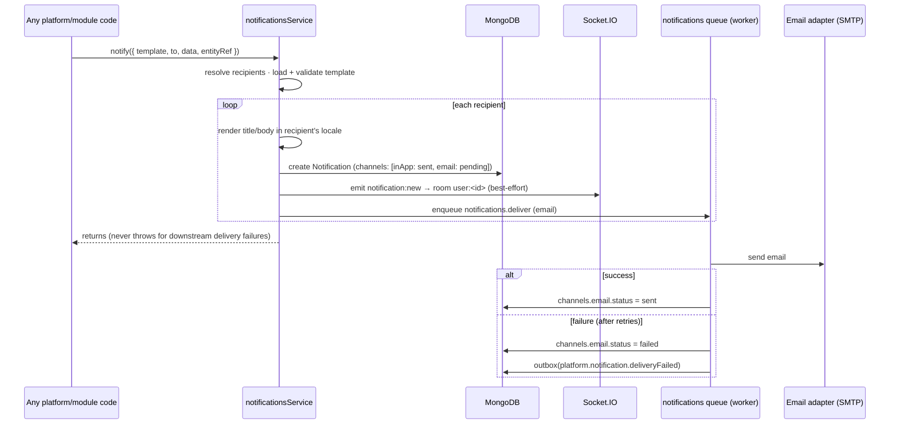
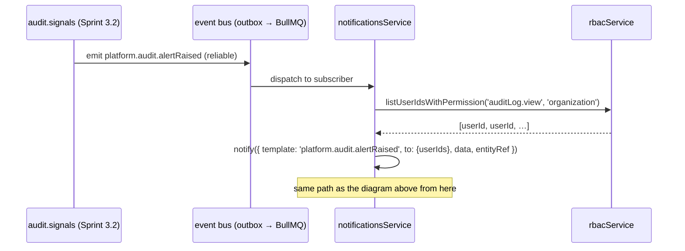

# Sprint 3.3 Planning — Notifications Service

**Release:** v0.5.0 (proposed) · **Capability:** one — Notifications (BD-006) ·
**Status:** 📝 Awaiting approval · **Design authority:**
[Platform Core §6](../02-architecture/platform-core.md#6-notifications-notifications),
[Domain Model §2.7 Communication](../01-domain/domain-model.md),
[Bounded Contexts](../01-domain/bounded-contexts.md), ADR-008, ADR-009

> **Honest starting point:** unlike Files (Sprint 3.1) and Audit (Sprint 3.2), which
> extended patterns already proven on this platform (storage adapters, queued writes),
> Notifications introduces genuinely new infrastructure: **the first stateful, long-lived
> connection in the API process (Socket.IO)** and **the first outbound network dependency
> to a mail transport (SMTP)**. This plan is written with that honestly in mind — the
> design reuses every existing seam it can (event bus, queue, settings, audit) and keeps
> the new surface (channel adapters, sockets) as small and swappable as the storage
> provider abstraction it mirrors.

## 1. Functional requirements

- **One internal capability for the whole platform:** `notificationsService.notify({ template, to, data, entityRef }, { session? })`
  — an in-process function call, exactly as scoped in Platform Core §6 ("modules never
  touch Socket.IO or SMTP directly"). Not an HTTP endpoint; callers are trusted
  platform/module code, the same trust boundary as `auditService.record()`.
- **Recipients (`to`)** resolve to one or more users: a single `userId`, an explicit
  `userIds[]`, or a **permission-based fan-out** (`{ permission, scope }` — "everyone
  holding `auditLog.view` at organization scope"), needed for the Sprint 3.2 follow-up
  (security signals → the people who can act on them).
- **Templates** are admin-managed data: a unique `key`, both languages required (ar/en)
  per the Domain Model invariant, a declared variable list, and per-channel bodies
  (in-app is a short text string; email has subject + body).
- **Rendering happens once, at send time**, in the recipient's own `User.locale`, and is
  **snapshotted onto the notification** — editing or deactivating a template later never
  changes what a past notification said (a support/compliance expectation, and it removes
  any need to keep old template versions around just to explain history).
- **Channels at launch: in-app and email.** In-app is the source of truth (a persisted
  inbox); Socket.IO is *live push only* — a missed push is not a lost notification, the
  next inbox load shows it. SMS/push are **declared, not built**: the channel-adapter
  interface accommodates them exactly the way `StorageProvider` accommodates future
  storage backends, but no adapter ships this sprint.
- **Inbox:** list mine (paginated, unread-first available), unread count, mark one/all
  read, archive/delete mine — all scoped to the caller's own identity, like the existing
  "my sessions" endpoints.
- **Preferences:** per user × template `key` × channel, opt-in/opt-out, with an
  organization-wide default (settings-driven) when the user hasn't set one.
- **Delivery is always asynchronous** for real (network) channels and **never blocks or
  fails the caller's business operation** — the same non-blocking invariant ADR-012
  established for audit, extended here because a stalled SMTP server must not stall HR,
  Fleet, or any future module's write path.
- **No business content in this sprint.** This is the platform capability; the first real
  business-module consumer (e.g. Recruitment) arrives with its own module later. The one
  concrete consumer wired up now is the Sprint 3.2 follow-up:
  `platform.audit.alertRaised` → notify the people who can act on it.

## 2. Architecture design

A new Tier-2 platform feature, `platform/notifications`, in the existing boot order
(after settings/audit → users/organization/rbac/auth, alongside `files`), built on the
established feature shape (routes → controller → service → repository → model +
validation + events, `index.ts`-only exports — ADR-003).

```
platform/notifications/
├── notification.model.ts            # Notification, NotificationTemplate, ChannelPreference
├── notification.repository.ts
├── notification.service.ts          # notify(), inbox queries, mark-read
├── notification-template.service.ts # template CRUD (audited)
├── notification-preference.service.ts
├── channel-adapters/
│   ├── channel-adapter.ts           # the interface + registry (extension point)
│   ├── in-app.adapter.ts            # writes the Notification doc + emits the socket push
│   └── email.adapter.ts             # nodemailer over SMTP, queued
├── notification.socket.ts           # Socket.IO auth middleware + room join
├── notification.routes.ts / .controller.ts / .validation.ts
└── index.ts
```

**Channel adapter interface** (the same extension-point shape as
`registerFileProcessor`, Sprint 3.1):

```ts
interface ChannelAdapter {
  id: 'inApp' | 'email' | string; // future: 'sms' | 'push'
  send(notification: NotificationDoc, rendered: RenderedContent): Promise<ChannelResult>;
}
registerChannelAdapter(adapter: ChannelAdapter): void; // duplicate id throws, mirrors registerFileProcessor
```

Two adapters ship this sprint (`inApp`, `email`); the registry itself is generic —
adding `sms` or `push` later is a new adapter file, zero changes to `notify()`.

**`notify()` sequence** (mirrors the two-tier idea already used by files' upload path —
synchronous, reliable core; queued, best-effort fan-out):

1. Resolve recipients (`to`) → a set of `userId`s (permission-based `to` calls the new
   RBAC query described in §8).
2. Load + validate the template (unknown `key` is a caller bug → throws; missing
   declared variables → throws — fail fast, this runs in trusted platform code).
3. For each recipient: render title/body in their locale, **create the `Notification`
   document synchronously** (this *is* the in-app delivery — no queue needed for the
   channel that's just a database write).
4. Emit `notification:new` on the in-process Socket.IO server to room `user:<id>`
   (best-effort — a disconnected client just sees it on next inbox load).
5. For every *other* enabled, non-opted-out channel (email today), enqueue one
   `notifications.deliver` job per (notification, channel) — never looped synchronously
   in the caller's path, however many recipients there are.
6. `notify()` itself never throws for delivery failures downstream of step 3 — the
   Notification row existing **is** the guarantee; channel delivery failure is recorded
   on that row, not surfaced to the caller (same non-blocking invariant as audit writes).

**Socket.IO:** mounted on the same HTTP server as Express (per
[Software Architecture](../02-architecture/software-architecture.md) — "same API process
initially"). Connection auth reuses `authService.buildAuthContext(token)` — the same
verification the HTTP `authenticate` middleware uses, not a parallel auth path. Each
authenticated socket joins exactly one room, `user:<userId>`; no room ever mixes users.

**Queue:** a new `notifications` queue added to the existing `QUEUES` tuple
(`infrastructure/queue/jobs.ts`), one job (`notifications.deliver`) processed by the
worker, inline in test mode (existing pattern — no new test infrastructure needed).

## 3. Database model

Three collections — **exactly** the three already named in Platform Core §12 and Domain
Model §2.7; no new entities invented here.

### `notifications`

| Field | Type | Notes |
| --- | --- | --- |
| `_id` | ObjectId | |
| `recipientUserId` | ObjectId | indexed |
| `entityRef` | `{moduleId, entityType, entityId}` | **required** — shared kernel, "always references its origin entity" |
| `templateKey` | string | which template produced this |
| `data` | Mixed | the variables passed to `notify()`, kept for support/debugging |
| `title`, `body` | `{ar, en}` | **rendered and snapshotted at send time** — template edits never retroactively change history |
| `channels` | `[{ channel, status: 'pending'\|'sent'\|'failed', sentAt, error }]` | one entry per channel this notification was sent on |
| `readAt` | Date \| null | |
| `archivedAt` | Date \| null | soft "delete" — same never-hard-delete rule as everywhere else |
| `createdAt` | Date | |

Indexes: `{recipientUserId, createdAt: -1}` (inbox listing), `{recipientUserId, readAt: 1}`
(unread count), `{entityRef.entityType, entityRef.entityId}` (entity-scoped lookups — the
same shape as the audit/activity `ix_entityRef_at` index, see §8 for why this matters).

### `notification_templates`

| Field | Type | Notes |
| --- | --- | --- |
| `key` | string | unique, e.g. `platform.audit.alertRaised` |
| `subject` | `{ar, en}` | email only; null if the template has no email channel |
| `body` | `{ar, en}` | `{{variable}}` placeholders |
| `channels` | `string[]` | which channels this template supports |
| `variables` | `string[]` | declared variable names — `notify()` validates `data` against this |
| `status` | `'active' \| 'inactive'` | deactivation, not deletion |
| `version` | number | optimistic concurrency, `BaseRepository` convention |
| `createdBy`, `updatedBy`, `createdAt`, `updatedAt` | | |

### `notification_preferences`

| Field | Type | Notes |
| --- | --- | --- |
| `userId` | ObjectId | |
| `templateKey` | string | **simplification, stated explicitly:** preferences key on the same `templateKey` as `notify()`'s `template` argument — the Domain Model's "notification type" and a template's identity are treated as the same concept for this sprint. A coarser grouping (many templates → one preference type) is a natural future extension if the template catalog grows large enough to need it; not built speculatively now. |
| `channel` | string | |
| `enabled` | boolean | |

Unique compound index `(userId, templateKey, channel)`. Absence of a row = fall back to
the settings-driven organization default for that channel (§8).

## 4. Event contracts

**Inbound — Notifications subscribes to existing reliable events (no changes to the
emitting services):**

| Event | Recipients | Purpose |
| --- | --- | --- |
| `platform.audit.alertRaised` *(Sprint 3.2)* | everyone holding `auditLog.view` @ organization | closes the Sprint 3.2 backlog item — this is the event's first consumer |
| `platform.roleAssignment.changed` *(Sprint 2.1)* | the affected `userId` | proves the general subscription seam with one clear, low-risk, human-facing example beyond security signals |

Deliberately a **short initial list** — BD-006 discipline applies to what this sprint
*wires up*, not just what it *builds*. Additional subscriptions (e.g. lockout, session
revocation) are natural follow-ups, added when a real need is identified, not spun up
speculatively.

**Outbound — new events Notifications emits:**

| Event | Tier | Payload v1 |
| --- | --- | --- |
| `platform.notification.created` *(new)* | in-process | `{ notificationId, recipientUserId, templateKey }` — cache-invalidation/live-UI seam only |
| `platform.notification.deliveryFailed` *(new)* | reliable (outbox) | `{ notificationId, recipientUserId, channel, templateKey, error }` + `schemaVersion` |

`deliveryFailed` is reliable because it has a business consequence a future capability may
act on (e.g. a delivery-health dashboard, or feeding the Sprint 3.2 signal detectors) —
`created` does not, it is a same-process nudge only.

## 5. Permission catalog

| Resource | Actions | Notes |
| --- | --- | --- |
| `notificationTemplate` | `view`, `create`, `edit`, `delete` | matches the Milestone 1 Permission Matrix design row exactly — no surprises |
| `notificationTemplate.test` *(special)* | — | send a rendered preview to the caller only, needed to safely edit a template before publishing it; same pattern as `role.assign`, `fileCategory.manage` |

**No permission for the inbox or preferences.** Both are scoped by identity
(`authenticate` only), the same deliberate choice already made for session
self-management in `auth` — a user's own inbox is not organization data that RBAC needs
to gate, and gating it would be security theater, not security.

**No permission for `notify()`** — it is a function call inside trusted platform code, the
same trust boundary as `auditService.record()`; it is not reachable over HTTP.

**No break-glass permission.** Nothing here is a privileged bypass of a normal control.

Net new permission-matrix entries: 2 (`notificationTemplate` view/create/edit/delete +
one special). The generated matrix (`docs/06-security/permission-matrix.generated.md`)
will be regenerated at implementation time.

## 6. API specification

Base: `/api/v1/platform` · standard envelope, pagination, error codes (API Standards).

### Admin — template catalog

| Endpoint | Permission | Notes |
| --- | --- | --- |
| `GET /notification-templates` | `notificationTemplate.view` | list, filter by status |
| `POST /notification-templates` | `notificationTemplate.create` | |
| `GET /notification-templates/:id` | `notificationTemplate.view` | |
| `PATCH /notification-templates/:id` | `notificationTemplate.edit` | optimistic `version` |
| `DELETE /notification-templates/:id` | `notificationTemplate.delete` | sets `status: inactive` — never a hard delete |
| `POST /notification-templates/:id/test` | `notificationTemplate.test` | sends a rendered preview to the caller only, on the requested channel |

### Self-service — inbox & preferences (`authenticate` only)

| Endpoint | Notes |
| --- | --- |
| `GET /notifications` | mine; filters: `unreadOnly`, `entityType`, `entityId`; paginated |
| `GET /notifications/unread-count` | badge count |
| `POST /notifications/:id/read` | mine only (ownership checked, not permission) |
| `POST /notifications/read-all` | mine |
| `DELETE /notifications/:id` | archive mine |
| `GET /notification-preferences` | mine |
| `PUT /notification-preferences` | upsert mine, one `{templateKey, channel, enabled}` at a time |

### Real-time

`Socket.IO` namespace `/notifications`, JWT-authenticated on connect (handshake
`auth.token`), server → client event `notification:new` with the `NotificationDto`
payload. No client → server events this sprint (read receipts happen over the REST
endpoint, not the socket, to keep one source of truth for state changes).

## 7. Sequence diagrams

**`notify()` — the general path (module or platform service calls in-process):**



**Event-driven consumer — the Sprint 3.2 follow-up closes here:**



## 8. Integration points with existing Platform Core

| Service | Integration | Status |
| --- | --- | --- |
| **kernel event bus** | subscribes to 2 existing reliable events; emits 2 new ones | primary integration — no changes to the event bus itself |
| **rbac** | needs one new read query: `listUserIdsWithPermission(key, scope)` — a straightforward query over existing `role_assignments`/`roles` collections, **not** a schema or model change | **flagged dependency** — small addition to RBAC's public contract, to confirm at implementation time |
| **settings** | organization-wide defaults: `notifications.email.enabled` (kill switch), per-channel default opt-in | new settings declared by the notifications feature, same pattern as every other service |
| **audit** | every template CRUD mutation audited (ground rule: every mutation is audited); notification delivery itself is **not** audited by default (high-volume, not a compliance record) | no change to audit; notifications is a new consumer of `auditService.record()` |
| **users / organization** | recipient existence + `User.locale` for bilingual rendering | read-only dependency, existing contract |
| **queue / scheduler** | new `notifications` queue (delivery jobs); **no new scheduled task this sprint** — a future digest/retry-sweep job is a natural extension, not built now | infra addition only (`QUEUES` tuple) |
| **files** | none this sprint (attachments are a plausible future extension of the email adapter — deferred) | no coupling |
| **web (frontend)** | Socket.IO client + inbox UI are **out of scope** for this plan — this is the backend capability, matching how Sprint 3.1/3.2 also shipped API-only | deferred to a UI-focused pass |
| **Sprint 3.2 audit timeline** | `notifications`' `entityRef` index uses the identical shape as `audit_logs`/`activity_logs` — a future release could fold notifications in as a third timeline source; **not proposed now**, just noted as a design consequence of reusing the shared kernel | forward-looking note only |

## 9. Testing strategy

- **Unit:** template rendering (variable interpolation, missing-variable failure,
  both-languages-required validation), preference resolution (explicit row → settings
  default → hard-coded fallback), channel adapter registry (duplicate-id guard, mirrors
  `registerFileProcessor`'s test), Socket.IO auth middleware (valid/expired/tampered
  token — pure function, no live socket needed).
- **Integration:** `notify()` end-to-end (in-app doc created, inbox list/unread-count/
  mark-read/archive), preference opt-out suppresses a channel, template CRUD + its audit
  trail, the two event subscriptions (emitting `platform.audit.alertRaised` /
  `platform.roleAssignment.changed` in a test produces the expected notification for the
  expected recipients), Socket.IO connect/auth (valid token joins the room; invalid token
  is rejected) using a real Socket.IO client against the test server.
- **Known, stated limitation (planned, not hidden):** the email adapter will be tested
  against nodemailer's in-memory/JSON transport in CI, **not a live SMTP server** — the
  same honest limitation Sprint 3.1 logged for cloud storage drivers ("configuration-
  tested, not live-tested"). A Mailpit smoke test against the dev docker-compose stack is
  a manual/staging verification step, not a CI gate.
- Same harness as prior sprints: in-memory Mongo replica set in CI, `MONGO_TEST_URI`
  local escape hatch, inline queue driver in test mode — no new test infrastructure
  required.

## 10. Risks and migration considerations

| Risk | Notes / mitigation |
| --- | --- |
| **First stateful component in the API process** | Socket.IO holds open connections; today's stateless-API assumption (Software Architecture §NFR: "Stateless API → horizontal scaling") gets its first exception. Single-instance is fine at current scale; horizontal scaling later needs the Socket.IO Redis adapter — Redis is already in the stack, so this is a configuration addition later, not a redesign now. Flagged, not built. |
| **Email deliverability** (SPF/DKIM, provider reputation) | Outside this sprint's control — dev uses Mailpit; production SMTP provider selection is a deployment decision (configuration-driven, no code change to switch providers), out of scope for this plan. |
| **Template injection** | Templates are admin-authored freeform text with variable interpolation. Email bodies HTML-escape interpolated variables; in-app text is rendered as plain text client-side, never as HTML. A Security Architecture consideration to carry into implementation review. |
| **Fan-out volume** | A permission-based `to` could in theory resolve to many recipients; at EGYCASH's actual scale (single organization, ~6 branches) this is not a real concern, but the design already avoids synchronous per-recipient loops in the request path — each channel delivery is its own queued job regardless of recipient count. |
| **No data migration** | New capability, new collections — zero migration risk for this sprint. |
| **Template changes vs. history** | Mitigated by design: rendering is snapshotted onto the notification at send time (§2), so editing or deactivating a template never rewrites history; template edits are themselves audited so "why did this message say X" stays answerable. |
| **`notify()` contract stability** | Once modules start calling it, its shape is effectively load-bearing across the codebase. Kept intentionally small this sprint and Zod-validated at the boundary so mistakes fail fast at the caller rather than surfacing as a silent no-op notification. |

## Out of scope

Frontend inbox UI and Socket.IO client wiring (deferred to a UI-focused pass) · SMS/push
channel adapters (interface-ready, not built) · digest/scheduled-summary notifications ·
notification retention/purge job (no retention concern identified yet — would mirror
Sprint 3.2's pattern if one emerges) · any business-module notification content (the
first real business consumer arrives with its own module) · attachments on email
notifications · read-receipt delivery over the socket (REST only, this sprint).

## Acceptance criteria

- [ ] `notify()` is callable from platform code and creates a bilingual, entity-referenced
      Notification synchronously; delivery failure on any channel never throws back to
      the caller.
- [ ] In-app inbox: list, unread count, mark one/all read, archive — all self-scoped,
      no permission required, proven by integration test.
- [ ] Email delivery via the channel-adapter/queue path, retried on failure, final
      failure recorded on the notification and raises `platform.notification.deliveryFailed`.
- [ ] Socket.IO: authenticated connect joins exactly the caller's own room; `notification:new`
      received on a live `notify()` call in an integration test.
- [ ] Both initial event subscriptions (`platform.audit.alertRaised`,
      `platform.roleAssignment.changed`) produce the expected notification end-to-end.
- [ ] Template CRUD permission-gated and audited; template deactivation never breaks
      existing notification history (snapshot invariant proven by test).
- [ ] Preferences suppress delivery on the opted-out channel; settings-driven default
      applies when no preference row exists.
- [ ] No changes to any other platform service beyond the two flagged, additive
      integration points (RBAC's new read query; the two new settings keys).
- [ ] All CI gates green (lint, typecheck, unit + integration, build, permission-matrix
      and flag-expiry checks).
- [ ] Docs updated in the same PR: `docs/02-architecture/notifications-service.md`
      (files/audit-service-style reference), CHANGELOG, ECMS-BOOK sprint log.
